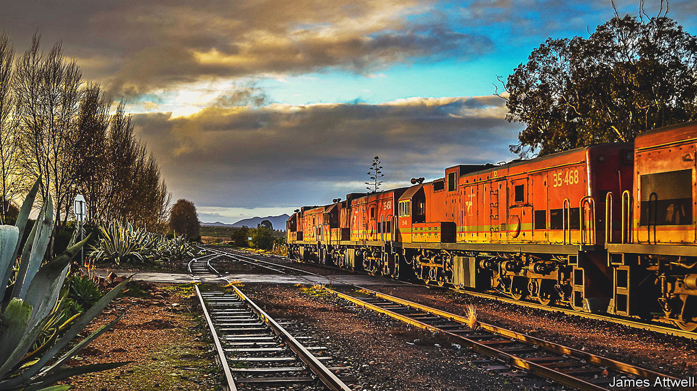
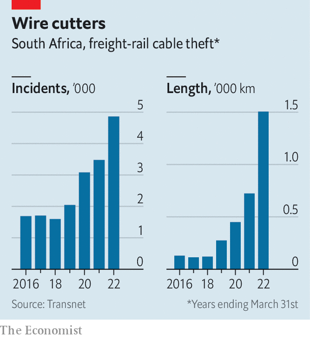

###### Off the rails

# South Africa’s disintegrating freight railway is crippling firms 

##### If exporters cannot move their goods, the economy will stumble 

 

> Jan 17th 2023 

The roads in the north of Kwa-Zulu Natal (KZN), South Africa’s second-most-populated province, were once sedate. Lorries carrying timber or sugar cane from nearby plantations would trundle past, overtaken occasionally by tourists heading to game reserves. But these days hundreds of  roar through small towns on their way to the port of Richards Bay. In September one lorry rammed into a pickup in the oncoming lane, killing 20 passengers, near the town of Pongola. “Our roads aren’t meant for this amount of traffic,” says Mike Patterson, from the local chamber of commerce. “The coal should be taken by rail.” 

Indeed it should. But South Africa’s freight rail network is in such bad shape that firms are struggling to move their goods. In 2017 trains hauled 81m tonnes of coal to export terminals. This year about 54m tonnes will go that way; lorries will carry only another 9m. The decline reflects a missed opportunity: international coal prices soared last year after Russia invaded Ukraine. The gap between what coal miners could dig and what they could export last year represents a loss of at least 80bn rand ($4.7bn), estimates Jan Havenga of Stellenbosch University. Other miners and manufacturers report similar deficits. The total hit to South African firms from lost exports and the extra costs of going by road will amount to about 400bn rand in 2022 (6% of gdp), says Mr Havenga.

Many people, including those outside South Africa, have heard of , the state-owned electricity utility with a market niche in keeping homes dark. Transnet, a less familiar state-owned enterprise which operates the freight rail network, as well as ports and pipelines, is a similar mess. And its woes are just as consequential for South Africa’s economy—and that of the wider region. So worried are miners, the industry most dependent on Transnet, that in December their lobby group asked its board to sack its boss, Portia Derby, warning that the firm faced bankruptcy. (She remains in her job.) 

Train geeks will happily tell you all the historical reasons why running South Africa’s rail network is not an easy task. In the 19th century British colonists laid “Cape gauge” railways to get diamonds and gold out of the country’s hinterland. This narrow gauge was fine in the days when the alternative was an ox wagon. But today most other countries have wider gauges and as a result their trains can carry heavier loads. In the 20th century during apartheid, or white rule, governments indulged farmers by building a dense but uneconomical network that stretched to remote rural areas with little freight traffic. Today South Africa has 0.6% of global GDP but 2% of the world’s rail network. It has about half of all the kilometres of rail in sub-Saharan Africa. All of it, no matter its profitability, requires upkeep.

When it came to power in 1994, the African National Congress (ANC) took over the supervision of Transnet, which four years earlier had been carved out of the Department of Transport. Transnet veterans advised the new government to allow the company to let rural lines rust and focus on the profitable coal and iron-ore railways. The ANC declined to do so. Instead Transnet eventually showed the typical characteristics of state firms under the ruling party: neglect, patronage and corruption. 

During the era of “state capture” under Jacob Zuma, South Africa’s president from 2009 to 2018, Transnet accounted for 72% of all irregularly awarded contracts, forensic auditors told an anti-corruption commission. The largest dodgy deal involved kickbacks tied to the purchase of more than 1,000 overpriced locomotives, mostly from China. The scandal not only hurt Transnet’s balance-sheet, but also brought thousands of trains to a halt: the Chinese firms stopped supplying spare parts after new managers cancelled further locomotive deliveries. Today Transnet has just 1,600 working locomotives, down from 2,300 five years ago. 

Vandalism is another scourge. In the financial year ending last March 31st, 1,500km (930 miles) of copper cable was stolen, says Ms Derby. “It has to be part of syndicated crime,” she says.

 


Short-sighted management matters, too. Over the past decade Transnet has almost doubled its wage bill, while cutting spending on maintenance, according to the African Rail Industry Association (ARIA), an industry body. Ms Derby concedes that the amount spent on maintenance is “quite disastrous”—roughly 30% of what it needs, she estimates. A strike in October ended with another pay bump for staff. Yet, as at Eskom, experienced engineers are in short supply. 

The effects of negligence are evident. The average distance travelled by locomotives every month is almost a third less than five years ago, reckons ARIA. Mining firms are scrambling for alternative outlets. There is the coal cavalcade in KZN. Chrome miners truck the metal to the border with Mozambique, where it is loaded onto trains heading for Maputo. Some Manganese is shipped through Namibia. Yet these workarounds are not enough.

Network defects

Transnet is paid to move things, so when it carries less freight, it makes less money. In the financial year ending in March 2021 it posted a loss for the first time in more than a decade. In October the government announced it would give it 5.8bn rand—its first direct bail-out in decades. 

To her credit, Ms Derby, appointed by Cyril Ramaphosa’s government in 2020 to clean up the mess of , recognises her firm’s problems. She says miners are “rightfully upset”, adding that the network “is too big for the South African economy; it needs to be scaled back.” Ms Derby says she also wants to allow more private firms to use Transnet’s network. 

Over the past few years several other African countries, such as Mozambique, Tanzania and Zambia, have allowed “open access” to their rail networks. These countries sell slots on the tracks to private operators, which in turn bring fresh investment. Last year the South African government published a white paper promising to implement the idea. Yet progress on passing a bill has moved about as slowly as a coal truck through KZN. 

