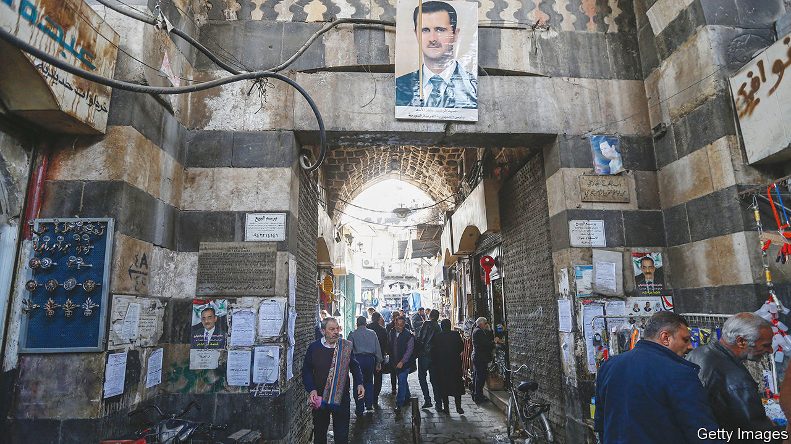
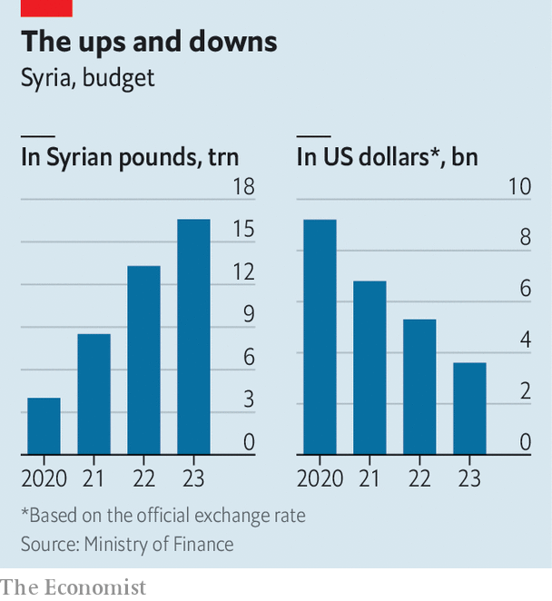

###### In from the cold but still miserable

# Turkey eyes reconciliation with a Syrian regime it tried to topple 

##### But it will mean little for millions of Syrians beset by poverty 

 

> Jan 19th 2023 

THEY WERE once friends, but even a good therapist might call their relationship hopeless. For years they traded insults. One used terms such as terrorist, butcher, baby-killer; the other had his own choice slurs, from thief and murderer to “small-time employee of the Americans”. Words are just words, but there were actions too: it is hard to forgive a friend for supporting men who want you dead. But in diplomacy everything can be forgiven, or—at least officially—forgotten.

With Russia’s encouragement, Syria and Turkey are edging towards rapprochement. Last month their defence ministers and spy chiefs held their first public tête-à-tête in more than a decade. It was followed by rumours that their foreign ministers might do the same—and then perhaps their presidents. Or perhaps not: the foreign ministers’ meeting has been repeatedly delayed. They have reasons to seek reconciliation, but there are also obstacles.

Whether it happens or not, the mooted meetings say much about the state of Syria. Twelve years after the first protests against him, you can view Bashar al-Assad in two ways. One is as a  who weathered an insurgency, kept his grip on power and is slowly emerging from isolation. The other is as a beggar with few real friends and . Both are true. Mr Assad won the war but is losing the peace.

It is easy to see why the Syrian president wants to reach out to Turkey, which controls more than 5% of Syria’s territory (with a quarter of its population). Mr Assad would like the land back. It would also be a diplomatic coup to restore ties with a country that supported the opposition—and which is a NATO member, to boot.

Recep Tayyip Erdogan, Turkey’s president, has his own reasons. The 4m Syrian refugees in Turkey have become deeply unpopular, a useful issue for his opponents to hammer ahead of elections in a few months’ time (see ). His ruling Justice and Development party would like voters to think that normalisation with Mr Assad will solve the refugee problem, even if, in reality, that is unlikely.

Other countries are urging them on. One is Russia, which played a decisive role in helping Mr Assad survive the civil war and maintains deep (if complicated) relations with Turkey. It would relish the sight of a Western ally embracing a Western pariah. Also keen to play mediator is the United Arab Emirates (UAE), which reopened its embassy in Syria in 2018 and last year welcomed Mr Assad on his first visit to an Arab country since the uprising began. Abdullah bin Zayed, the UAE’s foreign minister, flew to Damascus on January 4th for talks with Mr Assad. 

Even if the leaders of Turkey and Syria do meet, expectations would be low. Syria wants Turkey to leave the territory it controls. Mr Assad would then need to defend the border and rein in the People’s Protection Units, or YPG, a Kurdish militia that controls a chunk of Syria’s north-east. He is probably too diminished to manage that. Even if he gets a photo-op with Mr Erdogan, in other words, it is unlikely to lead to a Turkish withdrawal.

This is becoming a pattern. Mr Assad is emerging from isolation in the Middle East, if not the West, but has little to show for it. He no doubt hoped that restoring ties with the UAE would open a gusher of aid and investment. It did not. Even if American sanctions were not a concern (and they are), Emirati firms are not queuing up to pour money into a war-torn kleptocracy. Old friends of Syria are not much help either. Russia never invested much. It did snap up a few key sectors, such as sweetheart deals for oil-and-gas exploration off the Mediterranean coast and phosphate mining. But these are meant to turn a profit for Russia, not revive the Syrian economy.

Cold, hard cash

The same is true of Iran, which has struggled to keep its economy afloat since Donald Trump withdrew from the nuclear deal of 2015 and reimposed American sanctions in 2018. Iran has been Syria’s main oil supplier, but in recent months it has sent less. What oil Iran can export it would rather send to China, which buys it at closer to the market price—and pays upfront.

The fuel scarcity has, in effect, brought Syria to a halt this winter. Blackouts stretch for up to 22 hours a day, even in Damascus. Drivers queue for hours to find petrol. In December the regime announced unexpected holidays because of energy shortages. Schools and government offices were shut and public transport halted. The price of firewood has soared as families burn whatever they can to keep warm.

 


With few sources of hard currency, the regime’s finances are a mess. (Syria’s main export is Captagon, an amphetamine.) On January 2nd it devalued the official exchange rate by 33%, to 4,522 Syrian pounds to the dollar, still a good bit stronger than the black market, where the rate sits around 6,500. Last month Mr Assad approved a budget worth 16.6trn pounds, 24% up on the previous year—in local currency. In dollar terms it is worth about one-third less (see chart). The amount earmarked for subsidies is 12% lower than last year. The UN’s World Food Programme says that 90% of Syrians now live in poverty, and that the prices of some basic foods rose by 800% between 2019 and 2021.

For some of the regime’s foes, particularly in Washington, this is a sign that isolating Mr Assad is working: if living conditions get bad enough, they reckon, people will rise up again. That view is unpopular with Syria’s neighbours and even with a growing number of anti-Assad Syrians, who reckon that desperate people scrounging for firewood do not make good revolutionaries. At least so far, the latter camp seems correct. There have been scattered protests in Sweida, a restive southern province, but nothing that poses a real threat to the regime.

That should be small comfort for Mr Assad. He may no longer be persona non grata in regional capitals, but he has yet to find anyone willing to sink billions into rebuilding his ruined country. If Syria is coming in from the cold this winter, it is only as a figure of speech. ■

