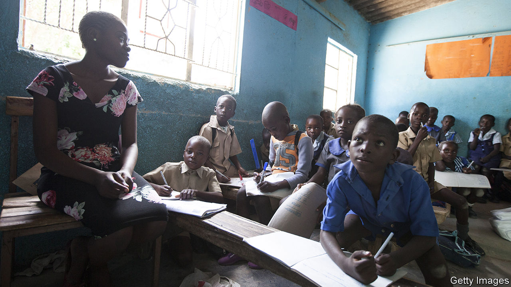

###### Economics lessons

# Why Zimbabwe’s schools have taken to selling chickens 

##### A collapsing education system means head teachers must get creative 

 

> Jan 19th 2023 

The job of a head teacher involves hiring teachers, disciplining pupils and placating parents. It does not normally include selling chickens. But that was one of several side-hustles run by Evermore Chakwizira, who until last year was the head of Chinyika High School in Goromonzi, 40km (25 miles) east of Harare, Zimbabwe’s capital. Since 2019 his school has sold hundreds of chicks a week at the local market. During the covid-19 pandemic, when children were at home, fluffy poults took up residence in the classrooms. 

The school has other businesses, too. It used the money earned from selling chicks to buy sewing machines to make face-masks and uniforms for schools across the province. Its latest schemes are to manufacture bricks and breed tilapia fish. 

Zimbabwe’s education system was once . As a result the adult literacy rate (90%) is still much higher than the average in sub-Saharan Africa (67%), according to the UN’s cultural agency, UNESCO. But under Zanu-PF, the ruling party, schools have fallen to pieces. Most have businesses of some sort. Without them schools would collapse entirely. 

The right to a basic education is enshrined in Zimbabwe’s constitution. But government schools are not free. Parents cover 96% of schools’ non-salary costs. Overall they contribute more than the state does. On average families in the countryside pay several hundred dollars a year for secondary schooling, a huge amount when 40% of people live on less than the equivalent of $2.15 a day. Though the government is supposed to pay the fees of the poorest pupils, the payments are often late or insufficient, or never arrive. 

That is because Zanu-PF has  through venal misrule. High inflation has eroded the value of teachers’ salaries. The rise in local prices from 2019 to 2020 meant that the education budget, nearly all of which goes on salaries, fell by more than half when measured in American dollars, the only currency trusted by Zimbabweans all too familiar with hyperinflation.

A teacher at another rural school says that her salary is worth the equivalent of $107 a month, down from $500 a few years ago. She says that some teachers who depend on taxis to get to school travel in the boot of the vehicle, as that costs half of a normal fare. An education official from a rural district admits that teachers can no longer afford to send their own children to school, before adding that salaries are less than what it would cost to buy bread for a family for a month. 

Desperate teachers have resorted to a practice euphemistically known as “extra lessons”: they only teach children whose parents pay them an extra fee. At another rural school teachers have taken a group of these fee-paying children out of their classroom to be taught under a tree. The poorer pupils are left unsupervised. This neglect makes things worse for destitute kids. More than a quarter of school-age children do not attend class because their parents cannot afford the official charges. Of those who do go to school, about 15% drop out before the end of their fifth year. In 2016 this figure was close to 1%.

Chinyika High School’s enterprising initiatives allowed it to build new classrooms and buy textbooks. Though its efforts are laudable, they are hardly the basis for a functioning education system. Often the means to get schemes off the ground come from politicians eager to be seen to be doling out patronage. The first 1,000 of Chinkyika’s chicks were donated by the local MP. Yet “there isn’t enough patronage for everyone,” says Obert Masaraure, the president of the teachers’ union. Bigwigs may pay for chicks but not the feed, making the project redundant. In other cases projects start promisingly but fail quickly, as when a bureaucrat responsible for delivering chicks as part of a government programme gave them to a relative instead.

Ahead of elections later this year Emmerson Mnangagwa, the president, has pledged again that primary education will be free. But Zimbabweans have learned their lessons. They know that, when it comes to schooling, his government has only a poultry offering. ■

