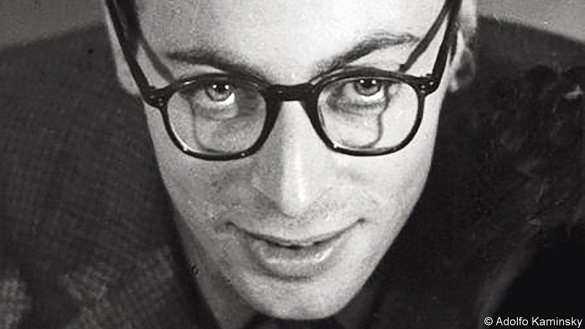

###### The good forger

# Adolfo Kaminsky saved thousands of Jews by changing their identities 

##### The forger of wartime papers and photographer of Paris died on January 9th, aged 97 

 

> Jan 19th 2023 

The policemAn was getting closer. As he shoved through the car in the Paris Metro he was shouting: “Identity check! General search!” The slight, bespectacled teenager shrank back in his seat and clasped his satchel tighter. Let me not give myself away, Adolfo Kaminsky was thinking. Not now, not today. 

Word had got round that police were looking for a forger. An expert one, who in Vichy France in 1944 was creating identity papers that looked impeccable. They would never suspect him. He was merely a child. When the officer asked what he had in his satchel he said “Sandwiches!” and offered to show him. The man waved him aside and moved on.

But Adolfo was the forger. In the satchel was his whole treasure: 50 blank identity cards, rubber stamps, his dip pen and a stapler. With these tools and a few more he could reproduce perfectly any official document you wanted. He could replicate names and addresses in the authentic loopy script of a municipal clerk; he could press paper in layers, engrave it and watermark it, until the page was perfect. To reproduce official perforations in passports, he used a sewing machine. At the end, to give an impression of long use and wear in a pocket, he aged his masterpieces with fretting from the base of a tobacco pipe and his own special dust, spinning them in a centrifuge made from a bicycle wheel. 

Then, with these documents, he saved lives. Each one replaced a Jewish name with a Gentile one, and a far-off birthplace with somewhere close. His own false ID card (not made by him) gave his name as Julien Adolphe Keller and his birthplace not as Buenos Aires, as was the case, but Alsace. With such cards, backed up by forged passports, baptism certificates and birth certificates, around 10,000 Jews were able to escape arrest, which would have meant death in the camps, and find safety. Most were children, many from institutions. As soon as a German round-up was announced, he and others from his group would visit those on the list and offer to make them new documents on the spot. Hence his presence, carrying the tools of his trade, on the Metro that day.

Sheer chance had pushed him into forgery. He had been bewitched by colours, and the chemicals that made them, when he went to work for a dyer after dropping out of school. He taught himself the science and did experiments on the stove at home, one of which turned the washing-up every colour of the rainbow. Ink-bleaching became a passion, and a part-time job at a dairy revealed that the secret was lactic acid. This could dissolve even Waterman’s blue “indelible” ink, the sort used on ID cards. His skill at erasing got him, at 17, into a resistance group called “La Sixième”, which specialised in removing and replacing personal details on papers. It was extremely hard, though, to remove the huge red “Jew” stamped diagonally across them. He gradually persuaded his comrades that it was easier not to tamper, but to start from scratch. Admiringly, they called him “the Technician”. 

Yet he was not a natural forger. He obeyed the law absolutely. Before the Metro incident, his tensest moment had been when La Sixième, as an initiation, made him create a new ID card for himself. This illegal act so disturbed him that he never forgot the smell of the wooden table where he sat, or the gape of the inkwell. When the law itself was inhuman, however, it had to be fought. 

Faith did not motivate him, for he was a non-believer. Nor did money, though he was usually broke; he never charged for his services either during the war, or in the decades afterwards when he continued his work elsewhere. In 1962 in Algeria, where he was helping the FLN against their French colonial rulers, he forged a cubic metre of 100-franc notes in the hope of destabilising the French economy. When a peace accord intervened he burned them, every one, in a great “fire of joy”. 

His motivation was simply this: to avoid deaths and save lives. Nothing else. There had been too many corpses. He had been traumatised by the death of his mother, pushed off a train when he was 15, and by a spell in 1943 in Drancy, the holding camp for Auschwitz, where the outcome for most was death but he, with his real Argentine passport, had escaped. Papers could release human beings or doom them; tie them to an identity, or set them free. That responsibility was now his. The hardest job his group was given was to produce 900 documents, for 300 children, in three days. For two of those, he forced himself to stay awake. In one hour, he knew, he could produce 30 forged papers; if he slept for an hour, therefore, 30 people would die. He could not bear that burden. He worked until he passed out, then woke and worked again. 

In wartime France the moral case for forgery was clear. It became less so after the war, where he helped violent groups such as the FLN, and Irgun in British-run Palestine, as well as those who resisted right-wing regimes in Spain, Chile, Nicaragua and South Africa. He also provided false papers for young Americans hoping to avoid the Vietnam draft. Wherever he was offended by the actions of rulers against ruled (all humans being equal), he stepped in with his pens and his rubber stamps. The work so consumed him that his family in those decades rarely saw him and had no idea, until he was almost 80, what he had been doing. 

While he did his forging his cover was never blown. To outside appearances, and to earn at least some money, he worked as a commercial photographer. He was free then to seek out humanity and beauty in a world filled with their opposites. At night he would climb out on rooftops to photograph Paris asleep. By day he prowled the streets of Pigalle, the flea markets and second-hand shops, looking for subjects. He snapped an old shopkeeper with his cats and books, a busker in the park, a tramp knitting, a woman waiting by a wall. These lives, too, he rescued from oblivion. 

One of the strangest photographs he took was of himself in a forest in 1948. He was sitting on a railway track, his gaze steady through his spectacles and the wind lifting his hair. He sat there as if he was the sole obstruction to the relentless train of fate. Toiling with his lactic acid and his dip pen, he had felt just the same. ■

