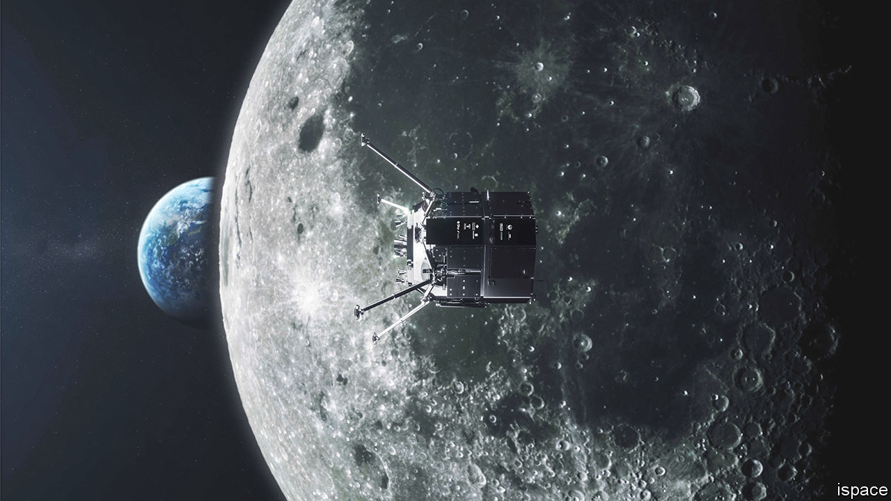
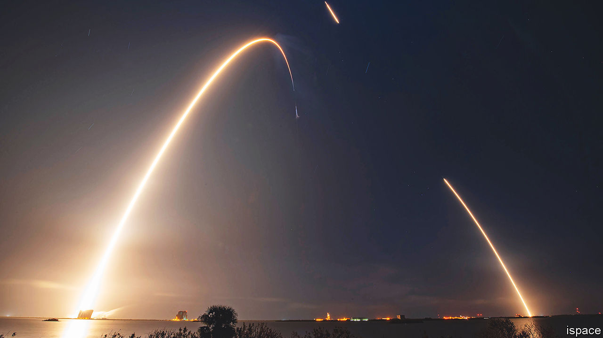

###### Private moonshots

# Which firm will win the new Moon race? 

##### Three rival missions raise tricky questions about who owns lunar resources 

 

> Jan 18th 2023 

IN recent years launching things into orbit has become the province of private enterprise. Of 178 successful missions in 2022, 90 were by companies (in many cases subcontracted by governments), and of those 61 were by one firm, SpaceX. When it comes to sending things to the Moon, however, governments retain a monopoly of success. , a privately paid for Israeli probe, ended up crashing into it in 2019. From the Apollo programme of the 1960s and 1970s to recent endeavours, such as China’s robotic rover, , all successful lunar landers, orbiters and rovers have been launched at taxpayers’ expense.

That seems likely to change in the next few weeks, when an uncrewed lander becomes the first commercial vehicle to touch down on the Moon. But which lander—and which company—will claim that accolade remains unclear. One vehicle, HAKUTO-R  operated by ispace, a Japanese firm, is already on its way and is scheduled to land in late April. But two others are preparing to launch shortly and could still get there first. There is, in other words, a new Moon race.

HAKUTO-R  was launched on December 11th on a SpaceX Falcon 9 rocket. Having climbed beyond the Moon’s orbit, it reaches its apogee of 1.4m kilometres on January 20th and will then fall back towards the Earth-Moon system. Its trajectory has been artfully designed so that it will pass close to the Moon and go into orbit around it. This “low energy” approach to arriving at the Moon takes longer, but uses less fuel, than a direct trajectory. As the Apollo missions showed, it is possible to get to the Moon in a few days, but it is then necessary to burn a lot of fuel to slow down and enter lunar orbit.

HAKUTO-R’s frugality saves weight, allowing for a larger payload. It is carrying two small rovers (one very small; the size of a baseball) and several cameras. But its slower voyage also means that it could be overtaken by two other landers intended to arrive on the lunar surface before its planned touchdown at the end of April.

The first of these is Nova-C, created by Intuitive Machines, a startup in Houston, Texas. Nova-C should launch in March—the announcement of an exact date is expected shortly—on a Falcon 9, and will take about six days to travel to the Moon and touch down. The company’s boss, Steve Altemus, says a direct trajectory minimises the radiation risk to the craft. Nova-C’s design uses technology from Project Morpheus, a programme operated by NASA, America’s space agency. This includes hazard-detection systems for landing, a novel engine design and the option for future landers to deploy a smaller vehicle that can “hop” by taking off and landing again. 

Nova-C will carry a selection of cameras and other instruments, including several from NASA, which has paid some of the mission’s cost as part of its “commercial lunar payload services” (CLPS) programme. This involves the agency acting as an “anchor tenant” on a commercial lander and buying several payload slots, rather than building and operating the vehicle itself. Intuitive Machines is contracted under CLPS to send three Nova-C landers to the Moon by the end of 2024. This is the first.

The third contender, the Peregrine lander built by Astrobotic Technology, in Pittsburgh, Pennsylvania, also operates under the CLPS programme. Like the HAKUTO-R vehicle, it has its origins in the Google Lunar X Prize, a contest that offered $20m to the first team to land a small rover on the Moon. (The contest was shut down in 2018 and the prize went unclaimed.) Peregrine is to be launched by the end of March on the inaugural flight of the Vulcan Centaur, a new rocket being developed by United Launch Alliance, an American launch provider. That adds an element of risk, and the launch of the Centaur has been repeatedly delayed. But Astrobotic is still in with a shot of getting to the Moon first.

Competition policy

Like its rivals, Peregrine will carry a small rover and a suite of instruments, several of them from NASA. Astrobotic has also developed a larger lander, Griffin, which will provide NASA with a resource-prospecting rover at a location near the lunar south pole, in another CLPS mission intended to take place in late 2024.

Who will win this new Moon race, and does it matter? “We do not believe this is a race to be first,” declares Hakamada Takeshi, founder and boss of ispace, who says he is “proud” that his craft is part of this group of “trailblazing” landers. Mr Altemus, of Intuitive Machines, says his firm’s missions “will have many firsts associated with them,” regardless of who wins this particular race. Both he and Mr Hakamada emphasise that their focus is to lay the groundwork for regular service to the Moon, opening up new opportunities for both governments and private companies. “The friendly competition only encourages more interest,” Mr Hakamada says. 

 


But what exactly are the opportunities being opened up? Being able to put things into orbit around Earth has made all sorts of things possible, from GPS navigation and satellite TV to better internet access and weather monitoring, as well as military uses. Access to the Moon has little obvious benefit beyond pure scientific research. Many of NASA’s CLPS payloads are intended to pave the way for the return of people to the Moon, for example by scouting possible landing sites or searching for resources (such as ice) for possible exploitation, notably as a source of fuel. But such “ resource extraction”, as it is known, opens a new can of worms, because there is no international agreement on the legal status of the Moon.

The Outer Space Treaty of 1967, space law’s foundational text, is showing its age. It dates back to the era when only governments had access to space. And it states that no claims of sovereignty can be made, on the Moon or elsewhere. Efforts to update the treaty to establish rules around resource extraction have run into the lunar regolith. America has refused to sign the Moon Agreement, adopted by 18 countries in 1984, whereas China and Russia have rejected America’s latest proposal, the Artemis accords of 2020.

The debate over who owns the Moon has been the subject of speculation since long before the space age. Lucian, a Greek satirist of the 2nd century AD, described a lunar voyage in which he claimed to meet Endymion, the king of the Moon. As the trio of landers now hoping to reach the lunar surface illustrate, cheap rockets and new technology mean that the previously fantastical question of the Moon’s ownership is about to get very real. These craft are the first representatives of a planned flotilla of lunar vehicles, both crewed and uncrewed, publicly and privately funded, that herald a new Moon rush. That brings possibilities, but it also raises tricky questions about the trajectory of humanity’s exploration and exploitation of space. ■


