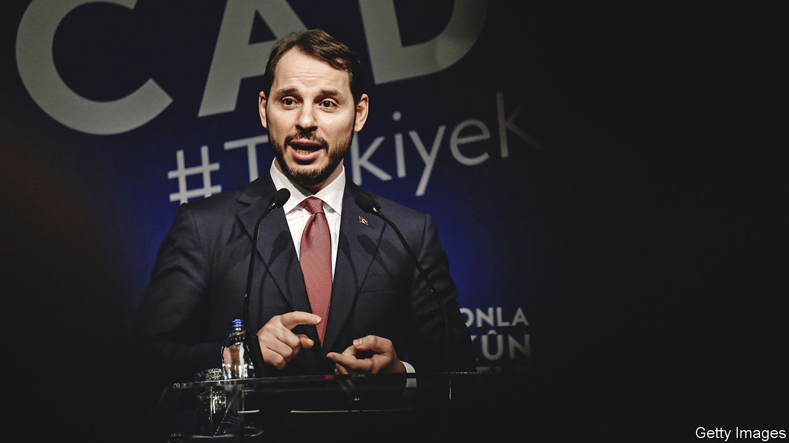

###### Friends and relations

# Recep Tayyip Erdogan’s relatives are becoming increasingly powerful 

##### A government over-reliant on kith and kin 

 

> Jan 16th 2023 

ASK opposition politicians and former Justice and Development (AK) officials who is responsible for Turkey’s new economic model, and one name, Berat Albayrak, comes up a lot. Mr Albayrak took over the finance ministry in mid-2018 after a few years as energy minister. By the time of his shock resignation two years later, the central bank’s foreign reserves and its credibility were depleted, and the lira had lost nearly half its value. Yet his legacy lives on. Insiders say the finance ministry is still staffed by Mr Albayrak’s allies. Nureddin Nebati, now the finance minister, is a close friend. On his watch, the country has resumed Mr Albayrak’s policy of cutting rates to stoke growth while selling foreign reserves to support the lira. 

Mr Albayrak is Mr Erdogan’s son-in-law. His career is emblematic of the Turkish leader’s tendency to dump technocrats and former AK heavyweights in favour of yes-men, opportunists and relatives. The coup attempt in 2016 was a turning-point, after which Mr Erdogan began to prize family and loyalty over expertise, says one former palace official. His coalition with MHP nationalists in parliament and with supporters who favour closer co-operation with Russia and China has sealed the fate of other former allies. 

Since 2016 Turkey’s leader has parted ways with Ali Babacan and Mehmet Simsek, architects of the boom of the 2000s, with Abdullah Gul, his predecessor as president, and with Ahmet Davutoglu, a former foreign and prime minister. Mr Davutoglu and Mr Babacan have set up two separate opposition parties, Gelecek (Future) and Deva (Democracy and Progress). Mr Davutoglu accuses Mr Albayrak of engineering his ousting. 

And he is just one of Mr Erdogan’s relatives. One of his sons, Bilal Erdogan, commands a following among AK officials and the party’s youth wing. Last year, the younger Mr Erdogan popped up at a summit in Tehran, alongside Ebrahim Raisi and Vladimir Putin, the Iranian and Russian presidents, and also accompanied his father on an official visit to Uzbekistan. The biggest star, however, is the president’s other son-in-law, Selcuk Bayraktar, the chief technology officer of Baykar, a defence company, and the face of Turkey’s successful drone programme. Though popular, even among opposition supporters, Mr Bayraktar has so far steered clear of politics. 

Mr Albayrak retains influence through his former ministry, some AK MPs and his older brother, Serhat, who runs Turkuvaz, a media group known for hyperventilating pro-government coverage. But his stock has taken a beating. Many Turks blame him for burning through $165bn in foreign reserves and for the state of the economy. The man once touted as Mr Erdogan’s possible successor could yet turn out to be a cause of the Turkish president’s undoing.■

