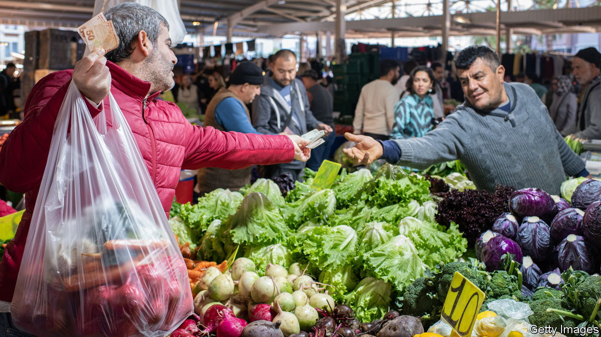
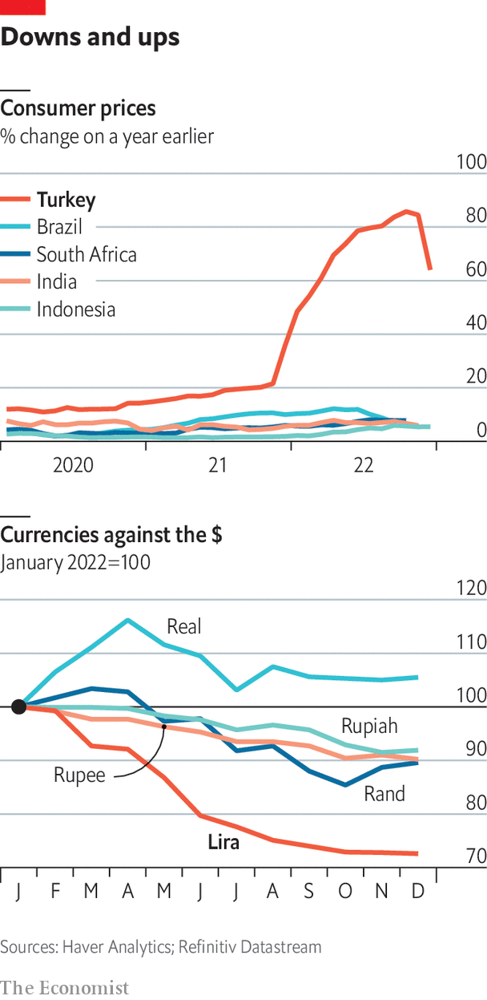

###### The economy

# The Turkish economy is in pressing need of reform and repair 

##### A bizarre monetary policy has left an economy in need of urgent repair 

 

> Jan 16th 2023 

A COUPLE OF years ago Mehmet Arslan, an architect in his late 30s, and his wife Mediha could afford to buy a flat in Istanbul. No longer. Mr Arslan’s salary rose by 30% in the past year, but inflation has been at least twice that. House prices have soared by even more, the result of higher construction costs, a low housing stock, and a spike in demand, mostly from Turks hoping to protect their savings from inflation. In the 12 months to October, property prices in Istanbul shot up by 241%, according to Endeksa, a consultancy. Mr Arslan’s salary now barely covers the rent and other living expenses. “We’ve given up hope of owning a house,” he says.

Their predicament reflects an economic experiment gone wrong. Mr Erdogan believes the remedy for inflation is to make money cheaper. Over the past year he has put his theory, which is about as popular among economists as alchemy among scientists, to the test. As other central banks have sought to rein in inflation by raising interest rates, Turkey’s has done the opposite. The bank has slashed its benchmark interest rate by fully ten percentage points since September 2021, to 9%. This has sustained growth, which may have been 5% last year, after 11% in 2021. But it has also pushed inflation to the second-highest level in the G20 after Argentina, and nearly 13 times the central bank’s ostensible target.

The government claims its policy makes Turkish goods more competitive by cutting labour costs, and adds that boosting domestic output will reduce inflation. Since inflation results from too much money chasing too few goods, the argument goes, prices will come down as home production takes off. Exports have indeed risen, by 13% in 2022 to a new record level. But because the economy depends heavily on raw materials from abroad, so have imports, by 34% in 2022. The current-account deficit has ballooned to $40bn (almost 5% of GDP). 

 


Financing such a large deficit is becoming harder. Put off by the government’s crazy monetary policy, as well as worries over corruption and the rule of law, Western investors are shunning Turkey. Foreign direct investment has dried up, as have portfolio inflows. To make up for the shortfall, Turkey has turned to new friends. The central bank has concluded $28bn of currency swaps with China, Qatar, South Korea and the United Arab Emirates. Russia has wired billions to Turkey to finance the construction, by a subsidiary of Rosatom, of a nuclear power plant. And Gazprom, another Russian energy giant, is poised to allow Turkey to delay payments for natural-gas imports. 

Some money comes in under the counter. In the first eight months of 2022, “errors and omissions” in the central bank’s accounts hit a surplus of $28bn. Much of that is believed to be gold and dollars from Russians who have fled to escape conscription and Western sanctions. Turkey has used foreign reserves to support the lira, a policy economists liken to selling the family silver. The bank is thought to have sold at least $100bn of reserves last year. This has relieved some market pressure, but only a little. The lira depreciated by almost another 30% against the dollar in 2022.

Unable to defy Mr Erdogan, the central bank and the banking watchdog tried to stave off another run on the lira through new regulations. One prevents companies with foreign-currency holdings from taking out new loans. Another forces banks deemed to have insufficient lira deposits to buy treasury bonds yielding 10%, far below inflation. These and other directives have stopped companies and ordinary Turks from dumping the lira in favour of the dollar. But they have also forced banks to start rationing credit. Many exporters and small enterprises are awash in cheap loans. Others are frozen out.

Critics say the new rules are diverting credit to those closest to the government. Opposition parties say they are a recipe for inefficiency and corruption. When loans are priced at 40 percentage points below inflation, even loss-making companies can thrive so long as they have access to credit. For a select few, getting rich has never been easier. In Ankara rumours swirl of palace officials mediating between favoured companies and state banks.

With credit no longer as readily available, Mr Erdogan has turned to spending to pep up the economy before the election. He has some headroom: at 40% of GDP, Turkey’s public debt is lower than in most EU countries. The government has offered early retirement to 2.3m workers, pledged 600bn lira for energy subsidies, and promised to build 500,000 new homes in five years. This month it raised the minimum wage by 55% and the pay of civil servants by 30%. Yet inflation will have wiped out most of these new handouts before June, one reason why Mr Erdogan intends to advance the election to May.

The earlier boom

All this makes a grim contrast to the early 2000s, when Mr Erdogan helped set off a boom. Reforms pushed through after an economic crisis in 2001 that catapulted AK to power had brought inflation down to single digits for the first time in decades. The economy took off. Annual real growth averaged 6.9% between 2002 and 2007 and 7.4% between 2010 and 2015. About a third of the population in 2002 lived below the World Bank’s poverty line for middle-income countries of $5.50 a day (in 2011 dollars). By 2018 that share had dropped to 8.5%. Foreign investment, which was never above $1bn a year before 2001, reached $22bn in 2007. Turkish builders and brands spread through Africa and the Middle East. The labour-force participation rate for women rose to 32.5% in 2021—still the lowest in the OECD club of mostly rich countries, but up from 25.3% in 2005.

Today, many of those gains are being lost. A decade ago, Mr Erdogan promised to make Turkey one of the world’s ten biggest economies by 2023, and to raise incomes per head from $11,300 to $25,000. The economy has since dropped from 17th to 19th, and average incomes have shrivelled to $9,600. Over the past two years, skyrocketing prices and falling real wages have pushed millions of Turks into poverty. Growth is no longer inclusive, as Mr Erdogan’s new economy creates more losers than winners, helping to wipe out a sizeable chunk of the middle class. 


A reckoning awaits whoever wins the election. The opposition’s solution is to restore the central bank’s independence and raise interest rates to rein in inflation. The harder question is what will happen if Mr Erdogan remains at the helm for another five years. He could concede to the laws of economic gravity, as in the past, allowing the central bank to raise rates. But there is reason to suspect he might refuse to do so. “As long as this brother of yours [ie, him] is in power, the interest will continue to fall,” he declared last October. Months beforehand, his finance minister had boasted of making the central bank’s policy rate irrelevant. Victory could encourage them to do away with conventional monetary policy altogether. 

Mr Erdogan has never put forth a serious economic theory to support his belief that high interest rates cause inflation, possibly because one does not exist. Some think his motives are religious. “If Turkey continues to go down this path, the banking sector will become based on Islamic finance,” says Arda Tunca, an economist. Mr Erdogan has not dispelled such suspicions, often invoking the Islamist injunction against usury as a reason to cut rates. More than anything, though, the new economy is an exercise in statism. Nearly all the president’s economic advisers are leftists and nationalists, says another economist. “They love the idea of being in control,” he says. “Bang your fist on the table, make the decision, and the market will go with us. This is economic illiteracy.”

Most analysts agree that this model cannot be sustained. Something will have to give. Currency swaps and cash from Russia may prop up the lira until the election, but not for much longer. Without a return to orthodoxy, another currency crisis and a fresh surge in inflation await. To stop the bleeding, the government might have to impose capital controls.

Economists still say Turkey’s long-term prospects are bright. The search for shorter supply chains means it can compete with China as a supply hub for Europe. An expanded customs union with the EU, held up by concerns over democracy, would help. Turkey boasts better infrastructure, including airports, bridges, hospitals and tunnels built during Mr Erdogan’s tenure, than many EU members. Turkish businesses and banks have weathered economic upheavals and barmy policy. The tech sector has great potential. Turkey boasts six unicorns (startups valued above $1bn), up from none three years ago. And demography works in its favour: by 2040 the population may by one estimate hit 100m. With the right policies, as well as strong institutions, the economy could break into the global top ten around the same time.

Yet economic mismanagement stands in the way. One effect is an accelerating brain drain. Turkey’s brightest minds, unable to afford a decent lifestyle at home, are eager to try their luck elsewhere. At least 30,000 software developers and 1,400 doctors are said to have emigrated in 2021. A survey last summer found that 82% of Turks between the ages of 17 and 30 would move abroad if they had the means. For young Turks, the long term cannot come soon enough.■

