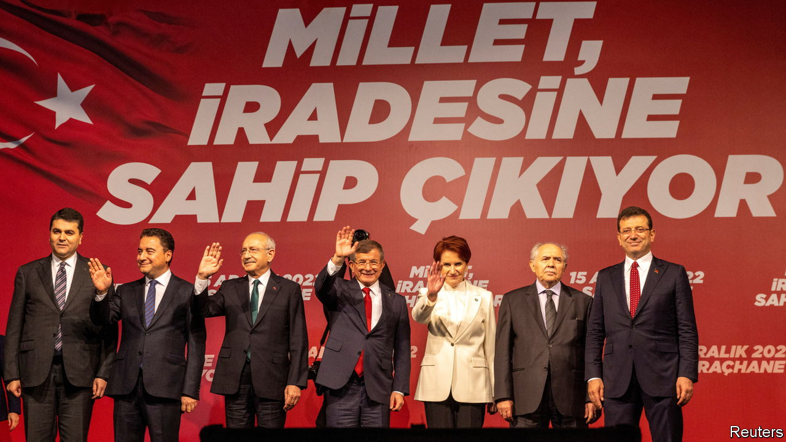
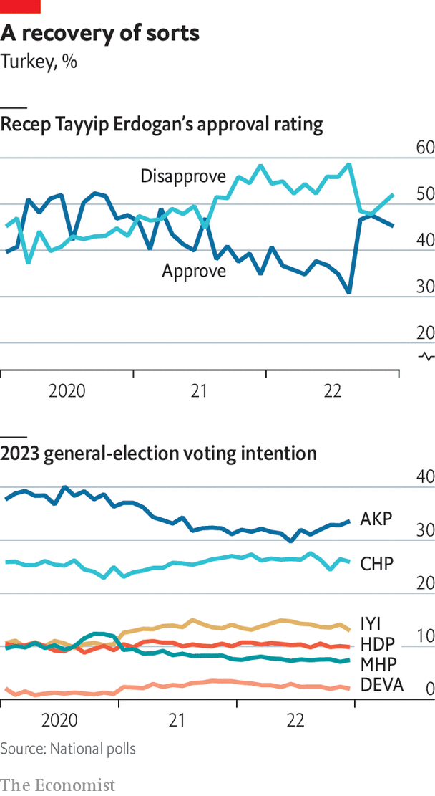

###### Politics

# The Turkish opposition faces big obstacles to winning the election 

##### They remain rudderless 

 

> Jan 16th 2023 

AT LEAST ON paper, Turkey’s opposition has it all worked out. In policy documents the opposition bloc, headed by the CHP and IYI, a centre-right party founded by defectors from the MHP nationalists, has plans for a post-Erdogan future. Constitutional changes will dismantle Mr Erdogan’s executive presidency, hand back to parliament the powers enjoyed by the palace, restore the post of prime minister, free the courts from political influence and lower from 7% to 3% the election threshold that keeps small parties out of parliament. With the central bank in charge of monetary policy again, zombie companies and government cronies cut off from free credit and inflation under control, foreign investment will gush in. “Turkey is going to be a target for a once-in-a-decade trade,” says Bilge Yilmaz, head of IYI’s economic team.

Most Turks, even AK voters who may be disappointed with the presidential system and the economy, could get behind such a programme. But the opposition is running out of momentum ahead of the summer election and is now seeing its lead over the AK-MHP alliance narrow. The parties face three major hurdles.

One is the media. Many of Turkey’s news channels, especially its public broadcasters, have turned into government PR agencies. The Kurdish HDP has been subjected to an informal media ban since 2017. Through censorship, fear of criminal prosecution and the blacklisting of certain pundits and journalists, the media have no power to hold Mr Erdogan to account.

 


The second is Turkey’s leader. Mr Erdogan has a history of using the central bank and the treasury to prime the economy ahead of elections, and the courts to harass opponents. He will not hesitate to do all of this again. 

The third obstacle is the opposition itself. With only months to go before the election, the Nation Alliance, as the opposition calls itself, has still not come up with a united candidate for the presidency. Mr Kilicdaroglu, the CHP chairman, seems determined to run, but is facing pushback from Meral Aksener, the leader of IYI. Cracks within the opposition are starting to show.

Mr Kilicdaroglu is a capable manager, and can take much credit for opposition success in the 2019 local elections, which saw AK mayoral candidates defeated in Turkey’s three largest cities. But he may also be unelectable. As a public speaker, he does not hold a candle to Mr Erdogan. The Turkish leader’s mass rallies have the atmosphere of a rock concert. Mr Kilicdaroglu’s can feel like a fireside lecture. Another concern is that the CHP leader hails from the Alevi religious minority, which faces prejudice from Sunni conservatives and the far right. 

Polls suggest two other CHP leaders, Mr Imamoglu, the Istanbul mayor, and Mansur Yavas, mayor of Ankara, would fare better. But to run for president each would have to resign and hand over the mayor’s office to AK, which controls the Ankara and Istanbul city councils. Each also has a weak spot. Mr Imamoglu’s star had already faded after his shock victory in 2019, and he has now been handed a ban from politics (though he will appeal). Mr Yavas, a hardline nationalist, may be too unpalatable to Kurdish voters.

A way with Kurds

There is a broader problem for the opposition alliance. Although it needs the votes of Turkey’s Kurds to have a shot at unseating Mr Erdogan, the opposition has given the HDP, the third-biggest group in parliament, the cold shoulder. The CHP continues to court the party’s support. But IYI nationalists, who see the HDP as merely the PKK’s political wing, refuse to sit at the same table. 

The HDP and its 6m voters, who have seen dozens of Kurdish mayors and parliamentarians thrown in prison since 2016, have no love for Mr Erdogan. But they are disappointed with the Nation Alliance, which shies away from speaking about Kurdish rights. “When it comes to solving the Kurdish problem, they behave timidly, spinelessly,” says Pervin Buldan, the HDP’s co-chair. “If they think differently from AK, they have to make it clear, otherwise they will be no different from the government.” The HDP has now said it will nominate its own presidential candidate.

Working out what the opposition stands for is also hard in foreign policy. CHP and IYI politicians claim to want to patch up relations with America and Europe, to turn Turkey back into a dependable NATO ally, to issue fewer threats and to reduce dependency on Russia. But they acknowledge that Turkey is too big and too independent, and exists in too tough a neighbourhood, to stay in lockstep with its Western partners. Disputes over issues like America’s support for the YPG, Europe’s attitude to the PKK, or sanctions on Russia and Iran, are bound to continue.

On too many issues,the opposition has given Mr Erdogan a blank cheque. The CHP backed the government’s gunboat diplomacy in the east Mediterranean, its offensives against Kurdish fighters in Syria, its intervention in Libya, its rapprochement with Russia and even its calamitous purchase of Russian S-400 missiles. As soon as Mr Erdogan invokes national security, the opposition falls into line. “Whenever there is criticism against one policy or another, the government accuses the opposition of taking sides with the terrorists,” says one CHP lawmaker. “You cannot express your views and opinions without being pushed into a corner.”

Given Mr Erdogan’s insistence that any dissent on matters of national security equals treason, a reluctance to criticise him is perhaps understandable. But it does not inspire confidence. “What the hell are they going to do that is very different?” asks Soli Ozel, an academic at Kadir Has University in Istanbul. “Either they don’t have the courage of their convictions, or they don’t have convictions.” Rather than find a strategy to win, the opposition seems merely to be waiting for Mr Erdogan and the AK party to lose. That may not be enough.■

