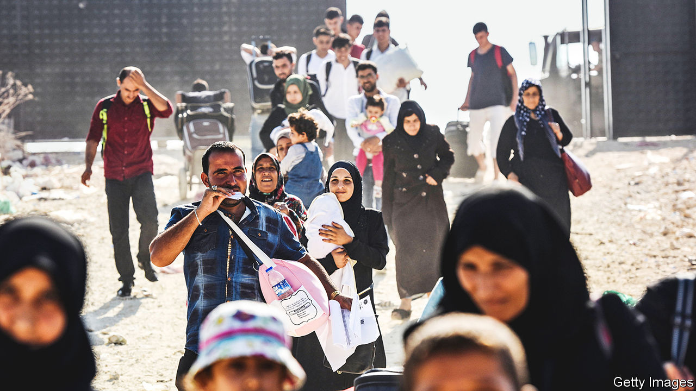
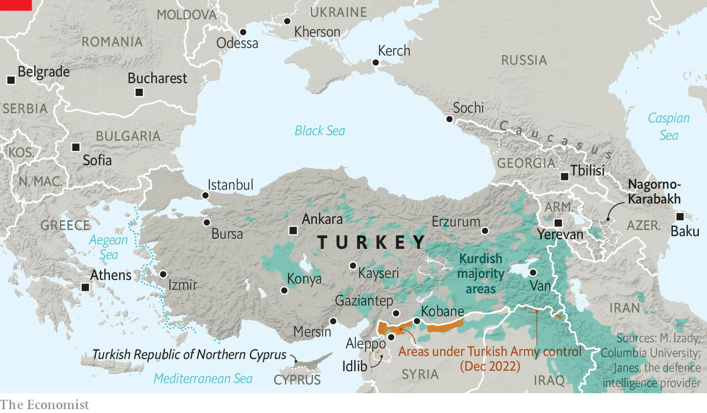

###### Syria

# The effects on Turkey of Syria’s civil war 

##### The war has redrawn Turkey’s political map 

 

> Jan 16th 2023 

ALTINDAG, A NORTHERN suburb of Ankara, still bears the scars of summer 2021, when local mobs rampaged through the streets, attacking Syrian businesses and homes after the killing of a Turkish teenager by a refugee. Police vehicles patrol the main intersections. Parts of the area feel deserted. In response to the violence, Turkey’s interior ministry decreed that the share of foreigners in some neighbourhoods, starting with Altindag, would be capped at 20% of the population. To drive this home, the authorities moved out 4,000 Syrians and tore down more than 300 buildings, presumably to ensure that refugees could not return. 

Tensions have calmed, but the Syrians who remain are uneasy. What they fear most is not renewed violence, but the risk of mass deportations. Yasin, a barber from Aleppo, says he was once arrested for smuggling cigarettes, and this could give the police an excuse to deport him to Syria. He would end up in prison, he says, because he fought against the regime. “Turkey welcomed us when practically every other Arab country refused,” he says. Now it is showing Syrians the door. 

Turkey is home to around 15m Kurds, a million Arabs, tens of thousands of Armenian descendants of those spared the genocide of 1915, and a small, dwindling population of Greeks and Jews. But the social and demographic changes the country has undergone because of the war in Syria are unprecedented. At the end of 2010, just before the start of the war, Turkey had only 10,000 refugees and asylum-seekers. Twelve years on, it hosts 3.6m Syrians, more than the rest of Europe put together, plus over a million migrants from Africa, Central Asia, the Middle East and Russia. Turkey is a country transformed. 

The gleaming, air-conditioned container cities that once dotted the border, where most newcomers sheltered in the first years of the war, are a thing of the past. Fewer than 50,000 refugees are now in the camps. The rest are scattered across cities, mostly in the south and west. Over 98% of Syrian workers are employed informally, reckons Saniye Dedeoglu, a professor at Abdullah Gul University in Kayseri, with no social security or other benefits. Most are paid less than Turks. Child labour, especially in agriculture, is widespread. But the refugees are better off than those elsewhere in the Middle East. Syrians have access to public health care and education, and a path to citizenship. Some 730,000 Syrian children, about 65% of the total, are in school. Around 220,000 refugees have been naturalised.

Western countries generally praise Turkey for doing a remarkable job for its Syrian refugees. Yet Turks do not want to hear it. Most say the country has become a safe house for foreigners whom Europe does not want to see within its own borders. And many want the refugees to go home. Violence of the kind seen in Altindag remains rare. But as the economy sputters and the election approaches, attitudes to the Syrians have hardened.

Opinion polls find that refugees are the third-most important issue for voters, behind only the economy and unemployment. Opposition politicians are stoking and feeding off the resentment. Kemal Kilicdaroglu, the head of the opposition Republican People’s Party (CHP), has pledged that, by restoring relations with the regime in Damascus, he will ensure that Syrians in Turkey return home “with drums and trumpets”. The government is not far behind. Mr Erdogan, whom many Syrians in Turkey consider a saviour, has begun placating his base by insisting he too wants most refugees gone. A few years ago, he proposed resettling them in areas of northern Syria formerly controlled by the YPG but now occupied by Turkish troops and their local proxies. Human-rights groups decried this as an attempt at demographic engineering. Turkey’s offensives in Syria, plus atrocities committed by its Arab proxies, have already displaced hundreds of thousands of Kurds. Turkey has also deported thousands of Syrians, mostly for alleged crimes, or for failing to register with the authorities. Many say they were forced or tricked into signing voluntary return forms by Turkish police. 


Public pressure has forced Mr Erdogan into a U-turn. No foreign leader has pursued regime change in Syria more doggedly than him. But last November Mr Erdogan said he was ready to bury the hatchet with Bashar al-Assad, the Syrian dictator. He wants voters to believe that rapprochement with Syria will pave the way for mass returns. Many Syrians in Turkey fear they may pay the price. They are likely to stay whoever wins the election. Deporting them would violate Turkish and international laws. And voluntary returns, at least on a mass scale, are a pipe dream. Studies find that only one in five refugees wants to go back.

Making nice with Syria’s regime could even trigger a fresh exodus. The areas of Syria now under Turkish control are home to some 4m people. Were Turkey to hand them back to Damascus, something Mr Assad will insist on as part of any normalisation agreement, many who fear his tyrannical rule might flee north. A Turkish withdrawal from Idlib province in Syria’s north-west, an opposition stronghold, would surely be followed by a renewed regime offensive, and another refugee wave.

Transatlantic woes

The war in Syria has upended Turkey’s relations with America, as well. Almost as soon as the fighting began, Mr Erdogan’s government threw its weight behind efforts to topple Mr Assad, offering rebels both weapons and a haven in Turkey. America initially backed this. But its appetite cooled, especially as foreign and Turkish jihadists poured into Syria through Turkey’s southern border, swelling the ranks of Islamic State (IS), a jihadist group. 

 


One turning-point was in 2013, when Barack Obama, despite previous talk of red lines, shied away from an armed response after Syrian troops had killed 1,500 people with chemical weapons. Another came a year later, when Mr Erdogan twiddled his thumbs as IS besieged Kobane, a Kurdish city in Syria within sight of the border. Only American air strikes and air drops saved the Kurds from a massacre. Turkey continued to call for Mr Assad to go, but America focused more on the war against IS, which it partly outsourced to the YPG. Turkey accused the Americans of doing nothing to stop Mr Assad. America accused Turkey of doing nothing to stop IS. 

With America’s help, the Kurds brought the IS caliphate crashing down. But their war, as well as violence unleashed by jihadists in Syria, spilled into Turkey. In 2015 IS fighters took their campaign of terror across the border. Over the next 19 months, their bombs across Turkey killed hundreds of people. Most of the victims were Kurds, or supporters of the Kurdish cause. Many perpetrators turned out to be homegrown Islamist radicals who had travelled to Syria to join IS and returned home. If their goal was to sow chaos in Turkey, they succeeded. Kurdish politicians claimed that Mr Erdogan was supporting IS against the Kurds in Syria. Some even accused his government of having a hand in the bombings at home. Days after one attack, two Turkish policemen were assassinated in a town near the Syrian border. A PKK offshoot claimed responsibility for what it called a revenge killing. 

Mr Erdogan responded to the assassination with more air strikes against PKK positions in northern Iraq. After years of calm, war returned to Turkey’s Kurdish south-east. PKK fighters, emboldened by their gains in Syria, holed up in cities across the region, booby-trapping homes and lobbing rockets at army vehicles. The government responded with a ruthless crackdown, sending tanks into urban centres. When the dust settled, some 2,000 people were dead, several districts lay in ruins, and Turkish politics had lurched further to the right. Mr Erdogan, who once bravely endorsed cultural rights for the Kurds and even opened negotiations with the PKK, courting Kurdish voters, had changed course, reinventing himself as a Turkish nationalist. 

Today, Mr Erdogan’s Syria policy has become a weakness, exposing him to voter backlash and to pressure from Russia, argues Gonul Tol, of the Middle East Institute, in a new book, “Erdogan’s War”. But the war has also allowed him to consolidate his power. Mr Erdogan has presided over the arrests of thousands of activists and politicians from the Kurdish HDP party, including the jailing of its former leader, Selahattin Demirtas. His war against the PKK in Syria and northern Iraq has helped him silence dissent and bulldoze his way to one-man rule. 

Mr Erdogan’s hawkish turn and his decision to go after the HDP won him new friends in the MHP. The coup attempt in 2016 sealed their alliance. Having purged supporters of the Islamist Gulen movement, whom he blamed for the coup, and other opponents from the army and the police, Mr Erdogan then handed the MHP nationalist party the keys to parts of the security apparatus. The MHP returned him the keys to an executive presidency. A year later the party, headed by Devlet Bahceli, a former leader of the Grey Wolves, a right-wing group with a history of political violence, backed a referendum giving Turkey’s leader sweeping new powers. Mr Erdogan prevailed, albeit by a slim margin. The war in Syria had, in effect, redrawn Turkey’s political map.■

