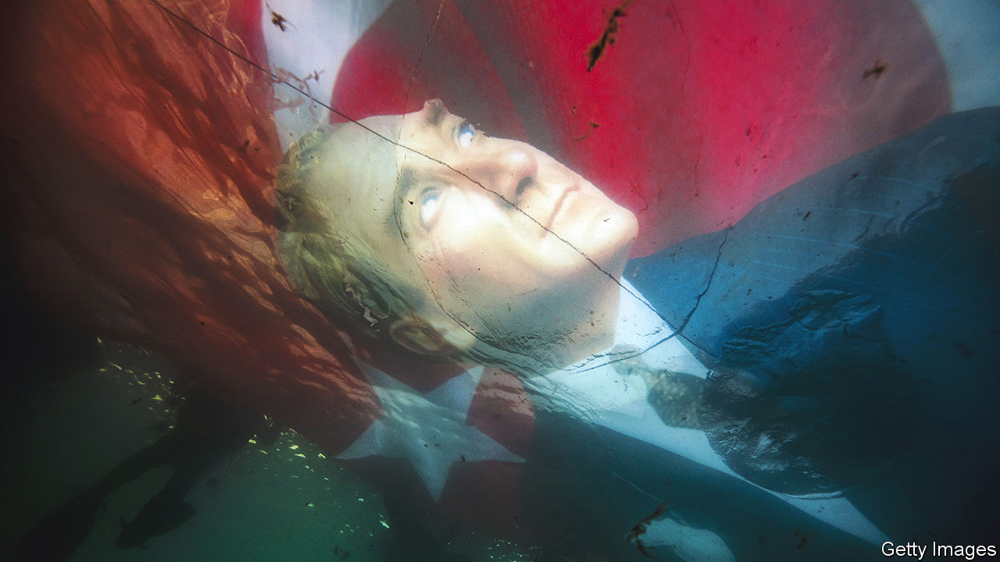
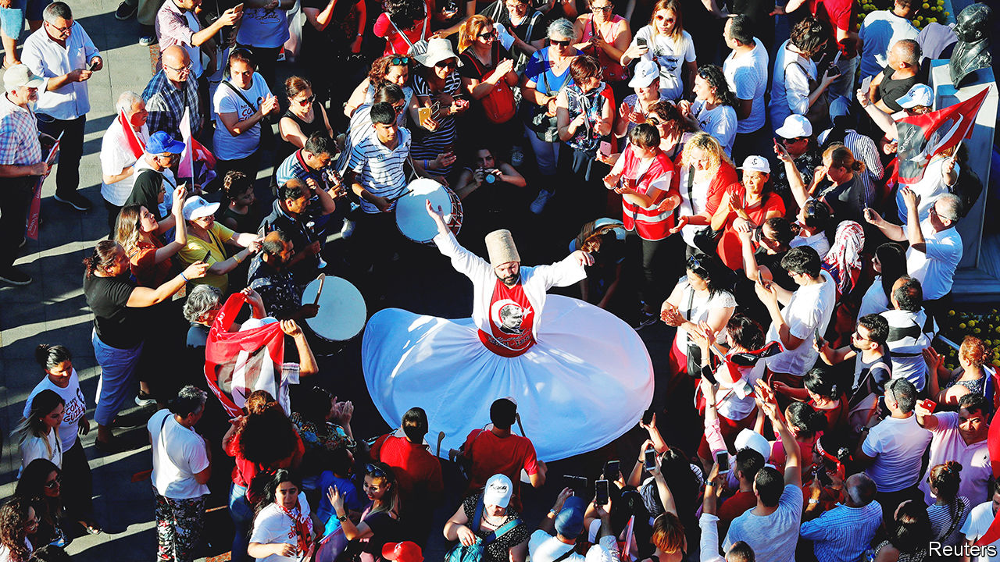

###### Turkey

# Turkey faces a crucial election this summer 

##### Approaching its centenary, the country prepares for an election that could decide its future as a democracy, argues Piotr Zalewski 

 

> Jan 16th 2023 

THERE IS NO getting around the Kulliye presidential palace on the edge of Ankara, Turkey’s capital, on foot. Black minivans pick up visitors, whisk them through a tunnel and underground car park, and deposit them in one wing. Above ground, endless carpeted corridors connect 1,100 rooms spread over 300,000 square metres of space, four times the size of Buckingham Palace. A mosque towers over the grounds. Security guards, sporting beige fatigues and expertly trimmed moustaches, zoom around in armoured vehicles. Foreign dignitaries calling on President Recep Tayyip Erdogan are welcomed by 16 costumed warriors, each representing a Turkish empire from the Huns to the Ottomans. 

Closer to the city centre is an unassuming pink building, the Cankaya mansion, which was the residence of Kemal Ataturk, modern Turkey’s founder, and his successors for over 90 years. With one exception. In late 2014, months after being elected president for the first time, Mr Erdogan moved into the newly (and, says a court ruling, illegally) built Kulliye. Cankaya then served two prime ministers before Mr Erdogan made the job redundant. The mansion has become a symbol of a bygone era. 

Later this year Turks will celebrate the centenary of the day when Ataturk, having fended off an invading Greek army, as well as the British, French and Italians, proclaimed the Turkish Republic and became its first president. What Ataturk would have made of today’s Turkey is a fascinating question. He would surely be moved to see his portrait in every office and classroom, his signature emblazoned on sweatshirts and the country stand to attention every November 10th, the day of his death nearly 85 years ago. He would have been awed by its transformation from a hobbling agrarian economy into a regional powerhouse and the most populous country in continental Europe (Turkey’s population of 85m has overtaken Germany’s.)

But he would recognise little else. For almost 20 years Mr Erdogan, who first became prime minister in March 2003, and then president in August 2014, has been the country’s all-dominant figure. Initial fears of his Islamist agenda may have proved exaggerated, but his autocratic bent has become ever clearer. Turkey now has an executive presidency, which Mr Erdogan has exploited to combine the roles of president, prime minister, party chairman and de facto central-bank governor. The army, once a big political actor, has been tamed. Mr Erdogan has a new foreign policy that prizes autonomy from the West and favours armed intervention, and a new economic model that treats low interest rates as the cure for, not a cause of, galloping inflation. Turkey even has a new name. In May 2022 Mr Erdogan decreed that it should be known in English as Türkiye, its Turkish name.

The new Turkey Mr Erdogan once promised, which he plans to govern for the foreseeable future, is hardly a finished product. But many of its building blocks are in place. The Kulliye has become its symbol and nerve centre. Over the past ten years power has ebbed out of other state institutions and into the hands of the president and his courtiers, friends and family. Mr Erdogan has the last word on almost all public policy. As prime minister, he restored the central bank’s independence. As president, he has made it in effect into a government agency. The foreign ministry, once a bastion of the secular establishment, is now little more than his foreign-policy secretariat. 

A similar fate has befallen the ruling Justice and Development (AK) party. “The AK party was never and will never be a one-man party,” Mr Erdogan said in 2014. This was hardly true then and is manifestly false today. There are divisions and competing factions within AK, but no room for dissent. The party is entirely beholden to Mr Erdogan, as is a big part of its base. “If the president says this is blue”, says an AK MP, holding up a white napkin, “then people will say it is blue.” 

Checks and imbalances

Constraints do exist on Mr Erdogan’s power. One is the economy. Reckless interest-rate cuts have sustained high growth, but at huge cost. Inflation peaked at 85% last autumn before easing to 64% in December, according to official measures. Unofficial ones put it much higher. New government handouts and large increases in the minimum wage, meant to offset plummeting living standards, have put additional upward pressure on prices. New rules forcing banks to buy government bonds and companies to borrow only in lira have also raised fears of a credit crunch. 

A second is the ballot box. Parliamentary and presidential elections were due in June, but Mr Erdogan plans to bring them forward to May 14th. His latest spending spree has earned Mr Erdogan and AK a reprieve, as his poll rating recovers. The share of Turks who disapprove of the government’s handling of the economy dipped from 75% in July to 62% in November. But polls suggest that the Turkish leader is still likely to lose to any of the opposition’s chief presidential contenders, while AK and its coalition partner, the Nationalist Movement Party (MHP), are on course to lose their parliamentary majority. By the time Turkey formally turns 100 on October 29th, Mr Erdogan may be out of office.

 


Betting against Turkey’s leader is a dangerous business, however. Mr Erdogan has won ten parliamentary and local elections, two presidential ones and three referendums. He has survived mass protests, corruption scandals, a turf war with the powerful Gulenist movement and a violent attempted coup. He has done so through repression and censorship, but also through ruthless pragmatism, solid political instincts and his own charisma. No politician in Turkey can command a room or a crowd like Mr Erdogan, and none can campaign as relentlessly. 

Mr Erdogan has also ensured that elections are fought on his terms. The president and the AK party commandeer state resources for their campaigns and exploit the media as public propaganda. Only about a tenth of news outlets in Turkey qualify as independent or opposition-leaning, and even these often steer clear of official red lines such as government corruption or criticism of Mr Erdogan. The internet, once a refuge for critical voices, is now anything but. Most evidence levelled against the 200,000 people investigated on charges of “insulting the president” since 2014, an offence liable to up to four years in prison, consists of social-media posts. A law criminalising the spread of “fake news” has given the government new powers to police Twitter or Facebook.

Mr Erdogan has also learned to extract political dividends from the use of armed force. Turkey has launched four military operations in northern Syria, mostly against Kurdish insurgents whom the government labels terrorists (but America considers allies against Islamic State). After a deadly bomb attack in Istanbul in early November, which the government immediately blamed on the Kurdistan Workers’ Party (PKK), the armed Kurdish separatist group, and the People’s Defence Units (YPG), the group’s Syrian franchise, a fifth offensive may now be in the offing. 

Finally, Mr Erdogan has used the courts to stack the decks in his favour. Over three years ago, he tried to rob an opposition leader, Ekrem Imamoglu, of victory in Istanbul’s mayoral election. In December Mr Imamoglu, who could be the strongest candidate to oppose Mr Erdogan, was given a prison sentence and a ban from politics, though both may be overturned on appeal. The Kurdish People’s Democratic Party (HDP), many of whose leaders have been locked up for years, may also be closed.

This special report argues that Turkey’s democracy, though damaged, endures, making the outcome of the election no foregone conclusion. But the stakes could not be higher. Another five years of “Erdoganismo” would push the country more overtly towards autocracy. Already, the patronage networks over which Mr Erdogan presides are so entrenched that Turks fear the government might go to extremes to hold on to power. They also struggle, after two decades of Mr Erdogan’s rule, to picture what a country without him might look like. Many of the changes Mr Erdogan has made, especially in foreign and security policy, will stay.

What happens in Turkey matters to the world, and especially to Europe. The war in Ukraine has highlighted Turkey’s importance to NATO and to Black Sea security, despite the country’s ambiguous relationship with Russia. For the European Union, Turkey is a first line of defence, not always a dependable one, against Islamist extremism and illegal immigration. Turkey’s comatose membership talks with the EU are encouraging European governments to play down the country’s human-rights record and focus on issues like border security and intelligence co-operation instead. 

Turkey’s reach extends to the Caucasus and Central Asia, where Russia’s influence has begun to wane, but also to Africa, the Middle East and the western Balkans. In the past year, Turkey has mended fences with Israel, Saudi Arabia and the United Arab Emirates, and it seems close to reconciling with Egypt and Syria. Criss-crossed by pipelines bringing oil and natural gas from Russia, the Middle East and Central Asia to Europe, Turkey has aspirations to be a transit country for the wealth of hydrocarbons buried under the east Mediterranean. 

In one decade Turkey has seen record numbers of refugees, terror attacks, an attempted coup, a state of emergency and covid-19. Now new problems loom. The most urgent is the economy.■

