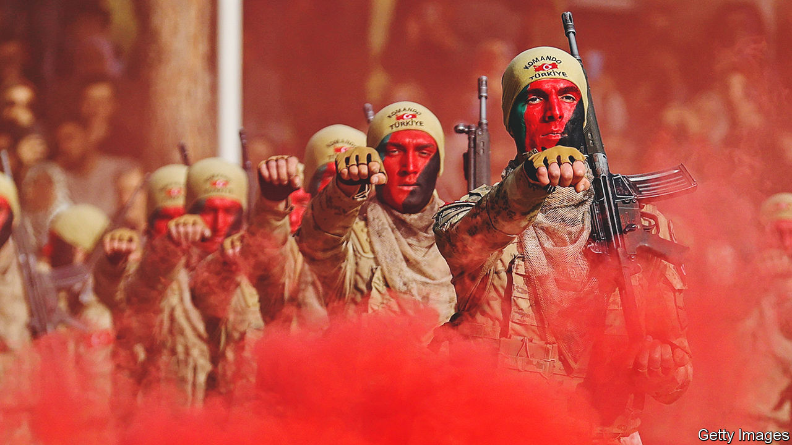
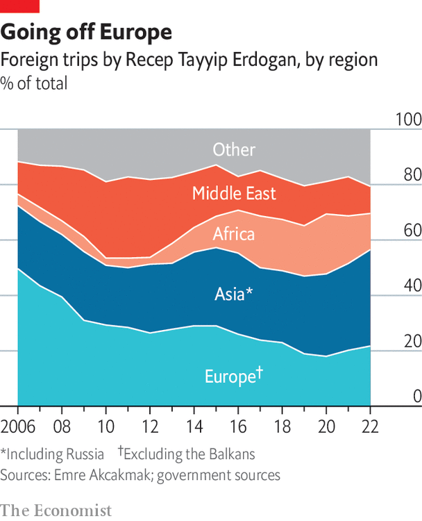

###### Foreign policy

# Turkey has a newly confrontational foreign policy 

##### The country has turned into an awkward ally for the West 

 

> Jan 16th 2023 

“TURKEY WILL strive for peace and durable stability in the region alongside the US, her strategic partner and ally for more than half a century,” a Turkish leader once wrote in an American newspaper. “We are determined to maintain our close co-operation with the US.” Those words seem from another era. They are, though not such a distant one. The year was 2003, Turkey’s parliament had rejected an American request to use the country as a launchpad for its invasion of Iraq, and the writer, keen to reassure his NATO ally, was the new prime minister, Recep Tayyip Erdogan. 

Turkey’s president strikes a different tone when he speaks of America and the West today. Mr Erdogan accuses America of supporting terrorism by arming the PKK, which Turkey considers its mortal enemy. Some of his associates suspect America of having a hand in the coup attempt of 2016. Similar recriminations are levelled at the EU, which Mr Erdogan says was never sincere about Turkey’s membership aspirations, has become a haven for terrorists and is envious of Turkey’s progress.

Policy wonks and diplomats accuse Turkey of abandoning the West. Turkish officials claim they are the ones being abandoned. Turkey no longer sees itself as on Europe’s periphery, or as part of a single zone of influence, but as a country with its own centre of gravity. Membership of NATO gives it the best insurance policy around. NATO cannot afford to lose Turkey either. But there is a sense in Ankara that the “new Turkey” is strong enough to ignore or test such old alliances, sometimes to breaking-point, to forge new ones and to act autonomously. “Turkey is trying to conduct a 360° foreign policy,” says Ibrahim Kalin, a presidential adviser. “And we don’t want to favour any particular issue or actor or region or country over others.” 


Mr Erdogan is even more uncompromising over national security. “We do not need to ask permission from anyone,” he said in November, warning of a new offensive in Syria, “and we will not be held accountable to anyone.” Foreign policy in Turkey, once the purview of generals and professional diplomats, has become a domestic issue and part of identity politics. Bashing the West goes down well with religious voters, nationalists and even many leftists. So does the idea that Turkey is destined to be a world power. Look at the inroads Turkey has made in Africa and Central Asia over the past decade, the popularity of its soap operas, the success of Turkish Airlines and the number of countries queuing up to buy Turkish drones, and you might think it is one already.

Many in Mr Erdogan’s inner circle celebrate the idea that the West is in decline and a new international order is taking shape. This conviction has become one of the pillars of Turkey’s new foreign policy, says Galip Dalay of Chatham House, a think-tank. A case in point is Turkey’s ongoing romance with Russia. Modern Turkey’s pursuit of good relations with Russia is nothing new. Ataturk reached out to the Bolsheviks for help in his war against Greece. They gave him weapons, money and military advisers. Even during the cold war, governments in Ankara co-operated with the Soviet Union; Russian engineers built some of Turkey’s biggest industrial plants. But the relationship under AK is stronger than at any point since the foundation of the republic.

Turkey depends on Russia for billions of dollars in tourism revenue, and more than 40% of its gas imports. The two regional powers have locked horns in the Caucasus and Libya. But for Turkey, it is in Syria that relations with Russia matter most. The buffer zones Turkey has created in Syria’s north would not have been possible without Russian approval. Although weakened by its war in Ukraine, Russia can still cause havoc for Turkey in Syria. A regime offensive against Idlib, backed by Moscow, could send hundreds of thousands of new refugees to Turkey’s borders. 

 


Hopes that war in Ukraine would prompt Turkey to distance itself from Russia have proved misplaced. The relationship has survived bigger tests. One was the assassination of the Russian ambassador to Turkey in 2016, which both countries called a provocation. Another came in early 2020, when a Russian airstrike in Idlib killed 34 Turkish soldiers. Turkey struck back, but only against Syrian forces, and never blamed Russia. “Syria is much more central to Turkish security,” says Dimitar Bechev, a visiting scholar at Carnegie Europe. “Once Russia inserted itself there, the stakes for Turkey were much higher than anything happening in Ukraine.”

Officials in Ankara say good relations with Russia allow Turkey to act as a mediator in Ukraine. Mr Erdogan has done a good job getting Russia to ease its naval blockade of Ukraine, allowing the resumption of grain exports by sea and negotiating prisoner swaps. But mediation has offered Turkey a cover for business dealings and for refusing to align with Western sanctions. In Ukraine Mr Erdogan takes credit for giving a besieged country the drones that helped save Kyiv and for closing access to the Black Sea for Russian warships. In Brussels and Washington he expects praise for his efforts. Yet in Moscow he reaps the rewards of acting as Vladimir Putin’s friend, and at home he takes credit for Turkey’s thriving business with Russia. Exports to Russia hit $7.6bn last year, up by 45% on 2021. 

Western leaders have come to terms with Turkey’s refusal to take sides over Ukraine. A wider concern is that its view of Russia does not appear to have changed during the war. For many in Europe, the invasion was a wake-up call. Not in Turkey. “We do not see Russia as a threat,” Mr Kalin says. “The fact that we are a NATO member, that we are part of the Western alliance doesn’t prevent us from having a good relationship.” Perhaps with the exception of Viktor Orban of Hungary, nobody else in NATO agrees.

A fickle ally

Turkey is important to NATO. Turkish soldiers have joined missions in Afghanistan, the Baltics, Bosnia, Kosovo and Macedonia. In 1950, two years before it joined the alliance, Turkey sent 15,000 troops to fight alongside American soldiers in Korea. But the country is often now a spoiler. It is threatening to block NATO accession for Finland and Sweden. Mr Erdogan wants to strong-arm both countries into deporting PKK suspects and Gulenists. Turkey may also hope its veto threat can extract concessions from America’s Congress, whose members have threatened to block the sale of new F-16 fighter jets. America has banned Turkey from buying F-35 stealth bombers, after Mr Erdogan went ahead with the purchase of an S-400 air-defence system from Russia.

Turkey also threatens to attack a fellow NATO member. A dispute over maritime rights with Greece, more suited to lawyers and bureaucrats, has drawn in politicians and generals. “We may suddenly come one night,” Mr Erdogan warned last October, suggesting a Turkish operation against one of the Greek islands that hug Turkey’s southern and western coast. He has even hinted that Turkey is capable of striking Athens with ballistic missiles. 

From the war in Ukraine to those in Syria and in Nagorno-Karabakh, to relations with China, to sanctions against Iran, to press freedoms, human rights and terrorism, the list of issues where Turkey and its Western allies no longer see eye to eye is long. The institutional links, including membership in NATO and the Council of Europe, and the customs union with the EU, are intact. But in policies, a decoupling is under way. In 2008 Turkey aligned itself with 88% of the EU’s foreign-policy decisions and declarations. By 2016 that share had fallen by half to 44%. Last year it was only 7%. 

Neither America nor the EU has come up with a persuasive strategy for their engagement with Turkey. Under Joe Biden, America has taken an ad hoc approach, stepping in only when Turkey and Greece risk coming to blows, or when Mr Erdogan prepares a new offensive in Syria. Mr Biden has been frosty towards Turkey’s leader, seemingly waiting until the summer election to work out how best to deal with him or his successor. “The view of the White House,” says Soner Cagaptay, of the Washington Institute for Near East Policy, “is that when you engage with Erdogan you end up with drama.”

The EU’s relations with Turkey have been in limbo for several years. Turkey’s accession talks with the EU were dying on the vine almost as soon as they started in 2005. German and French leaders, who were once merely lukewarm to the idea of Turkish membership, now seem to be openly hostile to it. The EU’s decision to admit a divided Cyprus in 2004 and the breakdown of peace talks between the internationally recognised Greek-Cypriot government in the south and the Turkish-occupied north have made matters worse. Mr Erdogan, who once backed the island’s unification, now favours partition. Many Cypriots fear Turkey may end up annexing the north. 

Talks on reform of the customs union with the EU have stalled. An upgrade to extend it to agriculture, procurement and services could boost Turkey’s GDP by as much as 1.8%. But Turkey’s descent into autocracy and the deadlock over Cyprus make EU politicians reluctant to agree. The relationship centres instead on a deal under which the EU has paid Turkey $6bn to keep refugees and migrants on its side of the Aegean Sea. The EU and Turkey are keeping the membership talks on life support at best. The relationship needs an alternative track. “We have no strategic vision towards Turkey,” despairs a European diplomat. 

The marriage between Turkey and the West is increasingly unhappy. But it will surely endure. The champions of the “new Turkey’s” eastern pivot might have a destination in mind, but also no means to get there. Turkey’s business and trade links with China and Russia pale in comparison with those with Europe. The EU is Turkey’s main trade partner and source of foreign investment, just as America is Turkey’s biggest supplier of weapons. The Shanghai Co-operation Organisation, the loose group of Asian countries headed by China, India and Russia which Mr Erdogan plans to join, might be a nice venue in which to rub shoulders with Mr Putin and discuss Western decline. But it is a poor alternative to improved relations with the West.■

