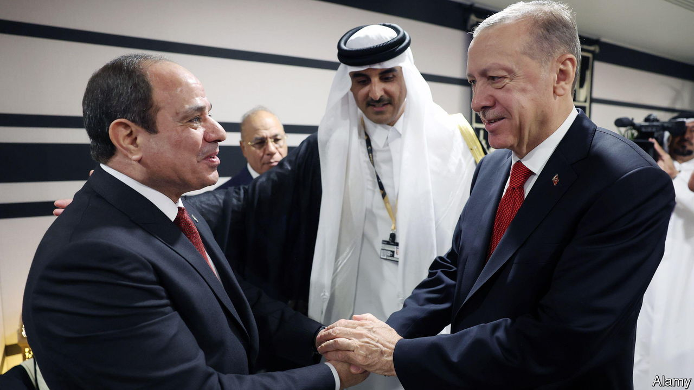

###### Political Islam

# Turkey has given up promoting political Islam abroad 

##### Recep Tayyip Erdogan is mending fences with his Arab neighbours 

 

> Jan 16th 2023 

MANGO JUICE is delicious. So AK officials had no reason to complain when Mr Erdogan began serving it in his palace last year. But they may have been baffled to hear that it was a present from Egypt’s president, Abdel Fattah el-Sisi. For Mr Erdogan and Mr Sisi had not been on speaking terms for a decade. As an avowed Islamist, Mr Erdogan had thrown his full weight behind the Muslim Brotherhood, which took power in Egypt in 2011 after protests toppled Hosni Mubarak. When Mr Sisi seized power two years later, in a coup that killed hundreds of protesters, Turkey’s leader called him a tyrant, held rallies in support of Muhammad Morsi, the deposed Egyptian president, and gave other Brotherhood leaders a haven. 

Political Islam has made fewer inroads in Turkey than Mr Erdogan might have wished. But the Arab spring that shook the Middle East in 2011 saw the country emerge as one of its main exporters. Besides Egypt, Turkey backed Brotherhood parties and other Islamist groups in Libya, Syria and Tunisia. Mr Erdogan and Ahmet Davutoglu, then his foreign minister, wanted to expedite the collapse of the old regional order and cement Turkey’s influence over the new one. But that policy ran out of steam in Egypt when Mr Sisi took over, and in Syria two years later when Russia intervened to prop up the Assad regime. Now it has gone into reverse. In November Mr Erdogan met Mr Sisi for the first time, on the sidelines of the World Cup in Qatar. Months of talks between Turkish and Egyptian spooks and diplomats paved the way for the meeting. 

Mr Erdogan also mended fences with other regional powers. He has proclaimed a “new era” in relations with Saudi Arabia, whose crown prince, Muhammad bin Salman, visited Turkey last summer. The crown prince is believed to have ordered the murder in 2018 of Jamal Khashoggi, a dissident journalist, in the Saudi consulate in Istanbul. Mr Erdogan has inked new trade deals with the UAE, which with Egypt waged a proxy war against Turkey in Libya, and which officials accuse of supporting the abortive Turkish coup in 2016. To the chagrin of his Islamist supporters, Mr Erdogan has also patched up relations with Israel, which broke down after Israeli commandos killed ten people aboard a Turkish ship in 2010. He has even reached out to Bashar al-Assad in Syria. 

Turkey’s motives are varied. Mr Erdogan needs Gulf money to support the lira, at least until the election. The UAE has pledged to invest $10bn in Turkey and agreed to a $5bn currency swap, boosting depleted dollar reserves. Saudi Arabia is in talks to park another $5bn in Turkey’s central bank. Turkey also hopes to weaken Israel’s and Egypt’s support for Greece in the east Mediterranean, and to position itself as a transit route for natural-gas exports. 

But the reset has come at a cost to Turkey’s Islamist credentials. To clear the way for reconciliation with Saudi Arabia, Turkey has dropped any investigation into the Khashoggi murder, ensuring impunity for the killers. It has ordered news outlets launched by Brotherhood exiles not to criticise the Sisi regime. At least one opposition channel has closed as a result. Damascus will also demand a price for normalisation. A deal with Mr Assad would force Turkey to sever its links with the armed opposition, says Dareen Khalifa, an analyst with the Crisis Group think-tank. Political Islam looks to be a spent force in Turkish foreign policy, at least as far as the Arab world is concerned.■

