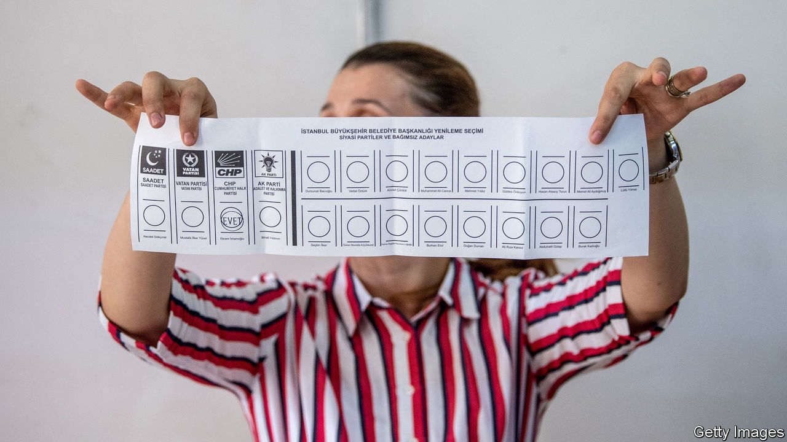

###### The future

# Turkey is still just a democracy, but it is not certain to remain that way 

##### The election will test the country’s democratic credentials 

 

> Jan 16th 2023 

IN SPRING 2019 Ekrem Imamoglu won the Istanbul mayoral election, defeating one of AK’s main leaders, Binali Yildirim, a former prime minister. He did so not just once, but twice. On election night, just as Mr Imamoglu was poised to overtake his rival, the state news agency suddenly stopped updating the vote tally. Overnight large banners proclaiming Mr Yildirim’s victory went up across Istanbul. But by the time the vote count had ended, Mr Imamoglu was ahead by over 13,000 votes. 

His victory proved short-lived, however. AK appealed, claiming irregularities, leading Turkey’s election board to cancel the vote and order a rerun. Two months later, Mr Imamoglu won again, this time by a resounding 800,000 votes. 

Optimists see this episode as evidence of the resilience of Turkey’s democracy. Pessimists say that a government capable of such shenanigans in a local contest could go to even greater extremes to win an election in which Mr Erdogan’s career and the future of his new Turkey may be on the line. 

So far, the pessimists seem to be winning the argument. On December 14th, in what many critics saw as a verdict handed directly from Mr Erdogan’s palace, a court in Istanbul sentenced Mr Imamoglu to over two years in prison and banned him from politics, pending an appeal. His crime was to have referred to the election officials who had briefly stripped him of victory in Istanbul as “idiots”. Earlier this month the constitutional court similarly froze the bank accounts of the Kurdish HDP party; the party may yet be banned altogether. 

Perhaps a glut of new spending to support living standards, his enduring popularity with conservatives and nationalists, and a successful electoral campaign, along with the usual censorship, would have been enough to ensure victory for Mr Erdogan, at least in the presidential election. But Turkey’s strongman seems determined not to take any chances. Governments come and go; regimes hold on for dear life. The system that Mr Erdogan controls already resembles the second. 

A presidential dilemma

A big problem with charismatic strongmen, especially those like Mr Erdogan who inspire genuine allegiance, is that the regimes they build lose their purpose once their leaders leave office. Turkey’s leader has no anointed successor, and no one within AK or the MHP comes close to being able to walk in his shoes. The person mandated to replace him as president, in case of his death or indisposition, is practically unknown to the rest of the world, and even to many Turks. He is Fuat Oktay, the vice-president. 

Mr Erdogan has persuaded himself that he is indispensable. Many of his supporters reckon the economic, religious and security gains they have seen over the past two decades depend on his staying in power. The people who stand to lose most from the end of the Erdogan era would not be ordinary voters, but thousands of senior officials, propagandists and businessmen whose careers and personal fortunes depend on the patronage networks over which Turkey’s leader presides. It is they who may do most to encourage Mr Erdogan, assuming he needs encouragement, to do whatever it takes to win. 

Yet Turkey is not a dictatorship. Elections are more like a football match in which one team has eleven players, the other eight, and the referee generally sides with the bigger team, says Berk Esen, an academic at Sabanci University. But the smaller team, assuming it has the better players and the right strategy, can still play to win, he suggests. 

Despite the camaraderie between Mr Erdogan and Mr Putin, and the Turk’s tendency to borrow from the Russian’s playbook, Turkey is not Russia. Mr Erdogan knows that his power depends not only on his ability to lock up his critics and to control public bodies, but also on the idea that he can be unseated through the ballot box. He may have dismantled many of the country’s democratic institutions, but he has also upheld the belief that elections can make a difference. The majority of Turks could not agree more: witness the impressive turnouts of over 80% in recent local and general elections.

Elections in Turkey have often been flawed, but so far never stolen outright. They are voters’ last remaining valve for dissent against their president. Closing it could trigger economic chaos and social unrest. The next few months will be crucial for what remains of Turkey’s democracy.■

