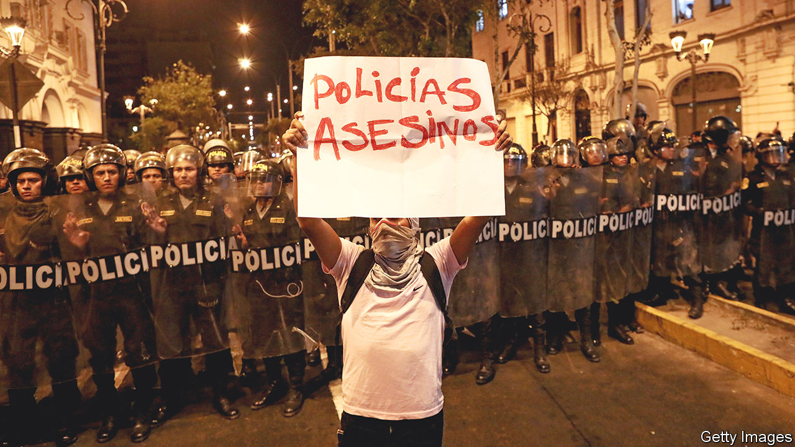

###### Ever more polarised

# Peru’s political chaos looks likely to persist 

##### At least 50 protesters are dead after weeks of clashes 

 

> Jan 19th 2023 

Peru has had six presidents in the past five years. Next year it may have a seventh. The latest resident of the presidential palace, Dina Boluarte, took office last month after Pedro Castillo, her predecessor, bungled a coup attempt. She did so in accordance with the constitution, backed by the institutions of state. She was, after all, Mr Castillo’s vice-president, elected to take his place in such circumstances. But in the eyes of many Peruvians her presidency is illegitimate. 

Since Ms Boluarte took office, the country has been shaken by protesters demanding her resignation, fresh elections and a new constitution. Indigenous and rural people, among whom Mr Castillo campaigned with promises to upend the status quo, are particularly angry. His 16 months in power were marked by corruption scandals, ineptitude and chaos. But many of those who voted for him blame the elites in Lima, the capital. They were furious when he was ousted so swiftly. 

The demonstrations were at first peaceful but quickly turned nasty, then deadly. By January 16th, 50 people had died in the unrest, most of them civilians in clashes with the police and army. Several of the victims were not even taking part in protests, such as Yhamileth Aroquipa, a 17-year-old girl killed by a stray bullet.

Ms Boluarte has described the protesters as a “group of radicals making the country bleed”. On January 14th she extended a state of emergency in much of the country. Extremists have no doubt been involved in the riots. Mr Castillo and his leftist allies have fanned the flames by insisting he is the victim of a coup. But Gonzalo Banda, an analyst, says that Ms Boluarte is underestimating the muscle of indigenous and rural groups, especially in the south. 

She has formed an alliance with centrist and right-wing parties that control Congress and has vowed not to resign. If she did, it would leave the speaker of the chamber, a retired military man, in charge of the country. Instead she has called for new elections to be held in April 2024, two years ahead of schedule. This requires congressional approval. So far the idea has failed to appease the protesters.

One proposal, long advocated by the left, is for a new constitution. This is now supported by 40% of Peruvians, double the number in 2021, according to a recent survey. But the poll also suggests that the search for a new political system might merely open more arguments. Fully 72% of those polled want to bring back the death penalty, and half of those polled want the state to control strategic industries.

Peru is “on a dangerous path” to levels of ungovernability, says Mr Banda. “There’s a very sharp cleavage between a Peru that defends the current system and a Peru that wants to change it.” ■

