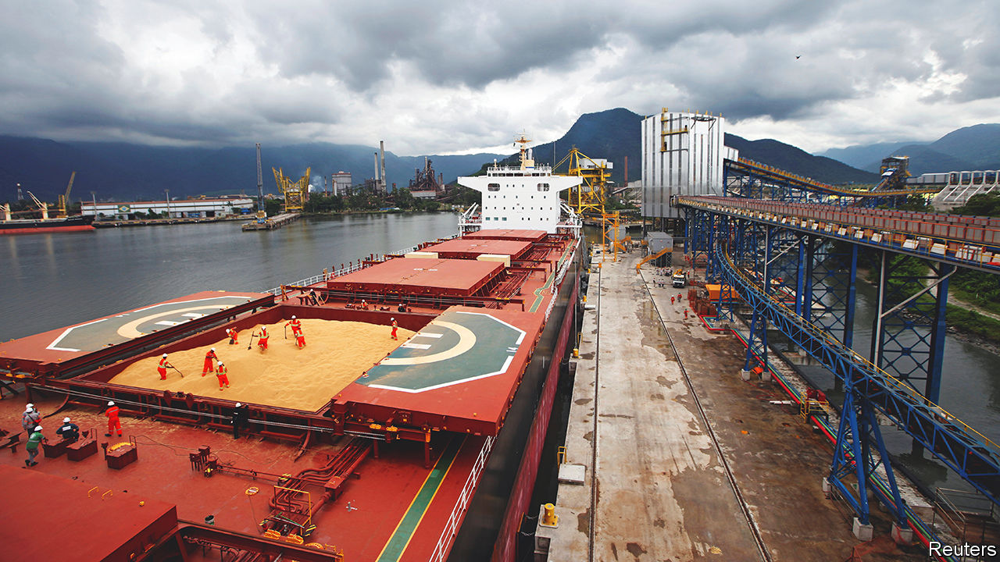
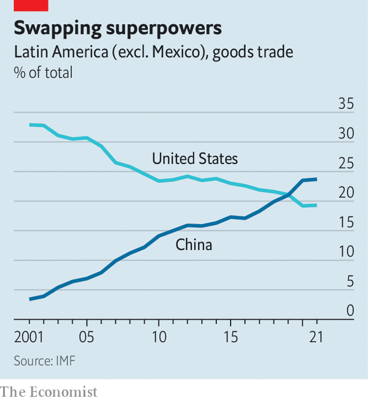
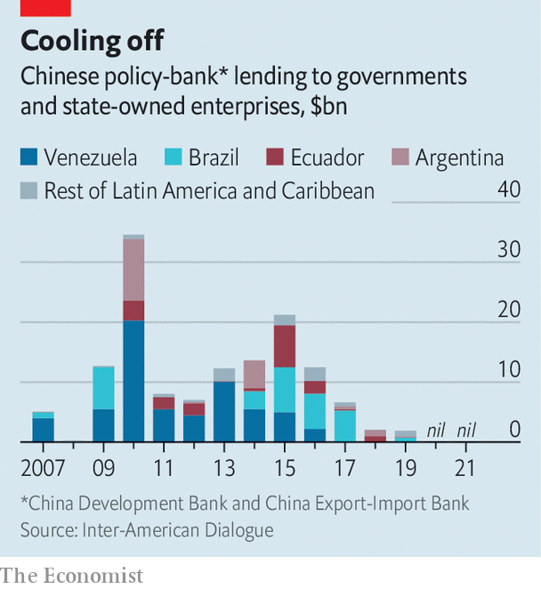

###### Boom or bust?

# What does China’s reopening mean for Latin America? 

##### The country’s post-covid rebound will be a boon for some countries, but not for all 

 

> Jan 18th 2023 

For centuries Latin America’s economies have been characterised by short booms and sudden busts, often on the back of commodity cycles. When silver was discovered in the highlands of Bolivia in 1545, the village of Potosí briefly became one of the most densely inhabited places on Earth as it provided more than two-thirds of the world’s supply. A century later, with the mines depleted, it was a ghost town. 

As  after almost three years of , some countries in Latin America are preparing for another boom. Morgan Stanley, a bank, thinks China’s economy could grow by 5.7% in 2023. That would trigger rising demand for the region’s goods. China consumes more than 16% of the world’s oil, over half of its copper and more than three-fifths of its iron ore. When rumours circulated last year that covid-19 restrictions would be lifted, the price of copper jumped by 7% in a day. 

All this is good news for commodities exporters such as Chile and Brazil. Fully 67% of Chile’s copper exports go to China; Brazil sends 70% of its soyabean exports to China. But, like the silver and gold rushes of the past, the good times may not last. Although strong growth this year is likely, the longer-term relationship between China and the region could disappoint.

In the decade after 2002 Latin America’s dollar GDP grew by more than 3% a year, thanks to a commodities boom triggered by Chinese industrialisation. China’s state-directed “policy banks”, including China Development Bank and Export-Import Bank, provided more than $138bn in loans to Latin America between 2005 and 2020. Poverty fell and government coffers swelled as China bought the region’s grains, metals and hydrocarbons. 

 


Trade with China grew from $12bn in 2000, or 0.6% of Latin America’s GDP, to $445bn in 2021 (8.5% of the region’s GDP). By 2021 China accounted for 18% of Latin American trade, up from 5% in 2005. Excluding Mexico, the share rises to 24% (see chart). Whereas China became South America’s top trading partner, the United States remains that of Mexico and Central America. Brazil, Chile, and Peru all run trade surpluses with China.

Booming trade has led to complacency among some Latin American politicians. Many expect the relationship to always stay the same, says Margaret Myers of the Inter-American Dialogue, a think-tank in Washington, DC. But this overlooks structural issues in China, such as a domestic property slump and the fallout from a trade war with the United States. There are already signs that China’s engagement with some parts of the region is weakening.

 


Since 2020 China’s policy banks have approved no new loans to the region (see chart). Although commercial banks and private-equity funds have filled part of the gap, they are not as generous. Venezuela, which used to get two-thirds of Chinese finance in the region, today only receives credit to help it maintain oil shipments to China. 

Chinese lending changed after several bad experiences. China struggled to recover millions of dollars in oil-for-loans deals with Venezuela after Nicolás Maduro, the autocratic president, came to power in 2013 and oil prices fell. Elsewhere, pushback from environmental groups also stalled investments, as did shifting policies under different administrations. 

According to AidData, a research institute at the College of William and Mary in Virginia, between 2000 and 2017 more high-value transactions linked to China’s Belt and Road Initiative were suspended or cancelled in Latin America than almost anywhere else. Similarly, work by CEPAL, a UN-linked research organisation, shows that Chinese investment peaked between 2010 and 2014 and has fallen since then.

Even if engagement with the region increases again as China reopens, it will not follow the same pattern. As China’s economy shifts towards services and manufacture of high-tech goods, electric vehicles and renewable-energy products, its imports and investments abroad will change. China’s imports of crude oil will fall, while those of critical metals will increase. From 2005 to 2009, 95% of total foreign direct investment (FDI) by China in the region went into raw materials. By 2015 to 2021, this share had fallen to 46%, with the balance split between manufacturing and services.

Between 2017 and 2021 Latin American exports to China of aluminium, used in solar panels, were 28 times as large as in the previous four years. China’s annual imports of balsa wood from Ecuador, used in wind turbines, rose by 57% over the same period. Lithium may be particularly prized. The price of lithium carbonate, used in batteries for electric vehicles, soared in 2021 and 2022 from a five-year average of $14,000 per tonne to $72,000. 

Other commodities may have a trickier future. The price of copper is expected by Goldman Sachs, a bank, to rise from $9,000 per tonne today to $11,000 in the next 12 months. But Andrés Bórquez at the University of Chile thinks that less of it may be needed—and that if China replenishes its copper reserves, which are at their lowest for 15 years, demand will eventually plateau. That could hurt certain overexposed countries, such as Chile: 38% of its exports go to China, over three-quarters of which are copper. 

Chinese investments are also becoming more strategic. Electricity is a key area. Between 2017 and 2021 investments in this sector made up 71% of Chinese mergers and acquisitions in the region, according to Boston University’s Global Development Policy Centre. In 2021 two Chinese state-owned firms splurged $6bn collectively to buy Chilean and Peruvian electricity companies. Both projects were among the largest foreign investments ever received by either country. 

Chinese investment in other infrastructure appears to be accelerating. A survey by Mexico’s National Autonomous University reckons that of 192 regional infrastructure projects with Chinese involvement undertaken between 2005 and 2021, 57 were carried out in 2020 and 2021. The reasons may have to do with strategic projects linked to strengthening China’s food security. A state-owned firm is building a port 50km (30 miles) north of Lima in order to increase China’s supply of food. (So far the  do not appear to have affected it.)

All this has ruffled feathers in Washington. In 2020 Donald Trump’s administration put pressure on Brazil not to allow Huawei, a Chinese telecoms giant, to participate in a 5G auction. The Brazilian government went ahead anyway, but is creating a separate network for government agencies that excludes Huawei. Similarly, the Trump administration extended a loan to Ecuador to help it pay off billions of dollars’ worth of debt to China on the condition that it exclude Chinese telecoms firms from its 5G network. In 2021 the G7 launched “Build Back Better World”, to compete with Chinese infrastructure investment around the world. It was such a flop that it had to be rebranded last year.

South America has less to gain than Central America from cosying up to the United States. Brazil’s relationship with China “just really makes sense”, says Larissa Wachholz, at Brazil’s Centre for International Relations. “It’s beneficial for both sides.” She thinks the investment that is lacking in Latin America—in roads, ports and utilities—is exactly what China can offer. Now that the leftist  is in power in Brazil, its government is likely to make more overtures to China. 

A few countries are trying to lessen their reliance on the Asian superpower. Although Ecuador’s centre-right president is finalising a free-trade agreement with China, his administration also wants to join the Pacific Alliance, a trade bloc composed of Chile, Colombia, Mexico and Peru. Uruguay, which exports more than 60% of its beef to China, is seeking a free-trade deal with China as well as trying to join other free-trade agreements. Yet across the region, few countries are thinking about how to adapt if China’s comeback turns out to lack the potency of the past. The coming boom may not last long.■

