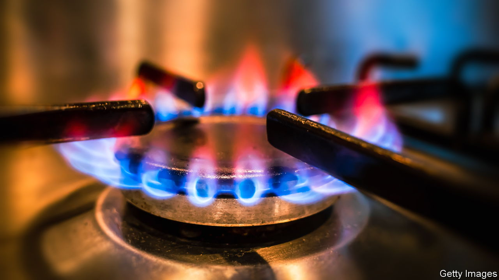

###### The Economist explains

# How gas stoves became part of America’s culture wars 

##### A proposal to ban them has inflamed some Republicans 

 

> Jan 17th 2023 

A FIERY DEBATE has ignited in America—over the use of gas for cooking. On January 9th Richard Trumka junior, a commissioner at the Consumer Product Safety Commission (CPSC), a federal agency, told Bloomberg that the organisation was considering a ban on gas hobs, describing them as a “hidden hazard”. That sparked outrage among many conservatives, many of whom blamed President Joe Biden. “If the maniacs in the White House come for my stove, they can pry it from my cold dead hands. COME AND TAKE IT!!” tweeted Ronny Jackson, a Republican congressman from Texas. Andrew Gruel, a television chef, taped himself to a stove in protest. Even some Democrats were riled. , a senator from West Virginia, called a ban a “recipe for disaster”. Why have gas stoves become part of America’s culture wars—and could they actually be banned?

Around 38% of American households have gas stoves, although that varies among states. Proponents say that they are cheaper and more efficient than electric alternatives​​—and even that food cooked on them tastes better. The gas industry has good PR. “Cooking with gas”, an advertising slogan from the 1930s, is baked into the American psyche. The American Gas Association, a trade group, publishes recipes on cookingwithgas.org. In sponsored social-media posts, influencers rave about their gas stoves. But the appliances, which emit nitrogen dioxide, particulate matter and other pollutants, also carry environmental and health risks, including asthma. The dangers can be mitigated with good ventilation, yet indoor pollution is not heavily regulated. Burning gas also releases greenhouse gases, including carbon dioxide and . 

The  offers incentives for consumers to switch to electric stoves, like those to encourage electric cars. For stoves, rebates of up to $840 are available. Since 60% of American electricity is generated by burning gas and coal, the alternative is not always greener. In an effort to reduce the use of fossil fuels some Democratic city councils have passed legislation to limit use of gas. In 2019, when Berkeley became the first American city to prohibit the fuel for heating and cooking in new buildings, California’s restaurant association tried to sue. (A judge dismissed the lawsuit.) This year New York City will ban gas in some new buildings. A similar plan proposed for New York state failed to pass its legislature last year, but Kathy Hochul, New York’s Democratic governor, may try again. Since 2021 more than 20 states, many of which are governed by Republicans and some of which are also producers of gas, have introduced laws to block local bans.

The federal threat to Americans’ cooking habits is not imminent. On January 11th a White House spokesperson said that the Biden administration had no plans for a ban. Nor is the CPSC, which is independent of the administration, “coming for anyone’s gas stoves”, Mr Trumka tweeted. Any national ban, if it ever happens, will be on new cookers, not on ones already in people’s kitchens. The CPSC’s current priority is to improve standards for new products. That should allow time for the most heated defenders of gas stoves to simmer down. ■

