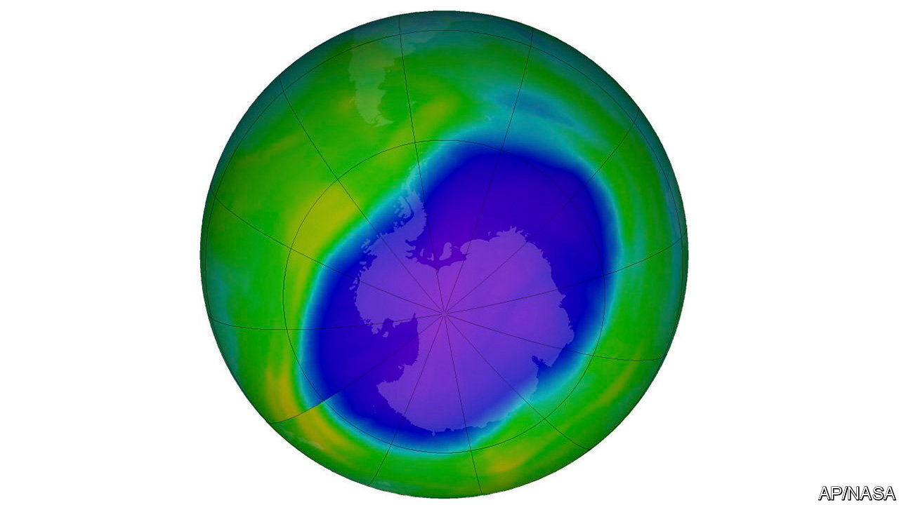

###### The Economist explains

# How humans healed the ozone layer 

##### Catastrophic harms to human health and the climate have been avoided 

 

> Jan 14th 2023 

IN 1985 SCIENTISTS discovered an area over Antarctica where the layer of stratospheric ozone, which protects Earth from ultraviolet radiation, had become dangerously thin. That chlorine from chlorofluorocarbons (CFCs), chemicals used in refrigeration and products such as hairspray, could break down ozone molecules had been known for some time. What the “hole” showed was that in the peculiar conditions of the Antarctic this breakdown happened at an unexpected rate. Two years later world leaders signed the Montreal Protocol, a deal to do away with CFCs. In 2003 Kofi Annan, then secretary-general of the United Nations, called it “perhaps the single most successful international treaty to date”.

A report released by the UN on January 9th supports that view. It finds that 99% of banned ozone-damaging substances have been phased out. It predicts that the ozone layer will return to approximately its state in 1980 between 2040 (across much of the world) and 2066 (over Antarctica). How did the world manage it, and what will the consequences be?

Too much ultraviolet radiation is damaging for most living things. In humans it causes  in the short term, and skin cancers, cataracts and immune-deficiency disorders over longer periods. It can lower crop yields. And it is particularly destructive for ocean-dwelling organisms like fish and zooplankton, which are crucial for many food chains. Reversing the depletion of the ozone layer has helped avert these harms. American scientists estimate that 443m cases of skin cancer will be avoided in the country by 2100 because of the Montreal Protocol. 

The treaty has also helped mitigate climate change. CFCs have a potent greenhouse effect, trapping heat in the atmosphere. Estimates for how much temperature rise has been avoided by banning them vary, but one study by Australian researchers, published in estimates that the implementation of the Montreal Protocol will have seen off around 1°C of extra warming by 2050. An analysis by  found that the Montreal Protocol reduced emissions by 135bn tonnes of carbon-dioxide equivalent between 1989 and 2013, making it the most efficient policy to reduce global warming ever enacted. 

 This side-effect led to calls to expand the agreement. In 2016, the “Kigali Amendment” committed countries to reduce the use of hydrofluorocarbons (HFCs), the man-made successors to CFCs. Though they do not deplete ozone, most commercial HFCs are hundreds to thousands of times more warming than carbon dioxide (though they hang around in the atmosphere for far less long). The recent UN report reckons that compliance with the amendment will avoid an additional 0.3-0.5°C of temperature rise by 2100. 

The success of the Montreal Protocol in healing the ozone layer means that it is frequently touted as a template for future environmental deals. Petteri Taalas, the secretary-general of the World Meteorological Organisation, recently said that “ozone action sets a precedent for climate action”. It certainly managed to overcome some of the problems which still , such as how to encourage widespread compliance. (The original Montreal Protocol is one of the only international treaties to achieve universal ratification—the last hold-out, Palestine, signed in 2019.) It did this, in part, through incentives such as allowing countries to trade controlled substances with other signatories, and by  doubters like China and India enough money to make them think joining was worthwhile. 

Unfortunately, these lessons are not as useful for climate change mitigation and adaptation as one might wish. Poor countries never relied on ozone-depleting chemicals for development in the way they do on fossil fuels; rich countries did not feel that their economies were based on their use. The costs involved in moving away from them were far lower, and the companies that produced them had far less to lose than the oil and gas giants that have fought so hard against emissions-reduction policies. And the science was less contested. Healing the ozone layer is a huge achievement, with many benefits, and it should be recognised as such. But the problems of climate action are in a class of their own. ■

