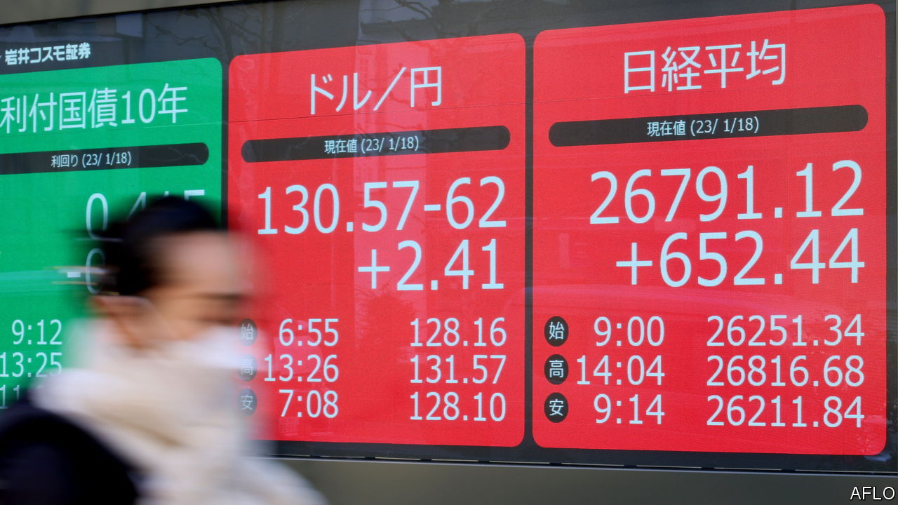
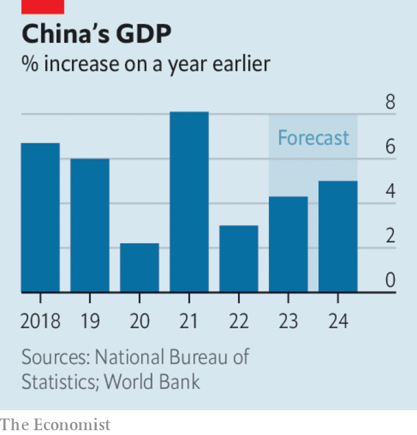

###### The world this week

# Business 

#####  

 

> Jan 19th 2023 

Markets were left dumbfounded by the decision to stick with its policy of  on Japanese long-term government bonds. Investors were expecting the central bank to at least signal that it would change its monetary policy, after it had raised the cap on fluctuations (above or below a target of zero) in ten-year bond yields in December. Since then it has spent ¥34trn ($265bn) purchasing bonds to keep yields low. The yen fell by 2% against the dollar after the announcement. 

Britain’s annual  rate dipped only slightly in December, to 10.5%. The government has promised to halve the rate this year. Food prices rose by 16.9% over 12 months, the fastest pace in decades. In America the inflation rate fell to 6.5% in December. In the euro zone it dropped to 9.2%.

When there’s little to deal in

 reported a slump in profit for the fourth quarter, caused in part by a slowdown in investment banking. The bank is shedding 6.5% of its staff, including investment bankers, as part of a cost-cutting drive. Still, Goldman’s net profit for the whole of 2022 came in at $11.3bn. Other banks have reported similar tales.  blamed its fall in revenue from investment banking on a “challenging market environment”. 

Some of Brazil’s biggest banks, including BTG Pactual and Santander Brasil, were left exposed to debt from , a giant retail chain that has reported accounting “inconsistencies”, leading to the resignation of its chief executive and chief financial officer. Facing bankruptcy, Americanas has been given a month’s protection from its creditors by the courts. The news of its potential collapse caused its stock to plunge by 77% in a day, the biggest fall for any company in the Ibovespa index for at least two decades. 

 said that China’s network-security office had given it permission to sign up new users to its ride-hailing service, 18 months after people were banned from downloading its app amid a crackdown on China’s tech giants. Didi fell foul of the authorities when it floated shares in New York in 2021. It eventually delisted its stock. The resumption of normal service indicates that the government now sees tech companies as engines of growth again, rather than as potential political threats. 

 


 grew by just 3% in 2022, the weakest expansion since 1976 apart from 2020. Last year brought more extensive lockdowns in China, disrupting factories and consumer spending. China’s  in December fell by 9.9% year-on-year in dollar terms, the sharpest decline since the start of the pandemic.

The “reopening” of China’s economy after zero-covid will affect a number of industries this year. The International Energy Agency reckons that  demand will hit a record 101.7m barrels a day, with around half the gain coming from China, even though the speed of its reopening is uncertain. The return of Chinese  was cited as a factor by the World Tourism Organisation when it forecast that international holidaymaking could reach 80-95% of pre-pandemic levels. 

Underlining the surge in demand for air travel after almost three years of covid restrictions, , Europe’s biggest airline, took 4.95m bookings in a week, its most ever. And  said its profit in the fourth quarter of 2022 was almost a third higher than in the same period of 2019, before the pandemic. It expects sales to be 50% higher this quarter than in the same three months last year. 

German GDP grew by 1.9% in 2022, despite the energy crisis and knock-on effects of the war in Ukraine.  economy ministry thinks a slowdown in the coming months will be “milder and shorter than expected”.

 decided to cut 10,000 jobs, around 5% of its workforce, the latest in a round of lay-offs by tech companies grappling with a post-pandemic slowdown in sales. 

Picking winners and losers

After months of trying to avoid bankruptcy,  called in the administrators. The battery-making startup had been championed by the British government three years ago as part of its “green industrial revolution”. On the same day that it collapsed the business committee in the House of Commons launched an inquiry into the viability of making batteries in Britain for electric cars, noting a “series of setbacks” in the industry. 

The trial got under way of  for securities fraud in relation to a misleading tweet he posted in 2018 that suggested he was taking Tesla private. A group of investors are suing him, claiming they lost billions in the market reaction to the tweet. Mr Musk may well settle before the trial reaches its conclusion. Jury candidates displaying hostility towards Mr Musk, including one who described him as a “delusional narcissist”, were weeded out from the final selection. 

