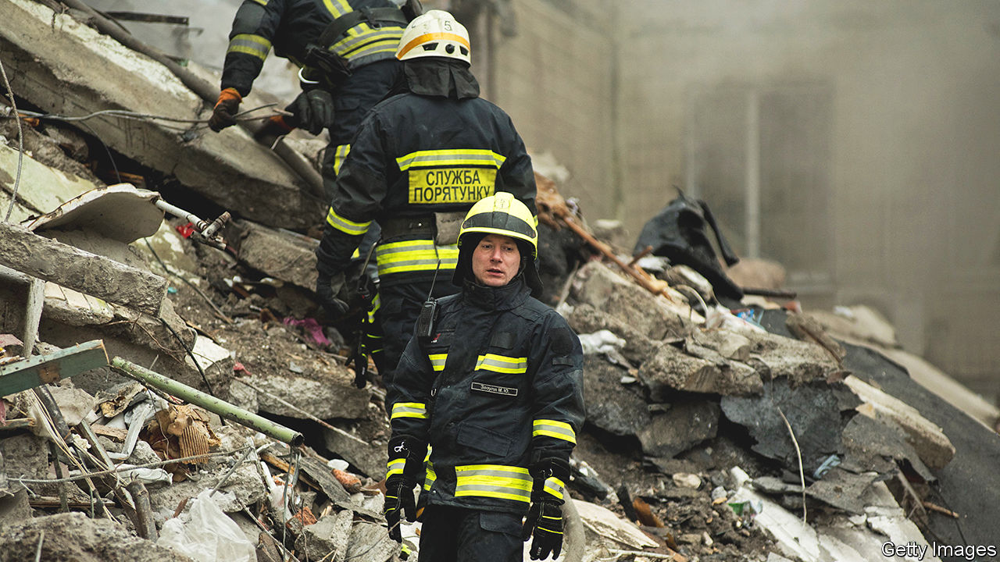
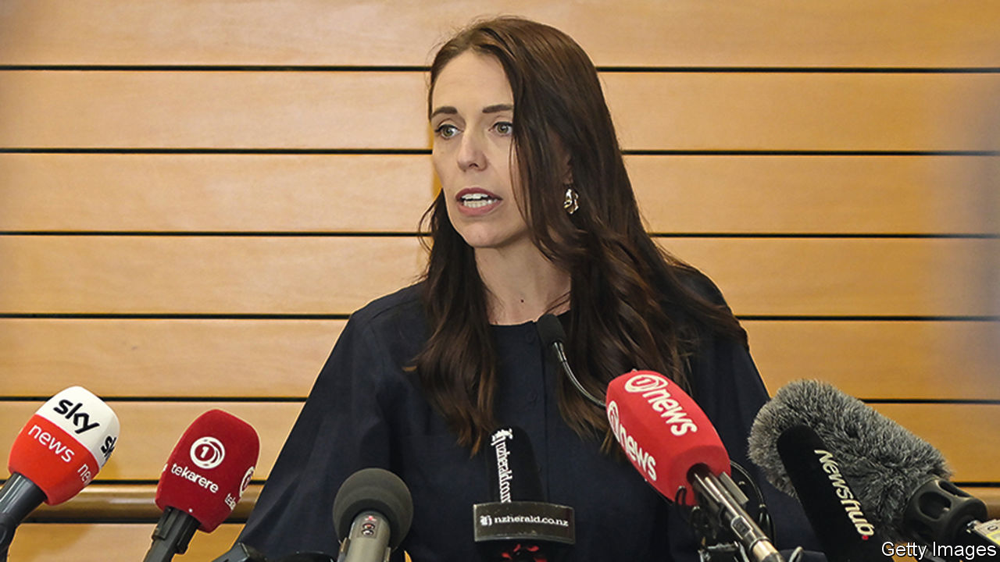

###### The world this week

# Politics 

#####  

 

> Jan 19th 2023 

Russia intensified its missile attacks on cities in , part of its strategy to bomb the population into submission. One rocket hit a residential block in Dnipro, killing at least 40 people, the deadliest single loss of civilian lives in Russia’s latest campaign. It has mostly targeted energy infrastructure, causing widespread loss of power in the depth of winter. 

Ukraine’s  was killed in a  in a suburb of Kyiv. The helicopter came down in dense fog near a nursery, killing at least 14 people in total. The interior ministry is responsible for domestic security and has helped gather evidence on Russian war crimes. 

Christine Lambrecht resigned as  defence minister. She had lost credibility after a number of gaffes, such as offering to supply Ukraine with helmets when it needs heavy weapons. The new defence minister is Boris Pistorius. His appointment came as Germany’s allies pressed the government to send Leopard tanks to Ukraine, a move it has resisted. 

Italian police arrested Matteo Messina Denaro,  most-wanted Mafia figure, after 30 years on the run. He was caught in Palermo attending a clinic under a false name. The arrest was hailed as the culmination of a three-decade-old strategy to weaken the grip of Cosa Nostra on Sicily. 

A Brazilian Supreme Court judge approved a request from prosecutors to include Jair Bolsonaro,  former right-wing president, in an investigation into the storming of government buildings by his supporters this month. Luiz Inácio Lula da Silva, the new president, dismissed 40 soldiers who were stationed outside the presidential palace when the protests took place. 

A constitutional clash

The British government blocked the Scottish Parliament’s recently passed  bill. It is the first time a Scottish law has been blocked since devolution in 1999. The Westminster government said allowing someone in Scotland to change their gender more easily would have a negative impact on nationwide “equalities protections”. Nicola Sturgeon, Scotland’s first minister, promised to pursue the issue in the courts. Separately, the British government reversed course and said that a new law to ban conversion therapy would now include trans people.

 fell for the first time since the 1960s. The government has long struggled to convince people to have more children. A shrinking labour force and ageing population will increase pressure on the economy and health system. It is also a blow to national pride: India is poised to pass China as the world’s most populous country.

 reported 59,938  between December 8th and January 12th. It was the first time the government had released such detailed figures since lifting its “zero-covid” policy last month. The real toll is much higher. The official statistics refer only to deaths recorded at medical facilities and doctors have been discouraged from citing covid on death certificates.

Mursal Nabizada, a former MP in , was shot dead at her home in Kabul. Ms Nabizada, a champion of women’s rights, had decided to stay in the country after the Taliban regained power in 2021. Step by step, the regime has been dismantling women’s freedoms and protections. It has even sought to cover the faces of shop mannequins (which is a compromise: it had wanted to chop their heads off). 

A plane crash near the tourist city of Pokhara in  killed all 72 people on board. It was the country’s worst such incident in 30 years. 

 


In a surprise announcement  said she would step down as New Zealand’s prime minister. Ms Ardern led her country through the pandemic—in often controversial ways, such as closing the border for two years. Her approval rating has slumped lately, and she says she no longer has the energy to stay in office. Ms Ardern had faced elections in October. 

In the  Maria Ressa and her news organisation, Rappler, were cleared of tax evasion by a court in Manila. Ms Ressa, a joint winner of the Nobel peace prize in 2021, provoked the ire of Rodrigo Duterte, the country’s previous president, when she investigated his bloody war on drugs. 

The Supreme Court in  blocked the appointment of Aryeh Deri as interior minister and vice-prime minister because of his conviction for tax fraud. The ruling sets Binyamin Netanyahu, the prime minister, who himself faces charges of bribery and fraud, on a collision path with the court. His government has proposals for reforming the court that would limit its powers and, say his opponents, undermine Israeli democracy. More than 80,000 protesters rallied in Tel Aviv against the plan. 

 executed Alireza Akbari, a British-Iranian convicted by the regime of spying. Mr Akbari, who was arrested in 2019, was previously the deputy Iranian defence minister. He said he had been tortured and forced to confess to crimes that he did not commit. 

Jihadists in  kidnapped 50 women and girls foraging for food near a town that has been blockaded by the insurgents. Thousands of people have been killed and millions forced from their homes and fields since jihadists began crossing the border from Mali in 2015.

Senior officials from America and Russia will visit  in a growing struggle for influence on the continent. Janet Yellen, America’s treasury secretary, is to visit Senegal, South Africa and Zambia in a bid to counter the economic and political influence of China, a big financier of infrastructure projects. Sergei Lavrov, Russia’s foreign minister, will visit South Africa.

The paper trail

More  were found at the private home of Joe Biden. The Justice Department appointed a special counsel to look into Mr Biden’s handling of the material. Republicans demanded the release of visitor logs to the home (there are none), pointing out that Democrats had lodged a similar request when Donald Trump’s home was searched by the FBI last August.

Eric Adams, the Democratic mayor of New York, visited America’s border with Mexico to declare that there was “no more room” in his city for any more illegal , and to criticise the Biden administration’s handling of migration. New York has received tens of thousands of migrants, in part because some Republican states have made a point of busing new arrivals to areas run by Democrats. 

