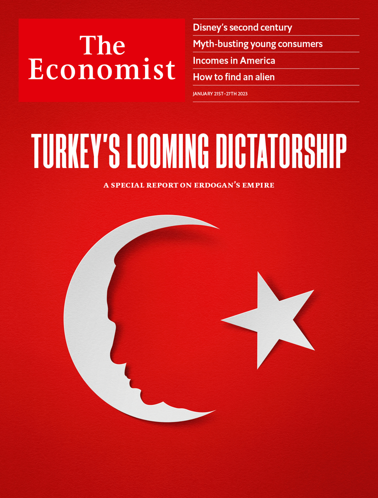

###### The Economist

# This week’s covers 

##### How we saw the world 

> Jan 19th 2023 

Some weeks, including this one, we publish more than one cover. In most of the world, we consider how technology is turning the business of culture upside down in the year of Disney’s centenary.

 


: 

: 


In mainland Europe we voice concerns that Turkey’s president, Recep Tayyip Erdogan, could turn a flawed democracy into a full-blown autocracy.

 


: 

: 


