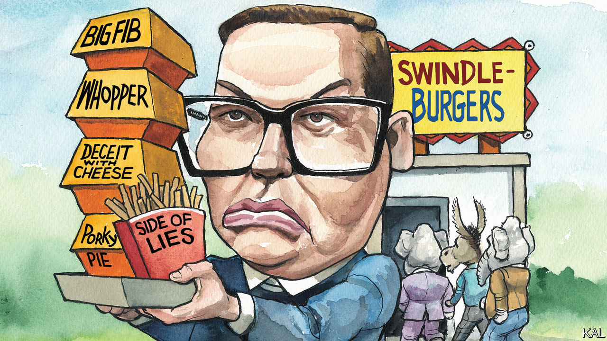

###### Lexington

# George Santos is the congressman America deserves 

##### He is the right man for a democracy where winning matters more than anything else 

 

> Jan 17th 2023 

Why do the many lies of George Santos matter? Maybe some of Mr Santos’s constituents, in a district stretching along the North Shore of Long Island,  in November because they were impressed he was a volleyball star at Baruch College and worked at Goldman Sachs, though none of that is so. Maybe they voted for him because he claimed to be Jewish, though he says now, with Seinfeldian sangfroid, that he meant only that he was “Jew-ish”. If such qualities did in fact seem like reasons enough to cast a ballot for someone, well, the voters deserve what they got.

But those qualities were probably not why most voters supported him. During the campaign his opponent raised doubts about his biography, as did a local newspaper, the , which noted an “inexplicable” leap in his reported assets from zero to about $11m in two years. The national press exposed some of his shady business dealings, and Democrats branded him a “flat-out liar”. The  went on to endorse the Democratic candidate, saying it wanted to support a Republican but that Mr Santos “is so bizarre, unprincipled and sketchy that we cannot”.

What seems certain is that, unlike the , the majority of voters in New York’s third district, which includes part of Donald Trump’s home borough of Queens, did prefer a Republican regardless of how sketchy he might be. They were swept up in a wave of discontent that washed through the Democrat-dominated, troubled state of New York. The  appealed to them, and Mr Santos, in his first votes, has supported it. 

But there is an even more troubling frame in which to view what Mr Santos calls his “résumé embellishment”. The voters also preferred Mr Santos, by a margin of more than seven points, at least in spite of—though probably because of—a much more destructive and transparent  that he told, that Mr Trump won the 2020 presidential election. 

After running for the same seat in 2020 and losing, Mr Santos appeared at a rally in Washington on January 5th 2021, the day before the attack on the Capitol, to declare that his own election, along with Mr Trump’s, had been stolen. Calling Mr Trump “the best president in modern history since Abraham Lincoln and Ronald Reagan”, Mr Santos asked, “Who here is ready to overturn the election for Donald J. Trump?” As a teller of tall tales, the man was not exactly hiding his light under a bushel. “You can’t make this stuff up!” Mr Santos declared at that rally— surely a contender for his most shameless lie. 

This is why the outrage of the press and the Democrats over Mr Santos is so poignant. Since he ran again, and won, they have not just torn away his veil of autobiographical humbug but turned his deceit into a national scandal. Yet given Mr Trump’s enduring success at warping reality, this blow for justice seems even less satisfying than catching Al Capone for tax evasion. It is more like hounding one of Capone’s accountants for jaywalking. 

None of this excuses Mr Santos. His lies do matter, but not really for what they reveal about him. That such a person should represent Americans in Congress is a national disgrace. But it is also fitting, because he represents something true and awful, particularly about the Republican Party, yet also about America, a nation lousy with misinformation, also known as deceit.

“In law and in journalism, in government and in the social sciences, deception is taken for granted when it is felt to be excusable by those who tell the lies and who tend also to make the rules,” Sissela Bok, a philosopher, wrote in her landmark book “Lying: Moral Choice in Public and Private Life”. Writing in the late 1970s after the deceptions of Watergate and the Vietnam war, Ms Bok was trying to make sense of the collapse of trust in American institutions. 

Ms Bok added a new introduction a decade later, after the Iran-Contra affair, and another a decade after that, once President Bill Clinton admitted he had lied about sex with an intern. Now—in the wake of the Iraq war and Mr Trump, Bernie Madoff, Q-Anon and Sam Bankman-Fried, after social media has turned so many Americans into deceptive brand ambassadors for themselves—it may be time for a fourth introduction.

Without trust in veracity—“a foundation of relations among human beings”—institutions collapse, Ms Bok wrote. She placed particular responsibility for the fraying of trust on politicians, partly because political lies, even when thought trivial by those who tell them, spread so far and are so widely imitated. “When political representatives or entire governments arrogate to themselves the right to lie, they take power from the public that would not have been given up voluntarily,” she wrote.

Chance on fire

That is what Kevin McCarthy, the speaker of the House, is doing by defending Mr Santos as innocent until proven guilty of a crime. In prioritising his fragile majority, Mr McCarthy is conceding that power matters more to him than veracity. The speaker has blown a chance to restore some trust, in himself and Congress.

Joe Biden has a chance of his own. He is not the résumé-embellisher he was when he first ran for president, in 1987, and claimed degrees and honours he had not earned. But he still tells the occasional fable about himself, and he has also lied at points about the economy and the pandemic. Now it appears the White House misled Americans by withholding news for two months that classified documents were found in Mr Biden’s private office and home, the first of them almost a week before the midterms. 

There is no sign Mr Biden deliberately held back documents, as Mr Trump did. But unless the White House comes up with a better explanation for its long silence than it has so far, Mr Biden should own the deception, and apologise. Mr Biden is no George Santos or Donald Trump, but deceiving the public to advance a political agenda should not be graded on the curve. It is always wrong, and America could do with a demonstration of virtue in leadership. ■


