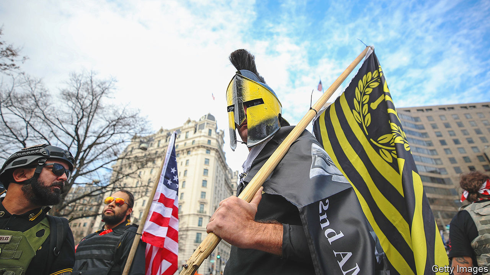
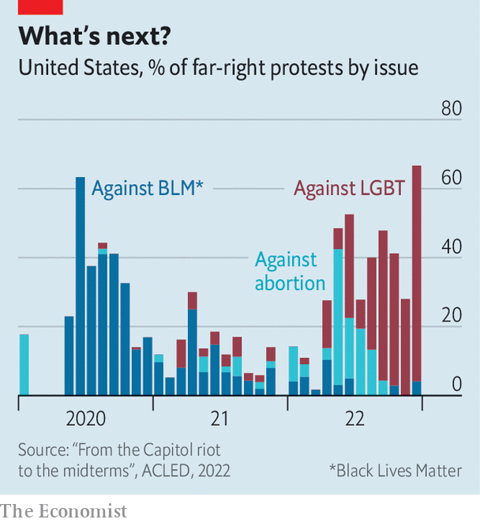

###### Proud, distracted boys

# How America’s far right flits from issue to issue 

##### Hostility to gay and trans Americans is the current obsession 

 

> Jan 19th 2023 

MORE THAN two years after supporters of President Donald Trump , several of his most rabid fans are facing punishment. The former leader of the Proud Boys, and four of his associates, are standing trial for seditious conspiracy, or plotting to overthrow the government. It is the most serious offence levied by the Department of Justice (DoJ) against the insurrectionists. The trial kicked off on January 12th and could last for weeks. Two members of the Oath Keepers, another far-right group, were found guilty of the same charge in November, and could face up to 20 years in prison. 

After January 6th, 2021, many far-right groups were temporarily scared into silence. But a new report from the Armed Conflict Location &amp; Event Data Project (ACLED), which tracks political violence, suggests that these groups are  in different ways. ACLED began to collect data on America in 2020. Its recent report tallied events between the start of that year and the end of 2022 organised by scores of far-right groups, including the Proud Boys and Oath Keepers. Their activities include protests, recruitment, training, the dissemination of propaganda and acts of violence.

The report shows that the issues motivating far-right groups are shifting. Protests against lesbian, gay, bisexual and transgender (LGBT) Americans and their rights are . The number more than tripled in 2022—and they accounted for about two-thirds of all far-right protests in December. The geographical boundaries of such sentiments are also expanding. Activity among far-right groups was documented in 18 states last year—up from six in 2021. Last June, for example, members of a white-supremacist group were discovered in a lorry in Idaho. They had planned to riot at a gay-pride parade. 

An examination of the issues animating right-wing extremists doubles as a timeline of the culture wars. After George Floyd was murdered in May 2020—and many Americans took to the streets to protest—demonstrations staged by far-right groups against the Black Lives Matter movement surged. Pro-Trump and “stop the steal” rallies proliferated before the 2020 presidential election and continued after Mr Trump’s defeat, culminating in the attack on the Capitol. Far-right groups then banded together to protest against covid-19 vaccines and public-health measures to curb the pandemic. After a leaked opinion suggested that the Supreme Court was poised to overturn Roe v Wade, rescinding the constitutional right to an abortion, anti-abortion events briefly dominated far-right activity, but subsided around the time it became clear that support for abortion bans would not benefit the Republican Party in the midterm elections. 

 


The far right thus fixates on whatever controversy is dominating politics at the time. Ever since January 6th, experts suggest, extremists have been searching for another cause that will unite the various strands of a historically decentralised network of far-right groups. There are signs that some centralisation is happening. The data show a modest increase in far-right activity over the past year, from roughly 780 events in 2021 to 800 in 2022. But the number of groups organising these events is shrinking as people gravitate towards a small number of organisations such as the Proud Boys, the Patriot Front and the anti-Semitic Goyim Defence League.

Overall, though, the story is one of decline. The only state where more outfits were active in 2022 than in 2021 was Arizona, where about 90% of all recruitment to far-right groups last year took place. That is perhaps not shocking: Arizona’s midterm elections were saturated with Republican candidates for statewide office who peddled conspiracy theories, including the “Big Lie” that Mr Trump won the presidency in 2020. ACLED’s data suggest that the far-right has largely moved on from “stop the steal” rallies. Hostility to gay and trans Americans may be a passing fad, too. Americans who don’t belong to extremist groups are moving in the other direction. Last year Congress passed the Respect for Marriage Act, which recognises same-sex unions. The far-right’s paroxysms may be a last stand in a losing battle. ■


