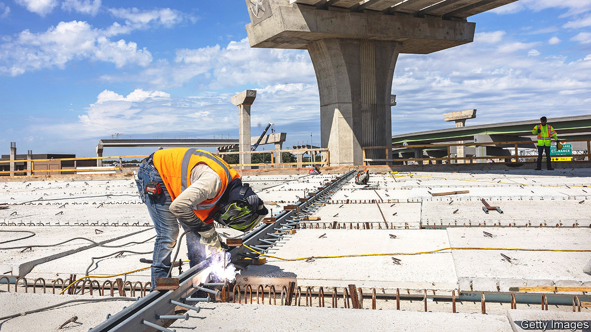
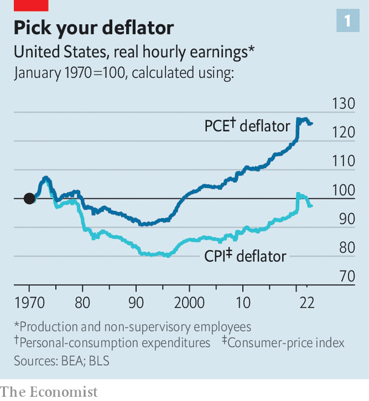
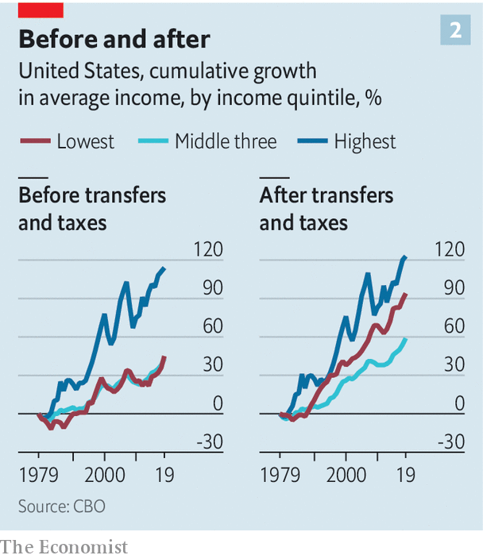

###### The unstuck middle

# Incomes are rising in America, especially for the poorest 

##### But those in the middle, hit by inflation, have less to cheer about 

 

> Jan 15th 2023 

Cardi B, better known for her punchy hip-hop than her economic analysis, recently observed that the price of a lettuce had soared to as much as $7. “If I think that shit is crazy, I can only imagine what middle-class people or people in the hood are mother [bleep] thinking,” she said. Ms B is right. Paying that much for a head of lettuce is indeed crazy. Inadvertently or not, she also opened a window onto a more fraught topic than the price of greens: are  going up or down?

Answering this question might seem easy. Hourly wages today are, on average, about 15% higher than on the eve of the pandemic—the biggest increase over any three-year period since the early 1980s. But  for everything from vegetables to vehicles has reminded consumers that what really matters is how much they can actually buy with their paycheques. When looking at real earnings—that is, accounting for inflation—the picture is more complex. If anything, low-income Americans appear to have fared the best in the upside-down . In the longer run, the range of estimates is so vast that some economists argue that median incomes have stagnated for half a century whereas others insist that the American dream of upward mobility is alive and well. A closer look at the data points towards the more optimistic end of the spectrum, albeit with some big caveats.

Much of the confusion stems from different ways of measuring prices. Media coverage of inflation typically focuses on the consumer-price index (CPI), a gauge of prices for a wide array of goods and services. An alternative, preferred by the Federal Reserve but not by headline writers (perhaps because of its ungainly name), is the personal-consumption-expenditure (PCE) price index. One crucial distinction is how often they are re-weighted to reflect changing consumption patterns: only once every two years for the CPI; monthly for the PCE. The latter is a more accurate snapshot of how people spend their money. To expand on Cardi B’s point, the CPI in effect assumes that people go on buying lettuce even after it has become a luxury item, whereas the PCE allows them to replace it with more reasonable veggies. 

 


Such substitution adds up. Since April 2020, when inflation began to perk up, CPI-based wages are down by over 3%, whereas PCE-based wages are roughly flat. Over time the differences are even more stark. When adjusting by the CPI, people appear to make a bit less today than in 1970. Adjusted by the PCE, wages are about a quarter higher today (see chart 1).

That may not seem like much to cheer about, given that it works out to real wage increases of less than 0.5% per year for the past half-century. Yet it is not bad. The slowness is overstated by a dreadful stretch for workers from 1970 to the mid-1990s, a period when unions broke down and companies spent heavily on the labour-saving technology of the modern workplace. Partly thanks to that, since 2000 income growth has consistently been faster, working out to nearly 1.5% a year. That puts income growth in America near the top among large, wealthy countries.

 


The more serious problem is that although average incomes look pretty good in America, many people have not done so well. The gains have been disproportionately captured by the rich. In a report in November the Congressional Budget Office (CBO) examined changes in incomes—a metric that is broader than wages alone, including extras such as social insurance and capital gains. From 1979 to 2019 it found that real incomes for the highest quintile of households rose by 114%. Income growth for the remaining four-fifths of households was, by contrast, a paltry 45%.

Taxation and means-tested transfers mitigate some of this. The lowest quintile of income earners see their tax bills shrink while also receiving more benefits, especially health insurance. Medicaid, which covers some medical costs, is the country’s largest and fastest-growing transfer programme. As a result after-tax income growth for the lowest quintile since 1979 amounts to 94%, roughly twice their pre-tax rate (see chart 2). But there are sharp limits to this redistribution.

A middle muddle

Shifts in taxation have failed to keep up with the explosive growth in incomes for America’s wealthiest. The share of post-tax incomes going to the top 1% of earners rose from 7% in 1979 to 13% in 2019, while the share going to middle earners has fallen. For all but the lowest quintile, taxation has become less of an equaliser over time. Tax rates have declined for the wealthiest, giving them a bigger share of the country’s post-tax incomes. That leaves America with the most unequal income distribution in the G7 group of rich countries.

Believers in the promise of America will note one major flaw in the foregoing analysis: the rich as a group may be getting richer, but the rich are not necessarily the same people today as they were yesterday. Put more technically, the composition of income quintiles changes when, for example, children make more (or less) than their parents. Studies show that nearly two-thirds of children born into the lowest quintile of America’s income earners—many of them the children of immigrants—eventually rise to higher strata. Such movement is a wonderful thing. Unfortunately, there is not more of it. Raj Chetty of Harvard University has found that America’s rate of upward mobility is roughly half that of Canada’s.

So far, this is a mostly bleak assessment of income trends in America. But are things now improving? The recent CBO report shows that the distribution of after-tax income was more or less steady in the decade before the pandemic. That is, although America was not getting more equal, it was, for the first time since 1979, not getting much more unequal. Even before taxes, wage trends were a little rosier, too. In a paper published in October, Clem Aeppli of Harvard and Nathan Wilmers of the Massachusetts Institute of Technology found that earnings inequality reached a plateau after 2012. The gap between top and middle-income workers persisted, but low-wage earners began to catch up to the middle. This, they concluded, stemmed from a tight labour market: unemployment fell steadily from nearly 10% in 2010 to 3.5% in early 2020, a five-decade low.

These trends appear to have been amplified since the pandemic. Just before covid, wages for the bottom half of income earners were growing roughly half a percentage point faster than those for the upper half, according to data from the Federal Reserve’s Atlanta branch. Over the past year the outperformance for the bottom half has widened to about two percentage points. David Autor of MIT and Arindrajit Dube and Annie McGrew, both of the University of Massachusetts, find that these gains have been caused almost exclusively by job switchers at the low end of the income ladder. This, they argue, could benefit the economy, because Americans are moving not only to better-paid work but also to more productive employers.

There are, however, two worries. The first is whether the good times can continue. Current wage growth is predicated on an ultra-tight labour market, which might stop if recession strikes (as many soon expect). Second, although the poorest Americans are doing well, the middle class is seeing less uplift. That even appears to be the case after accounting for inflation. Normally, rising prices hit the poorest the hardest. But research by Xavier Jaravel of the London School of Economics shows that over the past couple of years inflation has been particularly cruel for middle-income tiers in America, in large part because they seem to be more reliant on cars, and hence petrol, for getting to their jobs. Unlike $7 lettuce, that is not something they can quickly opt out of. It would also imply that while income stagnation in America is a myth, the squeezed middle is all too real. ■


