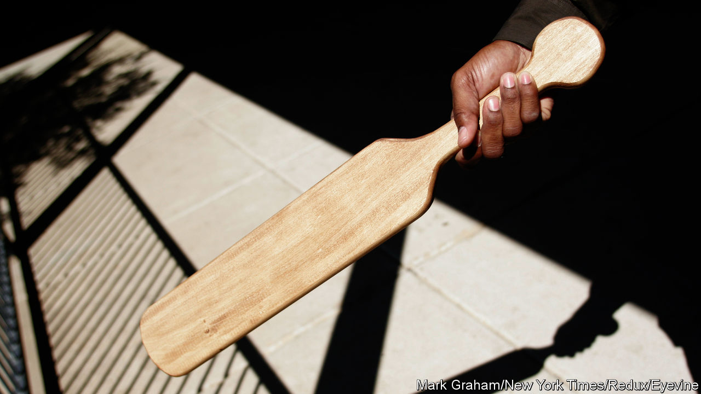
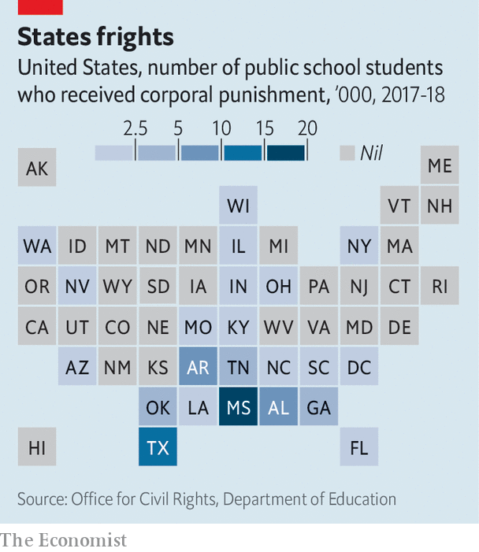

###### Batty

# It is still legal to hit children in school in 19 American states 

##### Corporal punishment is particularly common in Mississippi 

 

> Jan 19th 2023 

According to this year’s student handbook, wearing “sagging pants” or being too touchy with a crush in the hallway is enough to get a teenager paddled by the school principal in Union County, Mississippi. A first-time dress code infraction, public display of affection, repeated tardiness or failure to hand in homework three times in nine weeks makes children eligible for corporal punishment. Beatings in the state’s schools are not uncommon. In 2018, the year for which the latest numbers are available, 69,000 American children were hit by public-school staff—30% of them in Mississippi. Though intentionally wounding a pet cat is punishable by six months in prison, teachers in Mississippi can legally strike kindergarteners with wooden paddles for speaking out of turn.

Corporal punishment in public schools is legal in 19 American states; in private school it is permitted in all but two. For a wealthy country that is unusual. In Britain the practice was banned in 1986. Canada did away with it in 2004. In all of Europe and most of South America and East Asia it is outlawed. But since there is no federal prohibition on the books, American students, mostly in the South, can still be hit. Though others disregard it, America is the only country not to have ratified the United Nations’ treaty to protect the rights of children, which prohibits the practice.

 


The legal parameters for corporal punishment in Mississippi are vague. School boards and superintendents tend to set the guidelines. But according to Mississippi state law, as long as the act is not deemed “malicious”, teachers and administrators cannot be held liable for harm done to children. There are no statutes to specify which instruments can be used, how many times a day a child can be paddled or how old they must be.

In Mississippi black children bear the brunt of the beatings. Though just under half of the state’s students are black, in 2018 nearly two-thirds of those hit in school were. The majority were boys and one in six were disabled. Parents can put their children on the “no paddle list”—a practice encouraged by a school in Kentucky if the child “bruises easy”, suffers from severe depression or has been physically abused—but amid the back-to-school chaos many forget to submit the necessary form. The deadline to do so in the Covington County, an hour south-east of Jackson, is the second Monday of the school year and parents have to renew the request annually. The opt-out policy means some parents do not even realise that they have agreed to let their child be spanked. 

 In 2020 Kiory Baugh, then an ace 2nd grader in Grenada, Mississippi, was paddled by her principal even though she was on the no-paddle list. When Kiory came home from school she was in so much pain she could not sit down. The school told Julia, her mother, there was no need to take her to the hospital. Julia took her to the emergency room anyway, where the doctor told her he would have called the police if she had been hit outside of school. She missed seven days of classes to recover. After Julia complained to the district, Kiory’s teacher failed her. That summer Julia moved the family to Arkansas, where corporal punishment is less common. 

That’s a paddlin’

Why don’t American schools spare the rod? Teachers in states with greater shares of  are more prone to paddling. In the 1990s Irwin Hyman, a school psychology professor at Temple University, attributed the link to the religious right’s obsession with sin and punishment. But the racial history of physical retribution is impossible to ignore in the Deep South. A 2021 paper published in  found that each historical lynching of a black person increased the incidence of modern-day corporal punishment for black students in that county by 7.5%. The effect for white students was smaller and statistically weaker.

Consent from parents also perpetuates violence in schools. Children from blue-collar families are expected to be deferential and compliant, according to research by sociologist Annette Lareau. Discipline is paramount in working-class homes where parents tend to have little time. And some spank more than others. Black parents use corporal punishment more than twice as much as white ones. They smack their boys to teach them not to misbehave on the streets, where the consequences could be deadly, says Ellen Reddy, the head of a coalition to end corporal punishment in Mississippi. “The black community needs a narrative change around our relationship with our children,” she says. “We must undo those beliefs.” 

For reformers like Ms Reddy there is little hope the law will change. Back in 1977, when corporal punishment was legal in all but two states, the Supreme Court ruled inthat hitting children in school did not qualify as “cruel and unusual punishment”. Children, the opinion declared, were not protected by the 8th amendment, which spared prisoners from physical abuse. Many have since challenged corporal punishment under the substantive due process clause, arguing that the practice violates a child’s right to bodily autonomy. The only judicial circuit in the country that has ruled against that argument is the Fifth circuit, representing Louisiana, Mississippi and Texas. Making paddling unconstitutional would require a mood-change among judges in the Deep South or a reversal of precedent in the Supreme Court. Neither seems imminent. 

Instead, advocates have turned to politics. In 2019 the Southern Poverty Law Centre, a civil-rights group, got the Mississippi legislature to outlaw hitting disabled children in public schools. In recent years Louisiana, Oklahoma and Tennessee have done the same. While the unpalatable image of smacking a child in a wheelchair resonated with state legislators, forbidding it for all children is trickier. That is where Congress could come in. In 2021 Democrats in the House and Senate introduced a bill to eliminate corporal punishment in schools, but the proposal had few co-signers and never got a hearing.

Though the Union County school district superintendent claims that corporal punishment is “seldom used”, government data show that in the 2017-2018 school year there was a paddling nearly once a day at the county high school. Viral videos from Florida and Georgia show wailing five- and six-year-olds begging the grown-ups not to hurt them. Those who campaign against school beatings in America hope that one day there will be parity. Behaviour that counts as criminal assault if done to an adult, they argue, should not be permitted in the classroom.■


