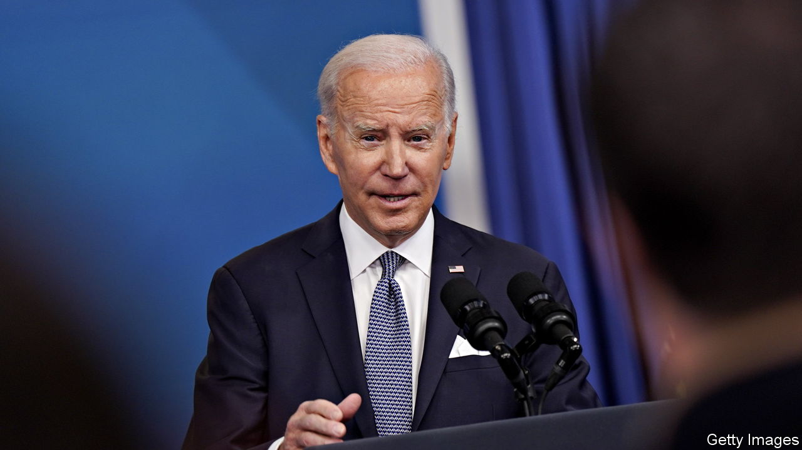

###### Sloppy Joe

# The presidential mislaying of classified documents is infectious 

##### Another president, another special counsel 

 

> Jan 13th 2023 

PRESIDENTS HAVE mishandled official documents since long before Donald Trump was flushing them down White House toilets and hoarding others at Mar-a-Lago. Several took files (mostly non-classified) with them when they left the White House, says Jeremi Suri, at the University of Texas at Austin, as keepsakes or for their memoirs. Occasionally, as with Lyndon Johnson’s obfuscation of classified Vietnam papers, they did so to keep unflattering information out of the public eye. The most infamous example, at least until the Trump saga, was the wiping of White House recordings in 1973, during the Watergate investigations into Richard Nixon. 

Although the recent discovery of classified papers in ’s office and home probably has less sinister motives, it is embarrassing because he had recently berated his predecessor for doing something similar. The headlines got worse when the president sought to reassure the public by mentioning that he stored his Corvette in the same locked garage as the documents. It did not take long for pundits to contrast the fbi raid on Mr Trump’s home with spoof images of Mr Biden driving a sports car with documents flying out of the back.

A week before the , several classified documents were found by Mr Biden’s personal lawyers as they cleared out his former office at the Penn Biden Centre, a think-tank in Washington, dc. This was not made public until this month. Then Richard Sauber, a White House lawyer, announced the discovery of a “small” second batch, this time in the garage and an adjacent room in the Bidens’ family home in Wilmington, Delaware. Two days later Mr Sauber announced that five more pages had been found. 

For Democrats, who have insisted that Mr Trump should face criminal prosecution for his mishandling of classified papers, this is horrible news. For Republicans, it is an unexpected gift—one enjoyed by Mr Trump. “When is the FBI going to raid the many homes of Joe Biden, perhaps even the White House?” he asked on Truth Social, his social-media platform. Other Republicans have demanded that the justice department treat Mr Biden with the same rigour as it has Mr Trump. In November the attorney-general, Merrick Garland, appointed a special counsel to oversee investigations involving the former president. Sure enough, on January 12th Mr Garland appointed a special counsel, Robert Hur, to review Mr Biden’s case, authorising him to prosecute any federal crimes arising from the investigation. Mr Hur was appointed by Mr Trump as attorney-general for Maryland, so seems fairly independent.

House Republicans have also announced an investigation of their own. James Comer, the Oversight and Accountability Committee chair, has demanded the Biden administration hand over visitor logs to the Wilmington home. The White House denies these exist—presidents do not normally keep records for private residences. Asked on CNN why the committee was not investigating the files found in Mr Trump’s home, Mr Comer said that his biggest concern was, “how there’s such a discrepancy in how former President Trump was treated, by raiding Mar-a-Lago, by getting the security cameras, by taking pictures of documents on the floor, by going through [former first lady] Melania’s closet. That’s not equal treatment.”

The appearance of hypocrisy, and the suggestion of a double standard among institutions such as the Justice Department, the fbi and the National Archives are at the centre of much of the public and (right-wing) media storm. Inevitably, baseless claims have been made tying the papers in the Bidens’ home to the controversy surrounding their son, Hunter. An article on Fox’s website speculated that, “Malign actors may well have gained access. The president’s son, Hunter Biden, who is under criminal investigation for influence peddling schemes involving foreign entities, had routine and ready access.”

Allies of Mr Biden have emphasised that the two cases are fundamentally different. Mr Trump tried to block attempts to recover the (hundreds of) documents held in his home and it took many months, and a search by the fbi, to get hold of them. Mr Trump made a strange defence, arguing that he had declassified all the documents he took. Mr Biden’s team claims to have handed over the first batch of documents as soon as they were discovered, and the documents in the second location were found as part of a search of Mr Biden’s properties instigated not by an fbi warrant but volunteered by Mr Biden himself.

Uncomfortable questions remain for Mr Biden. How did documents from the Obama presidency get to these places? Why were they (still) there? What did they contain? Why did it take until last week for all this to be publicly revealed? The newly empowered Republicans in Congress will make it their mission to pursue the answers and pick at any inconsistencies. The prosecution of Mr Trump for mishandling classified documents, which Democrats have pressed for, now seems less likely.■


