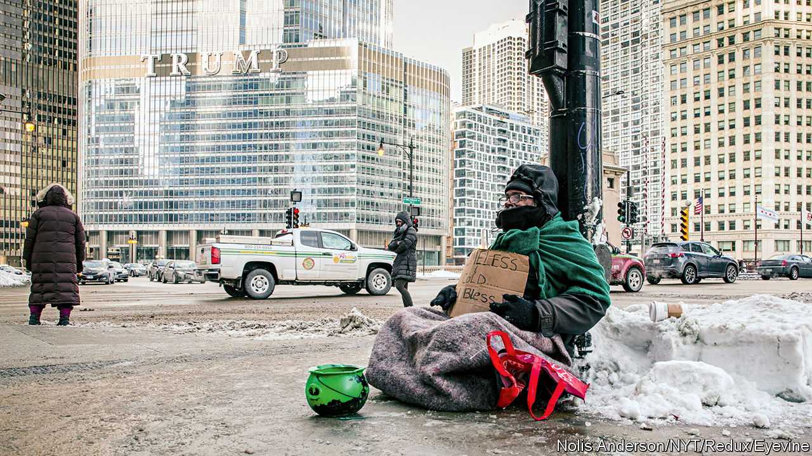

###### Cash for everyone

# What the spread of universal basic-income schemes says about America’s safety net 

##### Giving out cash by lottery ought to be a poor way to help people 

 

> Jan 19th 2023 

There were no giant cheques, but the people who filed into a conference room at the Cook County building in downtown Chicago to fill in forms on a snowy morning late last year had nonetheless won the lottery. On December 15th, 3,250 people were paid $500, either on special debit cards or by direct deposit into their bank accounts. They were picked randomly from over 230,000 applicants by GiveDirectly, a charity that has been brought onto administer the county’s  scheme. 

Applicants had to meet only three criteria to qualify: they needed to live in Cook County (which covers the city of Chicago and a large portion of its suburbs) and have a household income of less than 250% of the federal poverty line—about $69,000 for a family of four—and not be claiming from any other similar schemes. The $500 payments will continue monthly for two years. Recipients can do whatever they want with the money, and will continue to receive it as long as they stay in the county.

Such universal basic-income (UBI) schemes have been adopted by  across America in the past couple of years. They are paid for by the flood of money made available by the federal government for relief schemes during the worst of the pandemic. The Cook County programme is by far the largest yet. Some revenues from the taxation of marijuana have been set aside to continue the scheme when the federal money runs out. Toni Preckwinkle, the county president, says that her aim for the scheme is to test “good ideas that percolate up from the bottom”, with the hope that “eventually the federal government takes them over.” Yet in a way, the appeal of creating UBIs comes not out of hope, but out of frustration: the failure of the  to protect the poorest people.

Americans who fall on hard times can access a panoply of different schemes, at both a local and a federal level. There are disability benefits; food stamps; section 8 housing vouchers; Medicaid; and unemployment insurance (which is paid for and administered by states, but in crises often expanded federally). Most of this comes with an extraordinary amount of bureaucracy, however, and many people fall through the cracks—for example, because they do not have a permanent address, or they fail to file the right forms, or they do not qualify. Local governments generally do not have the data to even identify the people most in need. 

That helps to explain why Cook County—together with several other municipalities—has turned to GiveDirectly, which until recently mostly worked in poor countries using money from donors. According to Sarah Moran, the charity’s American country director, working in America requires making trade-offs. In its schemes in Kenya, the charity would sign up every family in a single village—local residents would help guard against fraud. Running a lottery open to such a large number of people however requires more formal checks, but having too many undermines the simplicity of the system. Under the scheme, the winners are asked to provide bank statements or payslips to prove eligibility—but people who cannot supply them, such as undocumented immigrants, can qualify by being interviewed. An algorithm is used to try to spot fraud—such as people applying with multiple identities.

The recipients filling in their forms last year were, unsurprisingly, delighted. Among them was Jasper, a 32-year-old father of three who, with his disabled wife and children, has been living in various family homeless shelters for several years, after losing his factory job and then, when he failed to pay his subsidised rent, his section 8 housing. “When I first got the email, I thought it was a scam”, he says. Without a permanent address, he has struggled to find a new job or even open a new bank account; without an income, he cannot get a new home. Food stamps cover the family’s basic needs, and he intends to save the payments until he has enough to put down a deposit for an apartment, and in turn start looking for jobs. The UBI will help him; but such people perhaps should not have to win a lottery to get assistance.■


