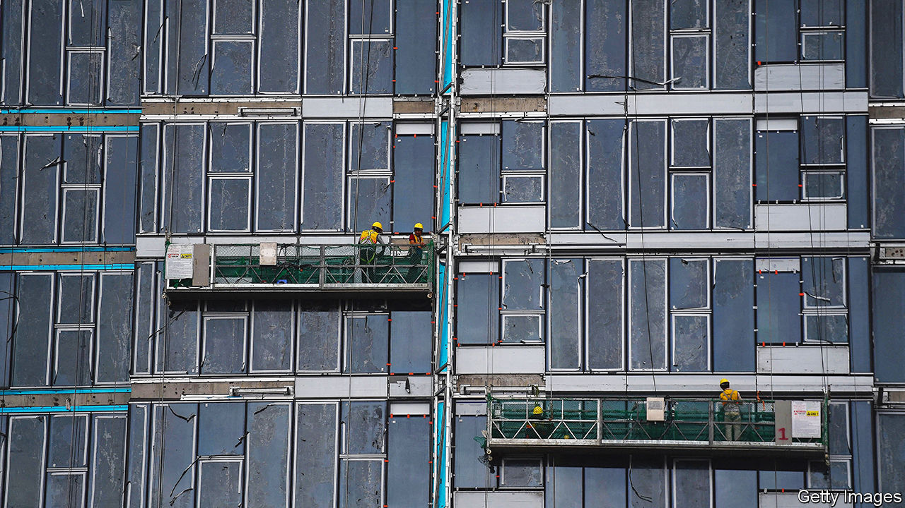

###### Corruption and covid-19

# An anti-graft drive brings down Vietnam’s president 

##### The crackdown on corruption is also a serious reform effort 

 

> Jan 26th 2023 

Vietnam’s communists showed a flair for emergency logistics in the 1960s by shipping arms by bicycle along the Ho Chi Minh trail. When covid-19 struck in 2020, their successors lived up to that billing. As borders closed, tens of thousands of Vietnamese citizens were stranded abroad.  promptly chartered almost 800 flights to bring them home.

Yet it soon emerged that not everyone’s trip had gone smoothly. Embassy officials had demanded inflated fees of $5,000 or more to facilitate the repatriations. “One woman in the quarantine camp where I stayed paid triple what I did,” recalled one evacuee. Again, the government was swift to act. In early 2022 investigators began arresting officials for allegedly shaking down the returnees for kickbacks. Dozens now face prosecution, including two former ministers. On January 17th Nguyen Xuan Phuc, Vietnam’s president, resigned to take responsibility for the scandal.

If corruption is not uncommon in , presidential resignations are. Mr Phuc’s underlines the remarkable degree to which the pandemic has ignited a decade-old anti-corruption drive known as  (“blazing furnace”). This crackdown is the signature policy of Nguyen Phu Trong, who as general secretary of the Vietnamese Communist Party (VCP) is the country’s paramount leader—more powerful than the prime minister or president.

Like Xi Jinping in China, Mr Trong has used corruption-fighting to amass ever more power for himself and the Communist Party. “Before the anti-corruption campaign there was a balance between the party and the state,” says Nguyen Khac Giang of the Vietnam Centre for Economic and Strategic Studies in Hanoi. Yet most of the senior officials purged for corruption rose mainly through government organs, not the party. The party has become increasingly dominant as a result.

The crackdown is also a serious reform effort. The 78-year-old Mr Trong, now serving his third five-year term, belongs to the last generation of leaders who experienced the war against America as adults. He is considered a true believer who wants to purge the VCP of the graft that spread after Vietnam adopted a market economy in the 1990s. Observers “got him completely wrong: we thought of him as a transitional figure,” says Andrew Wells-Dang, a Vietnam expert at the United States Institute of Peace, a congressionally funded but independent body. Some in the party reportedly call him , “stubborn bull”.

Those who corruptly exploited the pandemic were waving a red flag at him. In December 2021 the CEO of Viet A, a medical-equipment firm, was charged with bribing officials to purchase his company’s covid tests. Arrests of allegedly complicit bureaucrats followed, including the ministers of health and of science and technology, whose departments had falsely claimed that Viet A’s tests were certified by the WHO and the British government. 

Staff at embassies from Angola to Japan were punished over the repatriation flights. In April a deputy foreign minister was arrested over the scandal. The powerful ministry of public security, which carries out corruption investigations, made allegations against three of its own officials. On January 5th the purge cost two deputy prime ministers their jobs, including the foreign minister, who some considered a possible future prime minister.

The crackdown has also hit the financial sector. In April managers at a commercial-property group were arrested after it made a bid of over $1bn for land in Hanoi. In October the arrest of the head of another property company sparked a run on a bank which had sold its securities.

The campaign has been somewhat successful. Vietnam’s ranking in Transparency International’s corruption-perceptions index has risen from 111th in the world to 87th. The country is implementing accounting standards under investor-protection agreements with America and the European Union, says Oliver Massmann, a lawyer who has advised the government.

Yet some arrests look politically motivated. Nguy Thi Khanh, a celebrated climate activist, was sentenced in June to two years in prison for failing to pay tax on a prize she had been awarded. The campaign is also having perverse economic effects. With stricter accounting, says Dr Massmann, “corrupt officials have no interest in implementing capital-investment projects, because they can’t ‘eat’ from them.” Even some honest officials are so scandal-averse that they won’t approve projects.

The effect shows up in investment statistics. The disbursement rate of state capital investment—the share of the government’s planned spending on roads and the like which was actually spent—fell from around 70% in 2011-14 to about 50% in 2019. After a post-covid jump, last year it dropped to 58%. “Officials are afraid of any kind of responsibility, giving signatures or preparing public documents for projects,” says Mr Giang. The resultant snarl-up is evident even in tax collection. Several foreign residents report being unable to pay their taxes. The relevant officials worried that they might be held responsible for collecting the wrong amount. 

The logjam is slowing badly needed infrastructure projects. The nationwide North-South Expressway remains a patchwork. Ho Chi Minh City’s promised metro has yet to open a decade after work on it began. This will not jeopardise Vietnam’s growth in the short term. It was estimated at 7.5% in 2022 and is expected to top 6% this year. As America and Europe decouple from China, manufacturers are increasingly turning to Vietnam. Yet Mr Trong wants it to become a middle-income country by 2030. And for that to be feasible, honest officials should be able to approve projects without fear of being arrested. ■

