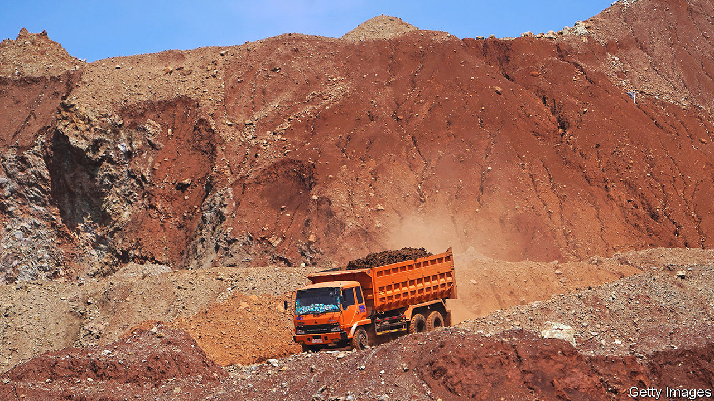

###### Full metal jacket

# Indonesia embraces resource nationalism 

##### It is about to discover that no two metals are alike 

 

> Jan 26th 2023 

Indonesia banned exports of nickel ore in 2020 in a bid to capture more of the metal’s value. So far, so good. Exports of Indonesian nickel products were worth $30bn last year, more than ten times what they were in 2013. Nickel smelters have sprouted around the country, and makers of batteries, in which the metal is a key component, are building factories. On January 17th a cabinet official said the government was close to sealing deals with the world’s two largest makers of electric vehicles (evs), Tesla and byd, to build cars in . Flushed with progress, the government is now thinking beyond nickel.

“This success will be continued for other commodities,” said , last month. He confirmed that an export ban on bauxite, the ore used to make aluminium, was coming in June. The bauxite industry is scrambling to prepare itself for the shock. Production of the metal is expected to fall from 50m tonnes last year to 31m. Access to the country’s limited refining capacity will be “fought over by 30 companies”, the head of a bauxite lobby group, Ronald Sulistyanto, told local media. “Who wants to produce bauxite, but can’t sell the bauxite?”

Mr Widodo, who is known as Jokowi, says this wrangling represents mere teething troubles, and that the bauxite export ban will eventually lead to a tripling of bauxite-based revenues. The government has suggested that a ban on copper exports could be implemented next, with bans on tin and gold exports to follow. Such a wholesale embrace of resource nationalism looks ill-advised.

The country’s pulling power in the global nickel market will be hard to replicate. Indonesia produces 37% of the world’s nickel. But its bauxite, gold and copper production is less than 5% of the global total. And an earlier metals export ban under Jokowi’s predecessor, in 2014, underlined how much market share matters. It spurred Chinese firms to build nickel smelters. But Chinese buyers of bauxite switched to Guinea and Australia. Indonesia’s share of China’s bauxite supply—then at 60%—collapsed. Today it stands at just 15%. The carnage forced Jokowi to pause that earlier export ban in 2017; it is not obvious why he wants to revive it.

The experiment with nickel also shows how costly bending metal supply chains is. Indonesia lured its new nickel smelters by promising a decade-long income tax holiday, a discount on mining royalties and exemption from vat and export duties. It also compels nickel miners to sell them ore below the market-rate. Smelters of bauxite can expect similarly generous treatment—even though aluminium does not have the strategic importance of nickel, the metal at the centre of Indonesia’s plans to be the nub of an ev supply chain.

Bauxite smelters are also expensive and harder to build than nickel smelters. Local firms are struggling to raise the capital needed for them, often around 18trn rupiah ($1.2bn), so the government is leaning on banks to offer prospective builders more generous terms. It has also eased environmental regulations on the industry—including potential penalties for environmental damage—to lower its costs. Although the government claims eight bauxite smelters are under construction, several are old projects long bedevilled by hiccups and delays, says Ahmad Syarif of Bower Group Asia.

All are Chinese investments. According to Mr Sulistyanto, only China’s firms find investing in alumina refining compelling. Indonesia should reconsider whether increasing its economic dependence on China is wise, says Perrine Toledano, a director at the Columbia Centre on Sustainable Investment. If the nickel industry is a guide, the new bauxite smelters will employ Chinese nationals as well as locals. This can cause conflict: on January 14th two people died and 71 were arrested following a serious brawl between Chinese and Indonesian workers at a nickel refinery on the island of Sulawesi.

Indonesia’s resource nationalism also risks falling foul of global trade rules. The wto ruled against Indonesia’s nickel export ban in November in a case brought by the eu, which frets that the ban is hurting its stainless-steel industry. More trade rows await once further bans kick in, but Jokowi is undeterred. “This is what we want to do: be independent, independent, independent,” he said.■

