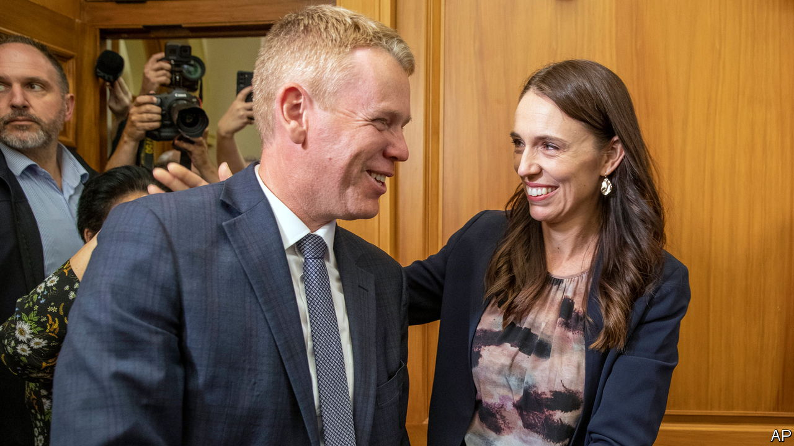

###### Kiwi politics

# Jacinda Ardern’s successor is unveiled 

##### Chris Hipkins will have his work cut out ahead of an election in October 

 

> Jan 23rd 2023 

The surprise  on January 19th of Jacinda Ardern, New Zealand’s widely loved prime minister, could have triggered bloodletting in the country’s ruling Labour Party. But it has selected a new leader with remarkably little fuss. Within two days of Ms Ardern’s announcement, Labour mps had coalesced behind Chris Hipkins, the education minister. He was formally endorsed as Labour leader on January 22nd and sworn in as prime minister on January 25th. “Leadership contests don’t have to be like the ‘Hunger Games’,” Mr Hipkins quipped.

No dramatic change of course is expected of him. The 44-year-old Mr Hipkins is a close friend and ally of Ms Ardern, whom he hailed as “one of our great prime ministers”. He also borrowed one of her lines, promising to govern with “the heart”. 

Mr Hipkins has a reputation in Wellington, New Zealand’s capital, for quiet competence, says Ben Thomas, a former adviser to the opposition National Party. During Labour’s two terms in power, he has been given a series of hard problems to manage. As health minister he was in charge of implementing New Zealand’s stringent response to covid-19, one of Ms Ardern’s best-known—and recently most contentious—policies. Last year, as the government struggled to tackle  and robbery, Mr Hipkins was made minister of police.

Mr Hipkins has replaced Ms Ardern’s deputy prime minister, Grant Robertson, with Carmel Sepuloni, the current minister for social development. She will be the first politician of Pacific ancestry (Samoan and Tongan) to hold the job. A more extensive cabinet reshuffle will soon follow. 

The goodwill towards Ms Ardern in her party is unfeigned. New Zealand politicos are not used to the global popularity that she achieved, as a charismatic cheerleader for progressive values and moderation. Still, her popularity has waned, as voters’ erstwhile approval of Ms Ardern’s covid-19 policies—which helped her win an impressive electoral majority in 2020—has given way to a familiar gripe about high inflation (currently around 7%).

A recent survey suggests that Ms Ardern’s net approval rating is slightly negative. Her main opponent, Christopher Luxon, leader of the centre-right National Party, had the same rating. Labour has been trailing National in the polls for months, currently by 32% to 37%. With a general election due in October, Mr Hipkins’s spell as prime minister could be brief.

He has vowed to recover his party’s standing by focusing on “bread-and-butter issues that people care about”. That, he says, will include tackling the “pandemic of inflation” and making “the tax system fairer”. In reality, Mr Hipkins’s best chance of signalling a change of tack will lie in abandoning a clutch of unpopular reforms that Ms Ardern had been pushing. An expensive merger between the country’s national television and radio broadcasters is likely to be scrapped. Unpopular legislation to overhaul management of the country’s water infrastructure—which has enraged conservatives and left other voters cold—may also be reconsidered. 

That could be enough to put Labour back into contention. Mr Luxon, a former chief executive of Air New Zealand, looks eminently beatable. And Mr Hipkins, a strawberry-blond known to his colleagues as “Chippy”, has a down-to-earth, self-deprecating manner that Kiwis tend to like. 

Covid-19 management aside, he may be best known for subsisting on a diet of cola and sausage rolls. And for those voters who crave another trailblazer at the helm, Mr Hipkins has an identity-political appeal all of his own. “It’s about time we had a ginger at the top”, he joshed, after he was nominated to replace the starry Ms Ardern.■

