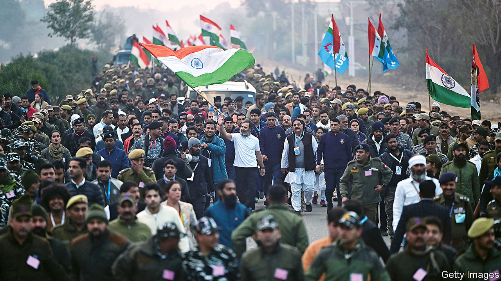

###### India’s opposition

# Relaunching Rahul Gandhi, again 

##### Do Indians still want the Congress party’s secular politics? 

 

> Jan 26th 2023 

Walk through the Indian countryside alongside  for a while and it is possible to imagine you are witnessing the rebirth of a political movement. Traversing the northern state of Himachal Pradesh one wintry day last week the leader of , was heralded in every town and village. Scores of people jostled for space behind windows and on rooftops, brandishing phones and occasionally tablets to record a glimpse of him. Sporting a white T-shirt and bushy beard, Mr Gandhi trudged inside a rectangular security cordon formed by police wearing tracksuits and carrying a yellow rope. Every few minutes the caravan stopped and security guards hustled bystanders inside the cordon for a photo-op and brief chat.

The “Bharat Jodo Yatra” (roughly “unite India march”) is an effort to boost Congress and its leader ahead of the general election due next year. Both badly need it. Congress, which as recently as 2009 won twice as many seats as its Hindu nationalist opponent, the Bharatiya Janata Party (bjp), risks becoming an electoral irrelevance. It controls just three of India’s 28 states and less than 10% of seats in the lower house of parliament. The bjp has 16 states, 56% of lower house seats—and in Narendra Modi, the prime minister, by far India’s most popular leader. He is the preferred prime minister of over 60% of Indians; half as many would pick Mr Gandhi.

A scion of Congress’ ruling dynasty—a son, grandson and great-grandson of prime ministers—he began his walk at India’s southern tip last September. By the time it concludes in Kashmir on January 30th he will have covered over 2,200 miles. Even by India’s tradition of political marches, this is a sterling effort. Mohandas Gandhi (no relation) walked 240 miles on his Salt March of 1930, a seminal act of civil disobedience; a previous bjp leader completed a similar route to Mr Gandhi in 1991 by car. At the helm of Congress for over a decade, as party president and, as currently, de facto leader, the 52-year-old Mr Gandhi has faced a suspicion that his heart is not in the family business. A modest uptick in his ratings suggests his exertions are helping to allay it. “He had this image of not being committed. This was a pretty visible way of overcoming that,” says Pratap Bhanu Mehta, a political scientist. 

Yet even if Mr Gandhi is a better politician than many Indians believe, he could not reverse Congress’s fortunes alone. Several failed attempts to boost the party by promoting its princeling leader have already proved that. Rather, Congress, a squabbling left-leaning coalition arraigned around its ruling family, needs to re-establish what it stands for. “We vacated the space of ideology, first to the left, then to the right,” says Jairam Ramesh, a veteran Congress leader from Karnataka who has walked with Mr Gandhi throughout. One aim of the , say Mr Gandhi and his acolytes, is to refresh Congress ideologically by reasserting its secular values.

They describe the  as an effort to promote love and unity against the hatred and division fostered by Mr Modi’s Muslim-bashing party. This recalls the principles of Mr Gandhi’s great-grandfather, Jawaharlal Nehru, India’s first prime minister. He and his supporters did not seek to banish religion from public life, as secularists in France had. Yet they saw the prioritising of one religious group over another as a guarantee of conflict in a diverse country with a history of religious, especially Hindu-Muslim, violence. For them, secular liberal institutions, including the legal system and bureaucracy, represented the country’s best hope of holding together.

Over the past three decades, and especially since Mr Modi won power in 2014, the bjp has eroded that legacy. First propelled to national power in the 1990s by communal rioting that its leaders had helped provoke, the bjp considers India a Hindu country for too long suborned to its religious, primarily Muslim, minorities.

Rallying Hindus against the other 20% of India’s population has helped paper over deep differences of caste and class within the majority group. It has also been so successful in redefining Indian nationalism as a Hindu cause that the bjp is able to deride its secular critics as unpatriotic. For many Indians, secularism and anti-Indianism have become, if not synonymous, then related. “Plenty of Hindus are now unwilling to consider secularism a good thing,” says Christophe Jaffrelot of Sciences Po in Paris. “The opposition will have to recreate the appetite for it.”

Mr Gandhi appears to be trying to do so by reaching beyond his atheist grandfather to the interfaith harmony preached by Mohandas Gandhi. He has walked parts of the  (a word that usually refers to a pilgrimage) in bare feet and often wearing a , a red mark connoting Hindu piety. He has referred to the Bhagavad Gita, a Hindu text, in presenting the as a or penance. Yet he has stressed religious inclusion. After the  entered the state of Punjab, he donned a turban to pay his respects at the Golden Temple in Amritsar, the spiritual centre of Sikhism.

He could be on to something. Surveys of young middle-class adults, a bjp constituency, suggest they are less Islamophobic than their parents. Moreover, if there is a better way for Mr Gandhi to present Congress as an alternative to the Hindu nationalists, it is not obvious. Despite Mr Modi’s pro-business and Congress’s pro-poor rhetoric, the two parties espouse broadly similar economic and social policies. But if Mr Gandhi may sense an opportunity, his heart-warming campaigning is nothing like an ideological counterweight to Mr Modi’s message of Hindu pride. Reviving secularism would require an alternative stance on divisive issues that have become vote winners for the bjp, such as uniform civil laws for minorities and interpretations of history, says Mr Mehta. “Saving secular pluralism from the charge of being anti-Hindu means giving a secular answer to communal issues. You need to explain what institutional measures you will take. It’s not enough to say ‘we’re secular’.”

If it is to revive demand for a large secular party, Congress will have to meet that challenge. There is currently no sign it is planning to. In theory, it could continue to languish. Indeed, the combined vote-share of the two big parties looks remarkably stable, at around 50% since the 1980s. They have simply switched positions. In 1991 Congress won 36% of the vote and the bjp 20%; in 2019, the bjp won 37% of the vote and Congress just under 20%. Yet this could change. The bjp was sustained in opposition by its cadre of deeply ideological activists. Congress, having no comparable ideology or foot-soldiers, could fizzle.

Half an hour after the  passed through Ganuspur in Punjab, its only remaining traces were a lorry laden with cardboard cut-outs of Mr Gandhi and policemen grumpily clearing away barricades. To secure the future of his party, and secular liberalism in India, Mr Gandhi will have to convince Indians that his trek through their towns and villages amounted to rather more than meets the eye. ■

