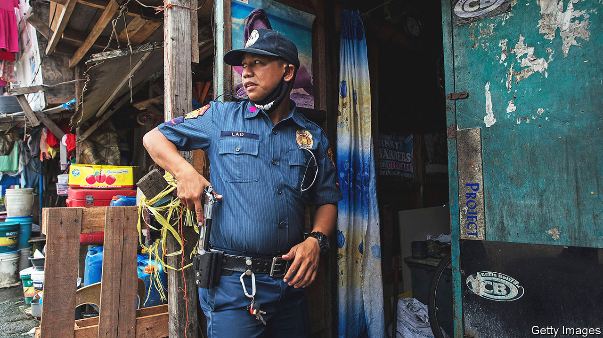

###### May the force be without you

# The Philippines’ new president rewires the war on drugs 

##### Bongbong Marcos has asked more than 900 police chiefs to resign 

 

> Jan 26th 2023 

WHEN HE BECAME president of the  last June,  promised to moderate his predecessor’s harsh drugs policies. Rodrigo Duterte had ordered the police to shoot dead any suspected dealer who did not surrender. This led to the killing of thousands of Filipinos. It also handed the police a much-abused opportunity to determine who was and wasn’t a dealer. One of Mr Marcos’s priorities is to reduce the corruption this encouraged in the Philippine National Police (PNP).

The minister of the interior, Benjamin “Benhur” Abalos, has asked all the country’s police generals and colonels to resign by January 31st. Mr Abalos promises a government committee will then reject the resignations of all except those suspected of corrupt involvement in the drugs trade. Some will be prosecuted, says Mr Abalos. Others, against whom there are serious allegations but insufficient evidence to bring charges, will be allowed to retire. Of the 953 police generals and colonels asked to resign, all but 11 had done so by January 23rd. 

The ploy is designed to get around the difficulty of defenestrating civil servants. It has incentivised the police chiefs to resign on the basis that appearing reluctant to do so could make them look guilty. The government used a similar trick to clean up the PNP in the 1990s; though some question whether that success can be repeated. The chief of the PNP, General Rodolfo Azurin, has said that fewer than ten senior officers are suspected of wrongdoing.

For Mr Marcos, discontinuing Mr Duterte’s grisly policy is an opportunity to mend the reputation of his family dynasty, tarnished by the corrupt regime of his late father, the first President Ferdinand Marcos, who ruled from 1965 to 1986. But the new approach mainly indicates that the drugs war failed.

Law enforcers say at least 6,250 people were killed in drug operations during Mr Duterte’s six years in office. Unofficial tallies suggest the toll may have been several thousand higher. Many of the victims were addicts or low-level hustlers. Some were allegedly murdered to prevent them revealing evidence of police involvement in the drugs trade. The violence achieved little. Abuse of methamphetamine hydrochloride, or as Filipinos call their street-drug of choice, remains rife. It costs roughly the same as it did in June 2016, when Mr Duterte became president.

