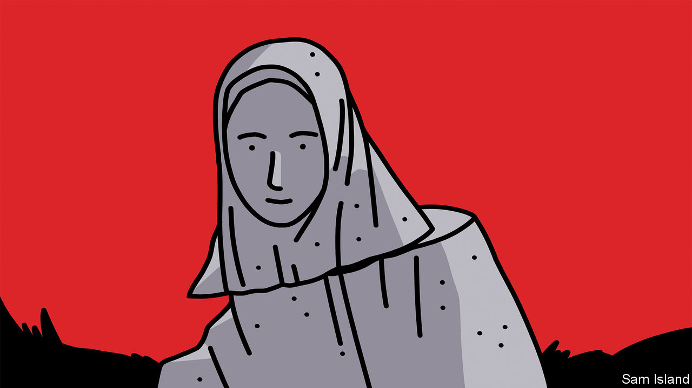

###### Banyan

# The Rohingyas long for their homes in Myanmar, but cannot go back 

##### A repugnant mass crimping of human potential 

 

> Jan 26th 2023 

IN A BAMBOO shack in Kutupalong, the world’s biggest refugee camp, a  woman keened last week for her sister. She was killed a few kilometres away, when her makeshift village in the no-man’s land between Bangladesh and Myanmar was attacked and her hut set on fire. The woman was burnt alive.

Extreme violence is all too familiar to the Rohingyas. A Muslim people from Rakhine state in , they have for generations been denied statehood and suffered persecution. The most brutal in recent times, carried out by the Tatmadaw, the Burmese security forces, was in 2017. Hundreds of thousands of Rohingyas crossed into Bangladesh with whatever they could carry and tales of murder, rape and torched villages. Over 900,000 Rohingya refugees are now housed in the Kutupalong and nearby camps, carved out of cleared forest south of Cox’s Bazar in south-eastern Bangladesh.

While roaming the camps, Banyan heard many heart-aching stories. Nearly every Rohingya he spoke with dreamed of returning home. Yet, though Bangladesh’s government is urging them to go, none is ready to. Rakhine state is currently peaceful by Myanmar’s standards. The Tatmadaw, which seized power two years ago, is distracted by other terror campaigns it is waging, including against an armed resistance in the Burmese heartland. But Myanmar is falling apart. Many of the 600,000 Rohingyas remaining in the country are not in their villages but also in un-run camps.

Though Bangladesh has given them refuge, violence still threatens the Rohingya fugitives. Thuggish gangs—part insurgent, part drug racketeer—have sprung up among the refugee population. The incinerated woman was a victim of one, the Arakan Rohingya Salvation Army (arsa). Grown powerful on guns and smuggling ,  a narcotic, arsa and other Rohingya crews are terrorising Kutupalong. It is no longer considered safe to walk the camp after dark. About two dozen refugees, including community leaders, have been killed since July. Kidnapping and extortion are on the rise.

The Bangladeshi police in charge at Kutupalong are often a big part of the problem. They demand bribes or confiscate goods. When investigating crimes, they frame the innocent. They are said to be in cahoots with the gangs they are supposed to suppress. A Rohingya woman in her late 20s describes in terrible detail how she was raped in a police station and now lives in fear of a repeat.

Besides women, Rohingya children, who make up nearly half of the camp’s residents, suffer most. Last year Bangladeshi officials shuttered 30-odd community-run schools in the camps that were teaching tens of thousands of students. That leaves unicef and a few ngos with permission to teach the camp’s youngest kids basic numeracy and literacy. A pilot project is under way to instruct 10,000 students in the Burmese curriculum. Otherwise, the refugees are denied schooling. A 17-year-old woman who says that she still hopes to become a doctor describes how frustrating this is. Denied education in the camps, the refugees are at the same time barred from studying outside. “I have a dream,” she says, “but it is not allowed.”

The refugees are also forbidden to work outside the camp. Any who wish to travel must first obtain a written permit from the local authorities (a situation disconcertingly similar to that of Rohingyas in Myanmar). Such restrictions, which refugees endure in many countries, reflect the Bangladeshis’ fear of the Muslim refugees putting down roots in their country. But this is driving them to take more desperate and subversive measures. Some 250,000 Rohingyas are estimated to have procured fake Bangladeshi passports and disappeared abroad, including to South-East Asia and Saudi Arabia. Others pay people-smugglers to take them on a perilous boat journey to South-East Asia.

This mass crimping of human potential is repugnant. By habituating so many young refugees into unemployability, delinquency and perhaps extremism, Bangladesh is also storing up an enormous problem—probably, given the unlikelihood that many will return home, for itself. Though fixing Myanmar is beyond them, Western governments should at least urge Bangladesh to grant the refugees more normal lives. But is that likely? With a war in Ukraine and much else to distract the world’s gaze, it is not on the Rohingyas, even as Western aid budgets shrink. And the residents of Kutupalong know it. ■


