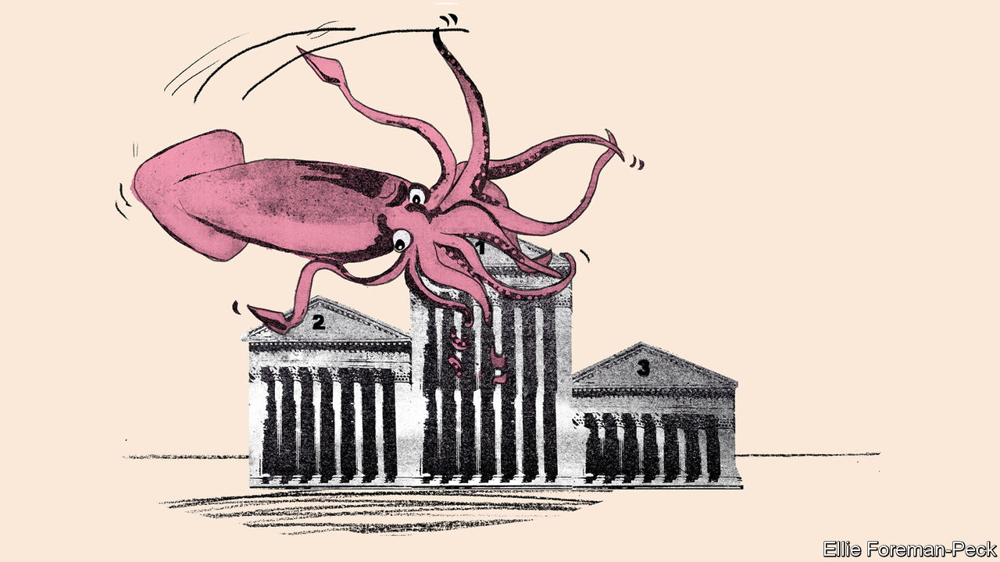
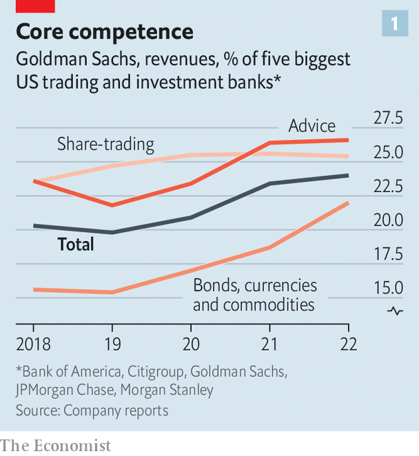
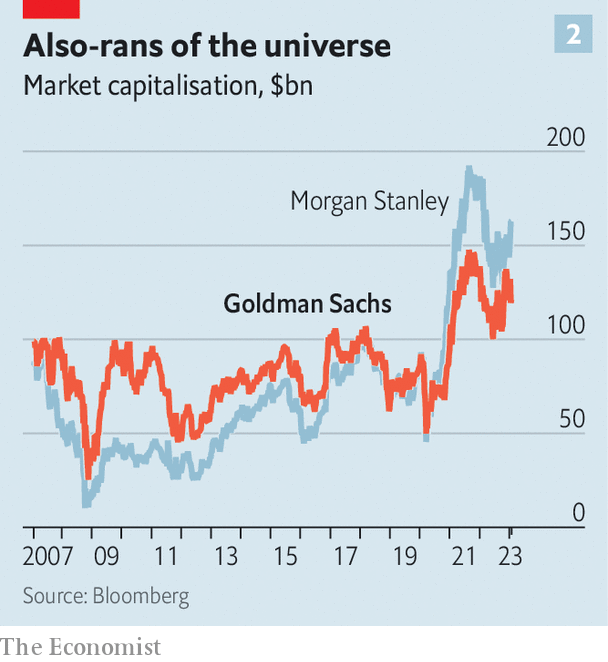
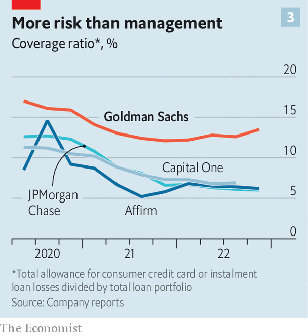

###### Vampire squib

# How Goldman Sachs went from apex predator to Wall Street laggard 

##### Its attempts to diversify out of volatile businesses and into consumer lending have disappointed 

 

> Jan 26th 2023 

THIRTEEN YEARS ago, when  described Goldman Sachs as a “great vampire squid wrapped around the face of humanity, relentlessly jamming its blood funnel into anything that smells like money” the description stuck, not just because it was vivid, but because it was a little bit true. Goldman made pots of money, more than anyone else on Wall Street. After the global financial crisis of 2007-09, most of the big financial institutions that survived were left licking their wounds, paying back bail-outs and pleading for forgiveness. Not Goldman: in 2009 it raked in $13.4bn in profits, its best year ever at the time and a record that stood for more than a decade.

 accused the firm of being “everywhere”, and that was not so far from the truth either. Goldman’s best and brightest, having cut their teeth on its trading floor or in wood-panelled conference rooms finessing mammoth deals, founded formidable hedge funds or giant private-equity firms. The revolving door between Goldman’s headquarters and the United States Treasury seemed to spin freely, regardless of which party occupied the White House: three recent secretaries of the Treasury and numerous underlings have been Goldman alumni. There have been lots at the Federal Reserve and other regulators, too. And former Goldmanites have helmed the European Central Bank, the World Bank and the governments of Australia and Italy. Goldman seemed omnipresent, omniscient and omnipotent.

 was far from the only critic of all this, but Goldman revelled in the attention. Indignant commentators marvelled at how it managed to mint money through good times and bad, often accusing it of ruthlessness or predation. Yet that reputation was also the reason that corporate bigwigs clamoured for Goldman’s advice when issuing debt or equity or taking their firms public. Goldman was staffed by winners—it was better to have them on your side.

That is not the story anyone is telling about Goldman Sachs any more. Morgan Stanley, a rival it long sneered at, has comprehensively outperformed it over the past decade. Its bosses, unlike Goldman’s, quickly grasped that the regulatory regime imposed after the financial crisis would require a shift away from speculative and volatile trading towards more predictable and safer businesses, and diversified accordingly. It took Goldman years to initiate a similar shift. But even since its adaptation has accelerated under its current boss, David Solomon, it has little to show for it. 

On January 17th Goldman reported dismal earnings for the fourth-quarter of 2022 of just $1.3bn in profit and a 4.8% return on tangible equity (a no-nonsense measure of profitability), which Mr Solomon described as “disappointing” and “not what we aspire to deliver to shareholders”. It is not just peers on Wall Street that Goldman has fallen behind: its consumer-lending business has had to make higher provisions for bad loans than almost any bank in America. Earlier this month the  reported that the Federal Reserve was investigating whether the unit in question had been monitoring its lending carefully enough.

Last year was difficult for many financial firms. Rising interest rates and plunging stockmarkets discouraged the transactions that are investment banks’ bread and butter. Most Wall Street firms are making lay-offs and cutting costs. But Goldman’s missteps have required earlier and deeper cuts. Its bonus pool for senior staff was reportedly halved, something elite bankers rarely take well. On January 11th the firm laid off 6% of its workforce.

The problem is not really Goldman’s main business, advising corporate clients and executing trades for them. The profits of these divisions are strongly cyclical, but they have done well in recent years. The wild swings in asset markets in 2020 pumped up trading volumes; the roaring bull market of 2021 led to a surge in initial public offerings, mergers and acquisitions; in 2022, despite adverse conditions in other respects, Goldman’s bond-traders were able to capitalise on rising rates. The bank made $21.6bn in profits in 2021, at last besting the record set in 2009. Return on tangible equity was a whopping 24.3%, its highest since 2007.

 


Crucially, Goldman did not simply benefit from favourable conditions in the markets; it also managed to win business from its rivals. Its share of the bond-trading revenue earned by the five biggest American banks in the business—Bank of America, Citigroup, Goldman Sachs, Morgan Stanley and JPMorgan Chase—has grown from 15% in 2019 to 22% in 2022. It has also won a bigger slice of share-trading business and the market for advising firms on M&amp;A and IPOs (see chart 1). Even if the total volume of such business among the five banks had not grown, Goldman’s revenues would have risen by 18% from 2019 to 2021, owing to its expanding market share. As it was, the boom in those businesses propelled a heady 68% leap in revenue over the period.

Goldman points out that this growth has been accompanied by better returns, too. The return on equity in its markets and investment-banking divisions, which were merged in the fourth quarter, has climbed from just 9.2% in 2019 to 16.4% in 2022. (The comparison may be a little misleading, in that 2019 was the year that Goldman booked a $3bn fine for issuing billions of dollars of bonds for 1MDB, a Malaysian government investment fund, the proceeds of which promptly vanished. But returns in markets and investment-banking climbed by around three percentage points from 2020 to 2022, which is nothing to be sneezed at.) Since Mr Solomon took charge in 2018 the firm’s average annual return to shareholders has been an impressive 13.2%, thanks largely to these units.

The problem is that investment banking is volatile, as the past quarter’s results show. Investors tend to value steadier, more predictable returns. This is precisely what Mr Solomon promised them when he became CEO in late 2018. By that stage Goldman had suffered a decade of stagnation. Regulators had forced it to convert itself into a bank in 2008, with all the extra red-tape that entails. New rules had also required it to hold more capital against risky activities, such as speculative trading on its own behalf, which had been a big source of profits. All this markedly dampened returns. An investor who purchased a share in Goldman on December 31st 2009 would have made a measly 4.5% a year on average, including dividends, by the time Mr Solomon took charge.

Mr Solomon was going to change all this. He promised not only to improve returns in Goldman’s core units, as he has done, but also to hasten its move into steadier, more predictable businesses, such as consumer lending and wealth-management. The idea was to generate lots of recurring revenues and thus deliver much more stable returns.

A similar strategy had worked wonders at Morgan Stanley, which in Goldman’s all-conquering era had been a perennial also-ran. James Gorman, who became its boss in 2010, recognised early that regulators would make the glamorous but cyclical businesses of investment banking and trading less attractive. He engineered the purchase of Smith Barney, a wealth-management business, from Citi when that lender was still struggling. The attraction was the predictable income from the fees that clients pay every year to have their money looked after. In 2020 Mr Gorman doubled down on that strategy, which he describes as balancing the “engine room” of the investment bank with the “ballast” of wealth management, by purchasing both E*TRADE, an online share-trading platform, and Eaton Vance, another asset manager for a total of $20bn. 

 


Shareholders in Morgan Stanley are delighted. Since Mr Gorman took the top job on January 1st 2010 a shareholder in the firm would have earned an average annual return of 11.4%—50% more than the equivalent figure at Goldman Sachs. A few months before Mr Solomon took over at Goldman the market capitalisation of Morgan Stanley drew level with that of Goldman for the first time since before the financial crisis. Today Morgan Stanley is worth a third more (see chart 2).

A similar attempt to diversify was initiated at Goldman by Lloyd Blankfein, Mr Solomon’s predecessor, who ran the bank from 2006 to 2018. In 2016 he launched a consumer bank, called “Marcus by Goldman Sachs”, a nod to Marcus Goldman, who founded Goldman Sachs in 1869. The new unit started as an online platform to take deposits, in an effort to lure the kinds of low-cost, sticky funds that benefit rivals with consumer banks such as JPMorgan Chase and Bank of America. Goldman subsequently launched the lending drive, something Mr Blankfein described at the time as a good business for the firm since it hinged on credit scores, algorithms and “risk management, which we think we’re pretty good at”. The plan was to offer personal loans of up to $30,000 to help customers manage credit-card debt.

Soon after came a credit-card partnership with Apple, organised by Mr Blankfein and launched by Mr Solomon in 2019. In 2021 Mr Solomon expanded the consumer-lending business yet more by buying GreenSky, an online platform that makes home-equity loans, for $2.2bn. After a reorganisation of Goldman’s different divisions last year, the second on Mr Solomon’s watch, much of the consumer-lending business has moved to a part of the business called “platform solutions”. It has made cumulative pre-tax losses of $3.8bn since 2020. These grew from $800m in 2020 to $1.9bn in 2022. 

Denis Coleman, Goldman’s chief financial officer, argues that the consumer business is not doing as badly as it seems. He points to accounting rules, implemented in 2020, which force Goldman’s lending arms to front-load the cost of a loan by making provision for possible future losses the moment the money leaves the bank. A business which is expanding its lending racks up big costs in this way before a penny of revenue has been earned, which creates a misleading drag on results. 

However, Goldman is also having to set aside a far higher proportion of the value of its loans than its peers, suggesting it is lending to the wrong people. In the fourth quarter it made provisions of 13.5% of the loans it issued. That is double the level of Capital One, a subprime lender, which set aside only 7% in the same period. 

 


Mr Coleman blames the lending unit’s youth. “If you have had a portfolio of credit-card loans for 15 or 20 years you have a very good set of data and you have removed clients from that portfolio that went delinquent.” Because Goldman’s loan book is so new, he argues, the bank has not yet weeded out the bad seeds. Yet even compared with recent startups, such as Affirm, which makes instalment loans, Goldman fares poorly. Affirm, which launched in 2012 but only began lending in earnest several years later, sets aside half what Goldman does (see chart 3). 

Goldman’s other defence is that consumer lending is a tiny fraction of its business. Just 3% of revenues and only 4% of common shareholder equity (about $4bn), is allocated to that part of the firm. But consumer lending was not supposed to be an obscure sideline for Goldman in the long run. The point of diversifying was to make a significant reduction in the share of the bank’s earnings affected by volatility in capital markets. The damage done to Goldman’s bottom line by the consumer-lending business is also more severe than those numbers make it sound. Of the entire firm’s $33.7bn of expenses and provisions in 2022, platform solutions accounted for $3.5bn-worth, more than 10% of the total. 

The firm admits that something has gone badly wrong. It has stopped making consumer loans through Marcus. Mr Solomon said in a recent call with analysts that Goldman had tried to do “too much, too fast” and perhaps “lacked the talent” to flourish in the markets concerned. Investment bankers in expensive suits, a financier quips, know little about consumer finance, where polyester is more typical. 

The other main element of Goldman’s effort to diversify its income streams was to do as Morgan Stanley has done and gin up its wealth-management business, thereby boosting reliable revenue from fees. In 2019 Goldman acquired United Capital, a small wealth manager which served rich (but not ultra-rich) customers, for $750m. It has since folded that firm into an existing business called Ayco, which specialises in executive coaching.

In 2020 Goldman set a target of earning $10bn from management fees by 2024. It seems likely to hit it: fees climbed from $6.8bn in 2020 to $8.8bn in 2022. But even $10bn is a relatively small slice of the firm’s $47bn in revenue in 2022. The expansion of parts of the wealth-management business has been “a little slower” than hoped, concedes John Waldron, Goldman’s chief operating officer.

What is more, the steady wealth management is now paired with Goldman’s much more volatile asset-management business. Returns in that unit gyrate because it invests not just its clients’ money, but Goldman’s as well. The firm says it will cut back on this form of investing, but not eliminate it entirely. “Our investors like to know that managers have some form of skin in the game,“ explains Mr Coleman.

Another thing that was supposed to change under Mr Solomon was Goldman’s corporate culture. Unlike his buttoned-up predecessors, he can be lighthearted. He once wore sweatpants to a meeting to woo the executives of Lululemon, the yoga-attire company. He moonlights as a DJ and relaxed the dress code. He was even declared a “woke dude” by  in 2018 because he suggested that employees not busy with an imminent transaction did not need to work on weekends and that putting in 70 hours a week was probably sufficient.

Mr Solomon started inviting big investors to annual powwows in 2020—a common practice on Wall Street but a first for Goldman. This was the most notable element of a push to be more open and engage more with shareholders. “We had been a public firm for 21 years and we had never done an investor day before,” says Mr Waldron. “I always felt like that investor day, the first investor day, was kind of like a re-ipo, where you had a new management team, and we were embarking upon a reasonably fundamental shift in strategy.”

 


But as Mr Solomon’s tenure has gone on, this kinder, gentler approach has fallen away. Last year he urged all staff return to the office full-time, putting an end to pandemic-induced home-working. His penchant for reshuffles and a management style that is most kindly described as blunt seem to have precipitated a series of high-profile departures. Senior executives such as Gregg Lemkau, head of the investment bank; Omer Ismail, once head of the consumer bank; and Eric Lane, head of asset management, have all left the firm. Bosses of other banks say it has become easier to poach Goldman partners.

Having professed to want a smaller, more elite group of partners and having elevated just 60 people in 2020, Mr Solomon appointed 80 new partners in 2022. And they are of a different kind. In 2016 some three-quarters of new partners had joined the firm as analysts or associates, at the start of their careers. By 2022 just 43% had. In the old days a job at Goldman was a one-way ticket to wealth and power. That inspired ambitious young people to join fresh from college and spend a lifetime at the firm. Its staff these days seem less devoted to that cause. 

Tentacles in a twist

With consumer lending in disarray, wealth management growing only slowly and the cultural overhaul going into reverse, the new Goldman Sachs looks a lot like the old Goldman Sachs, albeit with a small, loss-making consumer arm tacked on. It retains its superb advisory and markets arms, which make up around 70% of the firm, but yield volatile returns, as does its asset-management unit.

This array of businesses does not seem to excite investors. In 1999 Goldman’s share price implied the firm was worth four times the value of its assets (book value, in the jargon). Nowadays, it trades at book value, implying that investors would do just as well to liquidate it. Morgan Stanley, in contrast, trades at 1.7 times book value. It is embarrassing enough to be outshone by an old rival. In the consumer-lending business, to be outdone by the guys in polyester suits is pure humiliation.

Stand on the east side of the top floor of Goldman’s headquarters in lower Manhattan and you can look down on all of Wall Street. Despite the bank’s recent stumbles, its employees continue to enjoy the commanding view. But hardly anyone is looking up to them any more. ■

