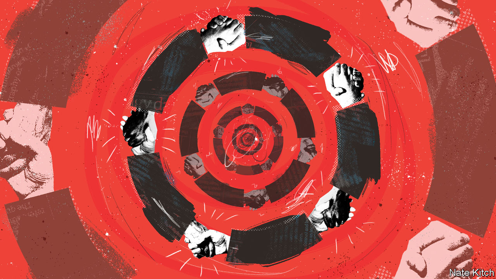

###### Bagehot

# Blat, the Soviet art of getting by, comes to Britain 

##### Lessons in navigating a land of queues 

 

> Jan 26th 2023 

After britain’s covid-19 shutdown, waiting times at driving-test centres rose to over six months. Where there are bottlenecks, there is potential for profit. Enterprising sorts created a lucrative secondary market: they built online bots to hoover up scarce test slots, and then sold them on to impatient candidates. The Driver and Vehicle Standards Agency promised a crackdown, but several of these intermediaries still seem to be in business. 

Gregory Grossman, a famed Sovietologist, would have recognised these  and the shortages on which they thrived. Propaganda might have presented the Soviet command economy as centrally planned, regimented and thoroughly socialist. In reality, Grossman said, there was a flourishing “second economy” of capitalist entrepreneurship, ranging from the ideologically unsound to the outright criminal. Peasants sold food from private plots; tradesmen moonlighted; shadow factories pumped out televisions for the black market. The whole system was lubricated by , or the “economy of favours”. In a land of queues, getting hold of a fridge, theatre tickets or a better apartment relied on a network of contacts, cunning and petty bribery. 

Grossman’s work is a useful way of understanding some of what is happening in Britain today. Universal public services are the closest Britain has to a state ideology. The NHS flag flies from municipal buildings; nurses will sing in the coronation choir later this year. But queues abound: hours for an ambulance, months for a visa, years for a criminal trial. And so a second economy thrives. 

For the better off, there are private options. Demand has jumped for one-off private medical procedures, particularly on knees, hips and cataracts. There is a nascent market in private emergency ambulances and in private police forces to patrol neighbourhoods. Private prosecutions are making a comeback. All of this is legal and rational, though not something politicians will rush to admit. Rishi Sunak has confessed to having “used independent health care in the past” with the tone of a Politburo member atoning for a collection of Gucci loafers.

There are kitchen-table remedies that do not require going private. On Mumsnet, a web forum, mothers trade tips on securing an appointment with their family doctor: queuing on the pavement before dawn, sobbing into the intercom or downloading an autodialler to bombard the booking line. Some eastern Europeans in Britain combine trips home with medical appointments. 

And for the better-connected, there is . The middle classes have long exploited the rule book and the lexicon of the bureaucrat to secure school places or medical treatment, notes Annette Hastings of the University of Glasgow. What has changed is the intensity of effort required to secure the most ordinary services. Contacting your MP used to be a last resort and is now a means of doing business: the passport office received 11,000 complaints from MPs in a six-month period last year. 

 dictates that to unlock health treatment, it is worth tracking down the consultant’s secretary. If you want a crime to be investigated, the detective’s mobile is far more useful than a crime reference number. Privatised utilities offer a particularly lousy service but they are sensitive to criticism from people with clout. At least one water company operates a second, unadvertised call centre for resolving VIP complaints that reach the CEO’s desk. 

Covid-19 was a breeding-ground for . The NHS fraud watchdog suspects that jabs and vaccine passports were sold on the black market by staff. A shortage of protective equipment meant rewards for middlemen who could supply the government. The Soviet fixers who helped factory managers get essential supplies were called . In England they are known as Tory donors.

The second economy in the Soviet Union ran on corruption, “beginning with the pay-off for a good room in the obstetric ward, ending with a pay-off for a quality burial plot”, as Steven Sampson, an anthropologist, put it. To the extent Britain is vulnerable to graft, it is because of bottlenecks. Government policy creates an acute mismatch between supply and demand for land, for example. Transparency International, a campaign group, sees a risk in the councillors and former officials who can be employed as “consultants” on planning decisions. 

If bribery remains comparatively rare in Britain, that is in part due to a proliferation of licit fast-track schemes. NHS hospital trusts are allowed to make half of their income from private patients’ units that are often attended by the same doctors. A hundred quid will secure a private room on a maternity ward (though not, Bagehot can attest, a better breakfast). This month the Home Office has created a priority service for those already in a queue for visas to join family members in Britain, which now stretches to six months, twice its target length. For an extra £573 ($704), the paperwork will be delivered in three weeks. A fast-track scheme that turns a gridlocked service into a merely late one is very Soviet. 

Seeing red

The second economy helped prolong a failing system. A supply of jeans and American records mollified a restless Soviet public, disguised the inadequacies of the command economy and dulled the pressure for reform. Even the worst bits of Britain’s public services can be made tolerable for those with money or bureaucratic cunning. It is more productive to pay up or pull strings than to protest. 

But it is also corrosive.  compounded the inefficiencies of the Soviet system and rendered its boasts ridiculous. It does the same in Britain. Nine in ten dentists have no space for new NHS patients, yet the NHS website boldly declares that it will “provide any clinically necessary treatment needed to keep your mouth, teeth and gums healthy and free of pain”. This is fiction fit for a May Day banner.  is a declaration of distrust in a system that only sometimes does what it promises. To queue is to be taken for a fool. Better to shed that English reserve, and push to the front. ■


