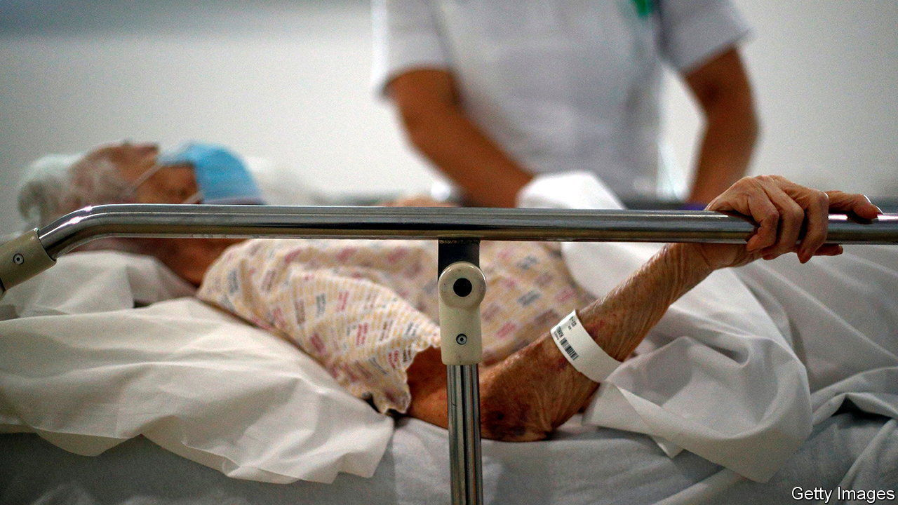
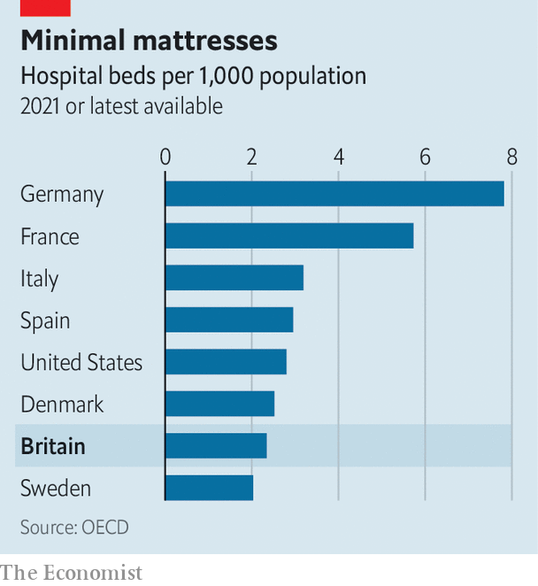

###### Bedlam

# Britain has fewer hospital beds than almost any other rich country 

##### Why that once seemed like a good idea 

 

> Jan 26th 2023 

Britain has 2.3 hospital beds per 1,000 people, compared with 5.7 in France, and 7.8 in Germany. So in the middle of what is perhaps the worst winter in the history of the National Health Service (NHS), it is not surprising that hospitals are rammed. In the second week of January, 95.7% of beds in acute and general wards in England were occupied, the second-highest figure ever recorded. High occupancy rates mean that it takes longer for sick patients to be admitted, resulting in record waiting times in accident &amp; emergency (A&amp;E) departments. 

After more than 12 years in power, the Conservative government can be blamed for many of the NHS’s current problems. Its refusal, until recently, to have a workforce plan helps explain why one in ten posts in the NHS are vacant. Cuts to the capital budget have run down hospital premises and led to skimping on medical equipment like scanners. Given the extent of current problems, it would be easy to blame the government for the bed shortage, too. In fact, it is more complicated than that.

In the decades leading up to the covid-19 pandemic, many countries reduced their numbers of hospital beds. Those who did so fastest—including Britain—were celebrated as paragons of caring efficiency. Beds for those with mental illnesses and learning disabilities were replaced by more appropriate care in the community. Medical advances helped patients in general, acute and maternity wards to get out of hospital faster, and therefore to recover more quickly at home. In the 20 years to 2020-21, the number of acute and general beds fell by 30%. During that same period the length of the average stay in hospital fell more sharply still, from 8.2 days to 4.3. 

The idea of bed reductions commanded support among managers and policymakers during the last Labour government. In 2006 the NHS Confederation, which represents NHS organisations, released a briefing paper entitled “Why we need fewer beds”. An all-party parliamentary group for dementia, headed by a cross-bench peer and former boss of Age Concern England, suggested in 2011 that at least 10% of acute beds should be cut in order to fund improved dementia care.

Given the current crisis, such schemes now seem ludicrous. “Most policy commentators would say the bed cuts went too far,” says Siva Anandaciva of The King’s Fund, a think-tank. Planners underestimated the demands on hospitals from an ageing population and the pressures of winter in a country which does not properly heat its homes, let alone from a disease like covid-19 (which continues to eat up bed capacity even now). 

 


Yet it is possible to imagine a scenario in which Britain could have pulled it off. Other countries have done so. At 2.5 beds per 1,000 people, Denmark has only slightly more beds than Britain does (see chart) but far fewer problems. This is because hospitals routinely have the right technology to monitor patient flow—how many are on their way to A&amp;E, how many are waiting there, which wards have space available—and therefore use what beds they have more efficiently. Most importantly, the Danes have a long-term, well-funded plan for elderly care. Britain, in contrast, has cut the number of community nurses and hugely neglected its own social-care sector. This is why, despite the demand for beds, 13,721 of them (13% of general and acute beds) are filled by patients who are medically fit to leave. 

Britain may well need more hospital beds. It certainly needs more staff to look after those in them. But it would be easy to forget what the reduction in beds was trying to achieve. “The vision is still right,” says Rory Deighton of the NHS Confederation. “The only way to deal with an ageing population is to help people to live independently, and in their own homes.” But if you want more people out of hospital, you must also fund the alternatives. ■


