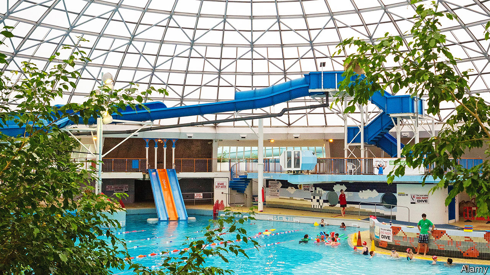

###### The architecture of fun

# Britain is beginning to protect its 1970s leisure centres 

##### Nothing makes your correspondent feel older 

 

> Jan 26th 2023 

“You need to use your imagination,” says Otto Saumarez Smith, an architectural historian. The Oasis swimming pool and leisure centre in Swindon closed in 2020 and is now drawing graffiti taggers and weeds. But when it opened, in 1976, it was a steamy tropical paradise with trees and slides under a bravura 45m-wide glazed dome. 

In 2021 the Oasis became the first leisure centre to be protected by Historic England, which noted the odd fact that a rock band from Manchester, more than 200km (124 miles) north, is named after it. A second 1970s leisure centre, in Bradford, was protected last year. The Twentieth Century Society, an architectural-heritage charity, is campaigning to save ten other structures, including the dome in Britain’s first Center Parcs resort. It says that several are being assessed. 

The society hopes to repeat the success of a campaign that began in 1991 to save open-air swimming pools known as lidos. Both types of building involve water, but are otherwise entirely different. With their cold water, uncomfortable changing rooms and art-deco styling, lidos preach the virtues of exercise. The indoor leisure centres of the 1970s and 1980s were about family and fun. 

Their pools were curvy and fringed with trees. You walked into the water via gently sloping beaches; the leisure centres’ architects had discovered that many Britons could barely swim. They had wave machines and waterslides, and some served alcohol. Their designers aimed to bring the Mediterranean to ordinary Britons. As Britons took to holidaying in the actual Mediterranean, some began to decline; austerity and covid-19 finished them off. 

But not all have been demolished, because local people have fought hard to protect these tacky temples. In December a group pushed Cornwall County Council to relinquish control of a leisure centre known as Ships and Castles, which had been slated for demolition. People associate leisure centres with fun memories and want to preserve them more than, say, a modernist housing typology. 

They are tricky buildings, admits Mr Saumarez Smith. In environmentally conscious times it is harder to justify heating a giant glazed bubble. Whereas only the roof of the leisure centre in Bradford is protected, in Swindon the pool is too, so it could probably only be used as its architects intended. Neil Robinson, who led the campaign to protect the Oasis, dearly hopes it will reopen. He has switched to another pool, “but it’s just boring lane swimming”.


