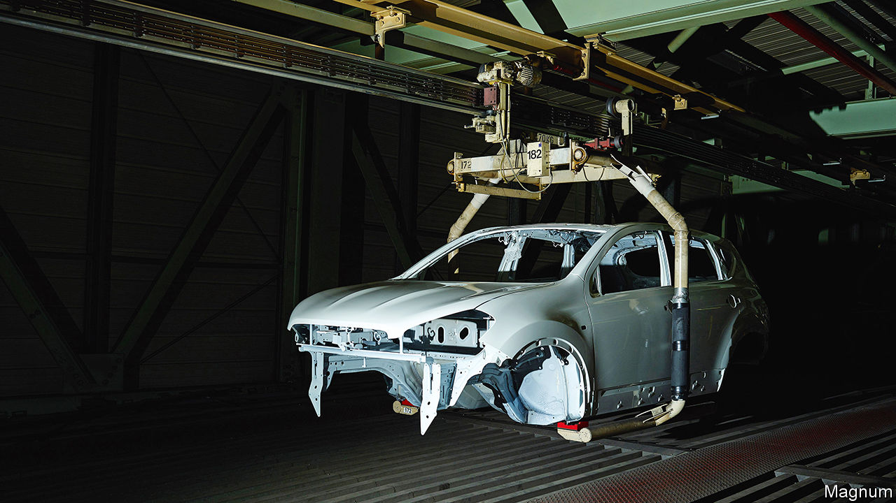
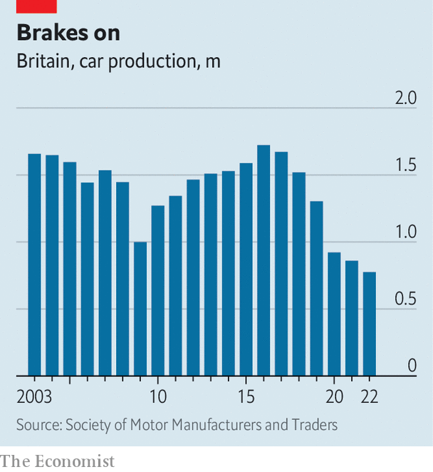

###### Pulling the plug?

# Britain’s carmaking industry is increasingly under threat 

##### Britishvolt’s collapse is not the only bad omen for battery-powered cars 

 

> Jan 24th 2023 

The performance of  over the years has varied as much as the vehicles it has produced. In the 1950s Britain churned out more cars than anywhere except America; by the 1970s the industry was close to collapse. Six years ago it was purring like a : 1.7m cars rolled off production lines in 2016. Since then , Brexit and the rapid shift to  have made it look more like a Morris Marina. The country fell from 13th in the carmaking league table in 2016 to 18th five years later. Only 775,014 cars emerged from British factories in 2022, the worst year since 1956 (see chart). 

 


Recent setbacks have added to the mood of pessimism. On January 16th Britishvolt, a battery startup once lauded by the government as a symbol of the electric-vehicle (ev) age, entered administration. bmw, the German owner of the Mini brand, confirmed in October that electric versions of the car would be made in China, and that its factory in Oxford would henceforth produce only petrol-powered cars. Shortly afterwards Arrival, a startup making electric delivery vans, said it would shift most of its operations to North Carolina.

Carmaking is an industry that directly accounts for 182,000 jobs and had a turnover of £67bn ($83bn; 3% of GDP) in 2021. But the chances of another revival in fortunes are ebbing, for three reasons: , Britain’s withdrawal from the EU and, above all, its poor performance on electrification, the most profound shift in the industry since the advent of mass production. 

The globalisation of the industry since the 1980s was good for Britain.  set up shop locally and other foreign firms snapped up the best British brands. All were keen to take advantage of domestic engineering prowess, flexible labour laws and membership of the eu, which made the country a useful base for exports. Some 80% of cars still go abroad, over half to Europe.

But globalisation also made Britain’s position fragile. It is a middling European production outpost for giant global firms making dispassionate investment decisions far away. That makes it vulnerable to any government policies that reduce its allure. Brexit was that writ large. In 2021 Honda ended manufacturing in Swindon, where it had made 150,000 cars a year, a decision announced after the vote to leave the eu. Despite a free-trade agreement for the industry, Brexit has added reams of paperwork for cars and parts that criss-cross the English Channel and made it harder to bring in foreign managers.

Brexit uncertainty has also stymied investment at a crucial moment for the industry, says David Bailey of Birmingham University. Britain has not entirely lost out in the switch to battery power. Ford said in December that it would spend another £150m to make ev components at Halewood on Merseyside, taking its total commitment to £380m. Stellantis, owner of Vauxhall, is spending £100m to convert its plant at Ellesmere Port in Cheshire so that it can churn out electric vans. Most significantly, Nissan and Envision, its Chinese partner, are spending £1bn to build a “gigafactory” in Sunderland that will start to produce batteries in 2025 for British-built EVs . But in a restructuring of an industry that will spend $1.2trn globally by 2030 on electrification these are trifling sums.

For global firms to choose Britain as a place to make evs the country needs a battery industry. As the Faraday Institution, a battery-research body, puts it, “without large-scale uk battery production, domestic vehicle producers would gradually wind down”. Importing batteries is not impossible—Mini has done so and Vauxhall plans to do the same—but this is a second-best solution. Batteries are bulky, critical components. For manufacturing efficiency and resilience, “just down the road is always better”, as one insider puts it. There is a “big question over a large industry without gigafactories”, says Mr Bailey.

Britain has some long-term advantages, including cheap and clean energy from the North Sea. But more than 40 gigafactories are already up and running or planned in Europe, either by startups or via joint ventures between carmakers and the battery giants of China, Japan and South Korea. So far Sunderland is Britain’s only one. 

Jaguar Land Rover (JLR), a maker of posh motors owned since 2008 by Tata, an Indian conglomerate, has plans to make EVs in Solihull from 2025. It is thought to be in talks with the government over sweeteners that might persuade it to build a gigafactory in Britain. But it could be induced to locate elsewhere. Toyota, which assembles vehicles in Derbyshire and makes engines in Wales, mainly makes hybrids, which require only small batteries. It has six other plants across Europe that might be better served by a new gigafactory. 

As for the prospect of startups establishing gigafactories, the question is whether established carmakers will trust new firms to supply a component that comprises around two-fifths of the value of an ev. Britishvolt, whose lack of customers contributed to its downfall, shows the difficulties. One startup that hopes to make batteries in Coventry has no investors so far. In contrast Northvolt, a startup that has already begun making batteries in northern Sweden, has investment from Volvo and Volkswagen, among others. 

It doesn’t help that other countries are striving to attract ev investments. Government support is more forthcoming in France, Germany, Italy and Spain, perhaps because they are still home to huge firms. They also have “much clearer investment and industrial policies”, according to Matteo Fini of ihs Markit, a consultancy. America’s recent Inflation Reduction Act is handing out dollars to lure investment—the reason for Arrival’s departure. British government funds are spread around central and regional bodies, making them harder to access than elsewhere.

The clock is also against Britain. The eu will stop the sale of internal-combustion-engine cars by 2035; in Britain the deadline is 2030. Under rules-of-origin requirements negotiated as part of the post-Brexit free-trade deal for cars, 55% of the value of components in cars exported from Britain to Europe will have to originate in either place by 2027 to avoid 10% tariffs. 

There are pockets of cheer. Engineering excellence has attracted many Formula 1 and other motorsports teams. World-renowned skills in battery science and other ev technology have persuaded many foreign carmakers to set up R&amp;D hubs in Britain. High-end, tiny firms for whom Britishness is a vital part of their brand, such as Rolls, Bentley and Aston Martin, are sure to stay. But mass manufacturing faces a tough future. If a big firm decides to follow Honda and leave, the rise-and-fall pattern that has characterised British carmaking could become a downward spiral. ■


