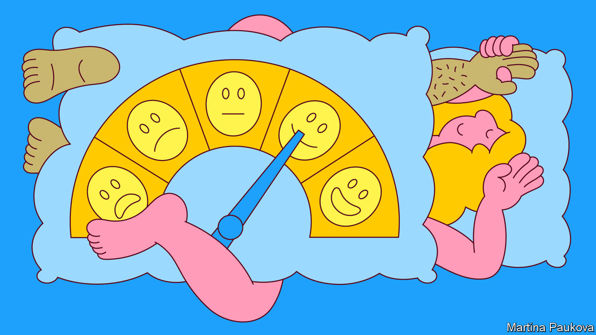

###### How was it for you?

# How to conduct a sex survey 

##### A British survey of sexual habits is precise, clear and involves absolutely no smut 

 

> Jan 25th 2023 

Nobody wanted “cunnilingus”: too much of a mouthful. Besides, the researchers feared people wouldn’t know what it meant. “Fellatio” was avoided for similar reasons. “Making love”, “having it off”, “going all the way”, “going to bed with” and “sleeping with” were all also avoided by the authors of the questionnaires—too oblique. “Fucking”, “bonking” and “screwing” were out too: too slangy. Research among the public indicated that they should also avoid the word “abstinence” (“absti-what?”). But most people felt that they did have a handle on “chastity”: that, as one respondent put it, was “like the pope or Cliff Richard”.

Talking about sex is . Strolling up to a stranger’s house, knocking on their front door and asking them when they last had sex—and if so what sort, was it with protection, and was it good—that is more awkward still. It is nonetheless extremely important to do so, for the sake of . Which is why, for the next 12 months, around 400 interviewers, led by academics at University College London (ucl), are fanning out across Britain, armed with randomly selected addresses, carefully worded questionnaires and imperturbable expressions, to assess the nation’s sexual habits. Think of it as a national passional lottery: it could be you. And if it is, brace yourself.


Britain’s fourth National Survey of Sexual Attitudes and Lifestyles (Natsal), which takes place every ten years and aims to interview 10,000 people, is under way. Ignore the “and Lifestyles” bit, which suggests that it might be about whether people are practising vegans or exercise regularly. This is about , plain and simple. Or rather, given that the survey has up to 607 questions and—depending on how thrilling your life is—takes around one hour to complete, it is more correct to say that this is about sex which is often neither plain nor simple, but which is written about in language that is both. 

To read the Natsal survey is a soothing experience. Passion in the hands of poets is a tempestuous thing. For Sappho, it was that “monster” which unbound her limbs and made her tremble; for John Donne, it was an awakening. For Natsal, passion tends to sound a little more like a gcse maths-logic problem. “Thinking about all of the people you have had sex with in the last five years,” asks one typical question, “did any of them overlap in time? In other words did you have sex with someone (person A) then have sex with someone else (person B) then have sex with the first person (person A) again?” Read the question twice, and turn the page when done.

But then Natsal itself arose from what was, essentially, a maths problem—namely, finding out the R number (the average number of people infected by each infected person) of the HIV virus. It is possible to smirk at Natsal now, but when it began, in the mid-1980s, it was deadly serious. An appalling new disease had appeared and was spreading largely among gay men. There was “tremendous fear and uncertainty”, says Dame Anne Johnson, professor of epidemiology at ucl, who led the first survey. As one scientist involved put it, people worried that aids “was going to overwhelm the nation”. To find out whether it would, it was necessary, as with covid-19, to find out how easily HIV was spreading. Since no one had any idea who was doing what with whom, or how often, this was all but impossible, and the idea of Natsal was born.

Care was needed. The history of sexual surveys is fumbling. The seminal work in the discipline is Alfred Kinsey’s “Sexual Behaviour in the Human Male”, an infamously flawed bestseller published in 1948. Kinsey’s questions could be leading and his focus, at best, idiosyncratic. On his “Contents” pages, as well as the subheadings “Homosexual Play” and “Heterosexual Play” comes the more unexpected “Animal Contacts” (“largely”, notes Kinsey, “confined to farm boys”). But the main problem was that Kinsey had questioned volunteers—and those who gamely volunteer for sex surveys tend to gamely volunteer for other things, too, which skews results. 

Natsal goes to considerable lengths to avoid similar flaws. Randomisation—which is done first to pick an address, then to pick a person from within that address—is meticulous. The response rates are high, though men are less keen on answering than women. Leading questions are avoided; language is carefully chosen. Slangy, clinical and judgmental words such as “adultery” are avoided and interviewers are trained in preserving what Cath Mercer, a professor of sexual-health science at UCL who is co-leading the current study, calls “that poker face”. 

The results of Natsal-4 will come out in 2025. This, says Professor Mercer, is no “quick and dirty” sex survey. The findings will reflect some changes in the survey itself (for the first time Natsal is asking about sexual pleasure and not just focusing on “bugs and babies”). The results will also doubtless reveal some changes in habits: a rise in same-sex experiences among women was one of the striking things to emerge from the previous surveys. But perhaps the main change is that Britons are increasingly comfortable discussing such things. When the survey began, says Professor Johnson, “we didn’t have a language to talk about sex.” There was euphemism, or poetry, or silence. Now, most are familiar with the terms that Natsal uses. 

Not that there is always much cause for them: one of the things past surveys have revealed about British sexual habits is how little sex everyone seems to be having. So perhaps the last line ought to go to the poets, after all. As Donne had it: “For God’s sake hold your tongue, and let me love.” ■


