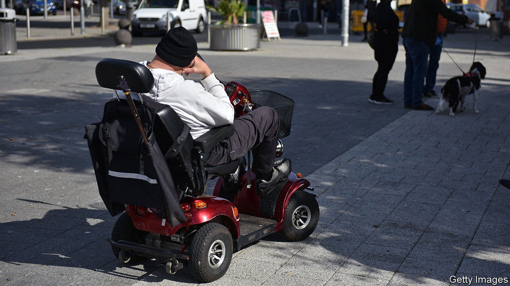
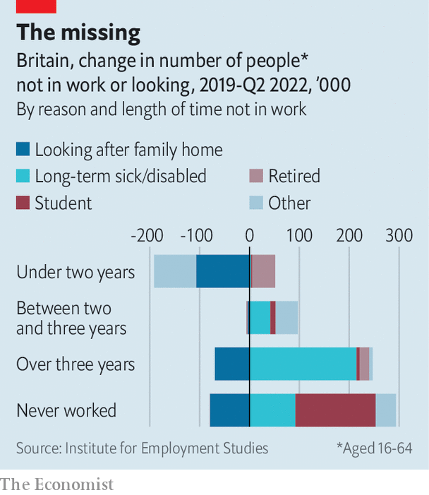

###### Sick or retired

# Illness is stopping Britons from coming back to work 

##### The ranks of the sick have swollen since the pandemic 

 

> Jan 26th 2023 

During the 2010s the British economy grew not by becoming much more productive but by keeping people in work for longer. Of the 4m or so extra workers who became employed in 2010-20, two-thirds had lived for more than half a century. Since the pandemic many of these veterans have gone absent without leave. New labour-market data, covering the three months to the end of November 2022, show that there were roughly 300,000 more inactive workers over the age of 50 compared with the first quarter of 2020. 

Number-crunchers divide those out of work into two groups—the unemployed, who are looking and available for work; and the inactive, who are not. There are far more inactive workers (about 22% of the working-age population) than unemployed ones (under 4%). Inactive workers include the long-term sick, the retired, those looking after children, students and those who have given up looking for work. 

The ranks of the sick have apparently swollen the most since the pandemic. There were an additional 300,000 workers between the ages of 16 and 64 who said they were inactive because of long-term illness in the third quarter of 2022 compared with the first quarter of 2020. (The other big increase was among students, typically at the younger end of the age spectrum.)

 


But research by Bee Boileau of the Institute for Fiscal Studies, a think-tank, shows that the increase in ill-health is among workers who have been inactive for over five years rather than among those who recently left the labour force. She points to another, unrelated trend: more workers have been retiring early (see chart). 

Pension rules, introduced in 2015 and known as “pension freedoms”, allow those over the age of 55 to withdraw their nest egg early and gradually draw down the balance to live on. The pandemic boosted the value of these pots. First, would-be retirees had more cash to save through not going into the office or socialising; second, lower interest rates and a stockmarket boom lifted the value of financial assets. Some will have used the windfall to retire.

Working from home also erased some of the non-financial rewards from employment, such as rubbing shoulders with colleagues. Extended periods at home gave others a trial run at what retirement could be like. Rather than being forced to retire, older workers may have chosen to: the proportion of inactive people between 16 and 64 who claim they would like a job fell to a record low of just over 19% in 2022. 

But looking for the “missing workers” only among those who have recently left work may be a mistake, says Tony Wilson at the Institute of Employment Studies, another think-tank. Britain’s problem is not that too many people are quitting, but that not enough are coming back. If the health-care system was in better nick some conditions may have not become chronic. Lockdowns and pandemic-era interruptions may have exacerbated mental-health problems, making it harder to return to work. 

The aggregate numbers, too, may hide quite how many younger workers have dropped out of the labour market due to ill health. There has been much less change in the headline numbers of those aged 24 to 50 who are inactive, but there has been lots of churn under the surface. The number of people saying they cannot work because they are looking after family has fallen by 114,000: working from home has made it easier to combine caring for others with a job. Without rising levels of ill health in this cohort, its total contribution to the labour force might have grown. 

Tempting more “inactive workers” back to the frontline could alleviate some of Britain’s economic problems. Rate-setters at the Bank of England are concerned that a tight labour market is fuelling inflationary pressure. Firms are having to fish for new employees in the much smaller pool of the unemployed; rapid wage growth is boosting services inflation. Although few inactive workers say they are looking for a job right now, more would like to in the future. 

That will be a challenge. Less than a tenth of retirees ever return. Mr Wilson says that supplying some form of employment support to help the long-term sick into work might help; at present Britain provides very little. But rather than luring missing workers back, the economy may finally need to come up with some productivity improvements instead. ■


