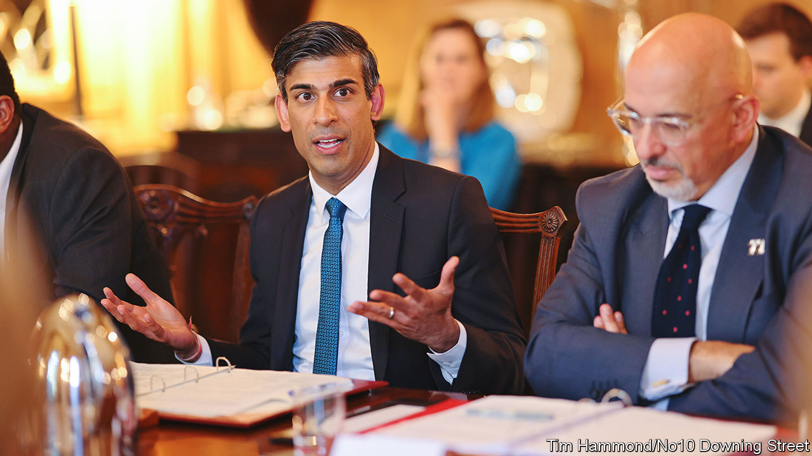

###### Birds of a Pennyfeather

# Rishi Sunak’s hapless government 

##### Britain’s prime minister resembles an accident-prone character from Evelyn Waugh 

 

> Jan 23rd 2023 

Evelyn Waugh, a satirist of pre-war England and of the careless aristocrats who ran it, would have had a field day with the . Sometimes it feels as though he already has. Take the resemblance between , Britain’s current prime minister, and Paul Pennyfeather, the hapless protagonist of “Decline and Fall”Waugh’s debut novel

Pennyfeather is an earnest and unworldly theology student at Oxford, who returns to the fictional setting of Scone College one evening just as the Bollinger Club, an aristocratic drinking society, is embarking on a night of mayhem. Pennyfeather is stripped of his trousers and runs the length of the quadrangle. He is sent down the next day for indecency. From there, things only get worse. 

Mr Sunak is no failure.  he has been top of the class, from Winchester to Oxford to Stanford and the City, putting scarcely a foot wrong nor a nose out of joint. But much of his agenda is inoffensively sensible. He is accident-prone. And he is surrounded by colleagues whose decisions cause him harm. 

The past few days have underscored this Pennyfeatherish pattern. On January 20th Mr Sunak received a second “fixed penalty notice” from the police, for forgetting to wear a seat belt while filming a peppy video clip in his official car. The first of these small fines came when Mr Sunak was chancellor and attended a birthday gathering for Boris Johnson in Downing Street in violation of covid-19 regulations. He was, Paul-like, caught up in the celebrations after arriving early for a meeting. 

Although Mr Sunak came to office promising to restore trust to government, the prime minister appears unable to escape the Bollingeresque chaos that routinely surrounds his party. The biggest current scandal surrounds Nadhim Zahawi, briefly Mr Sunak’s successor as chancellor and now chairman of the Conservative Party. 

On January 21st Mr Zahawi, who had a successful career as a businessman before entering Parliament, admitted to having reached a settlement with the authorities over previously unpaid tax. Mr Zahawi said that the tax authority had found him to be “careless and not deliberate”, tax-law terminology that Waugh would have enjoyed. Mr Sunak has asked his ethics adviser, Sir Laurie Magnus, to investigate. 

The broken glass left behind by his predecessor is causing trouble, too. On January 22nd the reported that Richard Sharp, the chairman of the BBC, was involved in brokering an undisclosed loan of up to £800,000 ($990,000) for Mr Johnson while he was prime minister, and shortly before Mr Johnson recommended his appointment to the broadcaster. Mr Sharp has denied arranging any financing. Mr Sharp has referred himself to the BBC for an internal review and the commissioner for public appointments is looking into how he came to get the job. 

Mr Sunak has brought a steadiness to government but not a recovery in Tory polling. Voters do not seem to loathe Mr Sunak; like the character he resembles, there is little to hate. Yet his inability to bring his party to heel leaves him at risk of appearing weak and, worse, unlucky. ■


