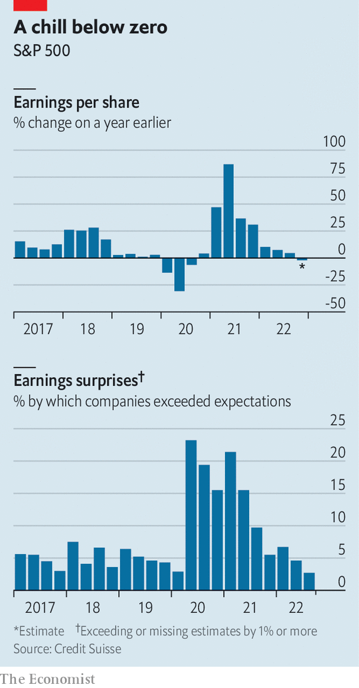

###### Bulldozed

# Big business is in for a rough earnings season 

##### Companies face falling revenues and rising costs 

 

> Jan 22nd 2023 

Chief executives of the world’s biggest firms seem in highish spirits of late. Although they see the  as a humanitarian tragedy, the risks to the world economy look for now to be contained. Central banks have got serious about inflation. The world economy has held up  a few months ago. China’s Communist government has launched a charm offensive, signalling that the country is not just r after its harsh “zero-covid” regime but also reintegrating with the world. Globalisation may not be in the rudest of health, but news of its demise appears, to many bosses, exaggerated.

The mood in corner offices may be about to sour. “Earnings season is going to be the confessional event,” says Jim Tierney of Bernstein, an investment firm, referring to the month or so when most companies report their quarterly results. The profits of America’s banking giants, which kicked things off earlier this month, fell by 20% year on year. Investment bankers got a particularly severe drubbing, as dealmaking collapsed amid economic uncertainty. Goldman Sachs is giving around 3,200 of its workers the boot. 

 


By January 25th titans of other industries, from manufacturing (3m and Boeing) to consumer goods (Kimberly-Clark) and technology (Microsoft), had reported soggy earnings. Profit estimates for large American firms are plunging. In the last three months of 2022 analysts revised their fourth-quarter earnings forecasts for the S&amp;P 500 index down by 6.5%, twice as much as the typical downward revision. Wall Street’s collective wisdom about the past quarter points to the first year-on-year decline in profits since the depths of the pandemic in 2020 (see chart).

For many companies, costs are rising faster than sales. Businesses are discovering that it is harder to resist wage rises than to persuade customers to bear higher prices. This is likely to compress margins at a rate that has yet to be fully digested by analysts, who collectively cling on to the prediction that profits will grow in 2023. If the American economy does slide into a , as many economists expect, overall profits will almost certainly decline. Since the second world war earnings per share have fallen by an average of 13% around periods of economic contraction, according to Goldman Sachs. 

The first thing to which firms will be confessing is the weariness of consumers. In firms’ conference calls with analysts at the end of last year, many spoke of weak demand, as shoppers reined in spending on discretionary items. Procter &amp; Gamble, whose products range from nappies and detergents to dental floss, has reported falling sales volumes across its businesses in the fourth quarter. It managed to meet earnings expectations only because it increased prices by 10%—and plans further rises in February.

Yet the chorus of bosses advertising such “pricing power”, last year’s favourite boast, will be quieter this earnings season. Although households are still spending excess savings built up during the pandemic, they are increasingly fishing for bargains. American consumers skimped on everything from restaurants to electronics in December, causing retail sales to decline by 1.1% on a seasonally adjusted basis, compared with the previous month. Constellation Brands, which makes and distributes Corona beer for drinkers in America, said on January 5th that it plans slower price increases this year. Many retailers are discounting goods to clear inventories. The prices of Tesla’s electric cars are lower globally by as much as 20%.

As demand falters, firms are owning up to excessive costs—their second confession. Technology companies, which saw demand for their products slow last year from pandemic-induced highs, are doing so with special zeal. Apple’s boss, Tim Cook, is taking a 40% pay cut this year. Twitter is auctioning off its neon-bird wall art. Less symbolically, on January 18th Microsoft announced that it would lay off 10,000 people. Two days later Alphabet, Google’s corporate parent, said it would sack 12,000. These cuts do not entirely reverse big tech’s pandemic hiring binge, but a prominent Silicon Valley venture capitalist thinks it will provide “air cover” for more tech firms to trim their payrolls and shore up their cashflows. 

Companies’ third confession concerns the fate of any profits that will be made. This earnings season is also a time for firms to lay out their spending plans for the year ahead. In aggregate, large American businesses tend to split their outgoings evenly between shareholder payouts (through dividends and share buy-backs) and investments (research and development, capital expenditure, and mergers and acquisitions). 

In the era of cheap money, before central banks started raising interest rates to quash inflation, the payouts were often financed with debt. Now that money is getting expensive, such borrowing is likely to subside. As for dealmaking, plenty of acquirers are still sorting out the mess created by transactions struck at peak prices during the pandemic merger boom. Write-downs acknowledging the fall in value for some of these are more likely than announcements of replenished war chests and a desire to strike more deals. 

That leaves investments. The 21st century’s mega-trends—decarbonisation, digitisation and decoupling between China and the West—argue in favour of mammoth spending on climate-friendly technology, on robots and software, and on non-Chinese factories. One European industrial boss contends that, as a result, capital spending should withstand the impending downturn better than usual. 

Maybe. For the time being, though, most companies remain cautious. After American firms’ capital expenditure ticked up in the third quarter of 2022, one tracker of corporate spending plans, compiled by Goldman Sachs, points to continued growth but at a considerably slower pace. 

Many companies are likely to defer significant spending decisions until the economic uncertainty lifts. Ericsson, a Swedish maker of telecoms gear, warned that its American customers are increasingly holding off on new network investments. Dell shipped nearly 40% fewer PCs, which it sells chiefly to corporate customers, in the fourth quarter, compared with the year before, according to IDC, a research firm. Logitech, which makes keyboards, webcams and other desktop-related hardware, now expects revenues to fall by as much as 15% in the fiscal year to March, down from its previous estimate of no more than 8%. Makers of software, such as Microsoft, and chips, such as Intel, could also be affected by crimped digitisation budgets.

Like all earnings seasons, this one will spring positive surprises. A few have already sprung. United Airlines increased its prices without putting off passengers. Netflix smashed expectations by adding 7.7m new subscribers in the fourth quarter, partly thanks to a new, cheaper, ad-interrupted service. The beleaguered streaming service, which has lost roughly half its market value since its peak in autumn 2021, has issued bullish earnings forecasts for 2023. On January 25th Tesla reported a record quarterly profit.

Such perkiness will, however, be the exception rather than the rule this year. In aggregate, positive earnings surprises have been getting less positive in recent quarters. Having reached an all-time high as a percentage of GDP last year, post-tax corporate profits look overdue for a correction. And they may have further to fall. High debt and low taxes, which propelled corporate profitability for several decades, are no longer the tailwinds they were, as interest rates rise and the appetite for deficit-funded tax cuts diminishes. As this new reality sinks in, CEOs’ half-full glasses may suddenly look half-empty. ■


