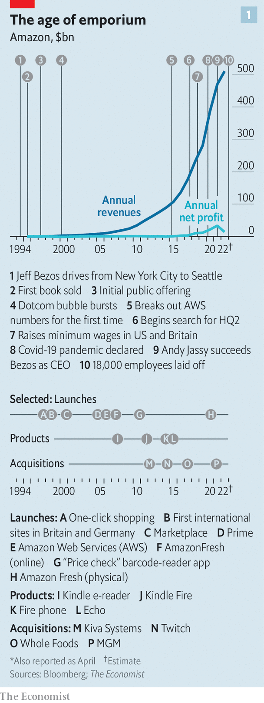
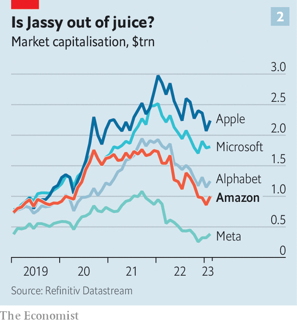
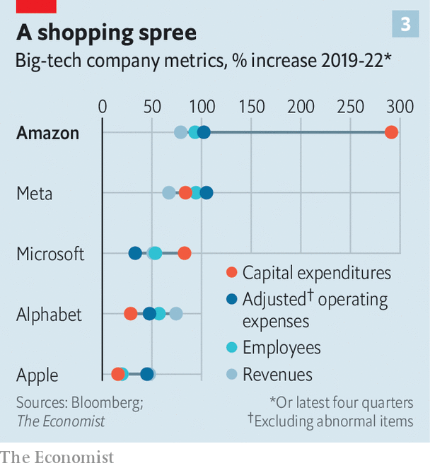

###### The too-much-of-everything store

# Can Amazon deliver again? 

##### The pioneering e-commerce giant battles soaring costs and a stagnating legacy business 

 

> Jan 26th 2023 

IT IS HARD not to be in awe of Amazon. It is one of history’s greatest companies. Jeff Bezos nurtured the firm from the humble online bookshop he founded in 1994 into a tech juggernaut, selling everything from corn syrup to cloud computing, a future trillion-dollar industry that Amazon more or less invented (see chart 1). Today it is the world’s fifth-most-valuable company, third-largest revenue generator and second-biggest private employer. Its warehouses, data centres, shops and offices cover an area almost the size of Manhattan. Consumers, competitors and politicians have been left to wonder if Amazon would take over the world. Or whether it would stop there—it is investing heavily in Kuiper, a satellite-broadband venture.

 


All the superlatives notwithstanding, it is equally hard not to recognise that Amazon finds itself in something of a funk. With a downturn on the cards in America, its biggest market, shoppers are tightening their purse strings and corporate IT departments are paring back cloud spending. Amazon’s market value is down by around $1trn since its peak in mid-2021 (see chart 2), erasing all the gains of the covid-19 pandemic, when customers rushed to join its Prime subscription service and businesses were shifting their data to its cloud division, Amazon Web Services (AWS). This month Amazon announced 18,000 white-collar lay-offs, amounting to 6% of its corporate workforce. When it reports fourth-quarter earnings on February 2nd its annual revenue growth may for the first time ever come in at single digits, down from 22% in 2021. In October the company warned it might make little or no profit in the last three months of 2022.

 


Amazon’s Icarus moment is not unique in big tech. All its fellow tech high-fliers have been hit as demand for their digital wares declines now that people are no longer locked down at home and postmen no longer bring pandemic-stimulus cheques from the government. But under Andy Jassy, the AWS chief who took over as CEO after Mr Bezos retired in July 2021, Amazon has expanded much more aggressively than Alphabet, Apple, Meta and Microsoft (see chart 3). This exuberance leaves the company in a tough spot as it contends with three big challenges: a sputtering retail business; decelerating cash engines of AWS and a newish advertising business; and growing competition. Can the understated Mr Jassy overcome them, and turn Amazon’s sprawling empire into a dependably profitable business? 

 


To understand how Amazon found itself in its current predicament, go back to just before the pandemic. The firm was already planning a big expansion of its warehouse and logistics network. The aim was to offer one-day delivery for more products to more Prime members. When national lockdowns created a boom in online shopping, Amazon doubled down. In April 2020 Mr Bezos told investors: “If you’re a shareowner in Amazon, you may want to take a seat, because we’re not thinking small.”

Over the next two years Amazon doubled the size of its fulfilment network. Mark Mahaney of Evercore ISI, an advisory firm, calculates that Amazon added about 130m square feet (12m square metres, or nearly four Central Parks) to its global footprint in both 2020 and 2021. In those years Amazon’s cumulative capital spending reached $100bn. No company anywhere in the world invested more in that period. Last year it may have invested another $60bn, again more than anyone else. Around half that sum went on warehouses and vehicles; most of the rest on AWS data centres. Amazon also increased its payroll to 1.6m, from 800,000 in 2019. 

In the first quarter of 2022 Amazon admitted that overhiring and overbuilding were each adding $2bn to its quarterly costs, relative to 2021. Pricier fuel and higher wages meant a further $2bn a quarter. In April 2022 workers at a warehouse on Staten Island voted to unionise, and called for “more reasonable” productivity targets and more pay. If Amazon agrees to the union’s demands, the Staten Island warehouse alone could add $200m or so to annual operating costs, estimates Morgan Stanley, a bank. At the same time, retail sales slowed; in December American consumers spent 1.1% less than the month before. Amazon’s retail losses are thus piling up. Mike Morton of SVB MoffettNathanson, a research firm, estimates that when you strip out profits from ads, annual operating losses from the retail division (plus devices, entertainment and other smaller units) amount to about $30bn. 

The ad operation itself is another point of concern. In the past few years it has gone from virtually non-existent to the world’s fourth-biggest, with yearly revenues of $36bn. Its operating margins are reckoned to be around 30%, on a par with the industry’s two giants, Alphabet and Meta. But profitability may be slipping. Amazon has reportedly splurged around $1bn for the rights to stream some American-football matches, and alongside them some ads—a fortune compared with the cost of posting banners on its own website. At the same time, year-on-year growth in ad sales has slowed sharply, to 25% in the third quarter of 2022, from 53% the year before. 

Amazon’s main cash engine, AWS, is also decelerating as business customers trim their digital budgets. Soaring energy prices, especially in Europe, made it much costlier to keep the power-hungry data centres whirring. What is more, AWS is particularly vulnerable to shrivelling orders from startups, which tend to favour it over rivals such as Microsoft Azure. As their venture-capitalist backers grow stingier amid the tech rout, the young tech firms are slashing their cloud spending. In October Brian Olsavsky, Amazon’s chief financial officer, admitted that AWS’s annual sales growth had declined to around 25%, the slowest on record. The average remaining lifetime of AWS contracts also ticked down in the most recent quarter, suggesting that customers are signing fewer deals or shorter ones. , the second-biggest cloud provider, said on January 24th that it expects sales growth at its cloud unit to decelerate by four or five percentage points this quarter. 

Another problem is stiffening competition. As covid pushed shoppers online, traditional retailers switched their focus to e-commerce. Walmart increased its last-mile-delivery capacity four-fold just since the start of 2022. Target, another legacy supermarket chain, has used its acquisition in 2017 of Shipt, an online-shopping platform, to spruce up its digital-sales channels. Between 2018 and 2021 six big conventional retailers, including Walmart and Target, increased their collective share of American e-commerce spending from 8% to 12%, according to SVB MoffettNathanson. In the same period Shopify, a Canadian firm which offers merchants tools to sell online, expanded its market share in America from 5% to 10%. It is investing heavily in its own fulfilment service, which it launched in 2019. 

Rivals are making their presence felt in Amazon’s non-retail businesses, too. AWS’s healthy first-mover lead in the cloud is being eaten away. Numbers from Synergy Research Group, a data provider, show that its global market share in the business has more or less stabilised at just over 30% in the past three years. Its two main domestic rivals, Microsoft and Alphabet, have more or less drawn level with it when taken together. In advertising, Apple has a small but growing operation and Microsoft is dipping its toe in the water, signing a deal last year to provide adverts for Netflix’s new ad-supported streaming service.

The combination of loss-making retail, slowing profit motors and growing competition is hammering Amazon’s profitability. The firm’s overall operating margin in the third quarter of 2022 was just 2%, the lowest since 2017. In the past four quarters Amazon lost $26bn in free cashflow (the money companies generate after deducting capital investments). 

Little of this can be laid directly at Mr Jassy’s door. Mr Bezos’s departure stripped the new boss of some battle-hardened lieutenants. Dave Clark, who ran the retail arm and was seen as another possible successor, left to run Flexport, a supply-chain consultancy. Charlie Bell, a talented AWS executive, jumped ship to Microsoft. Other Bezos-era stalwarts, including Jay Carney, head of public relations and policy, and Jeff Blackburn, head of media, are also moving on. Moreover, the startup-like culture of innovation Mr Bezos cultivated is hard to maintain at Amazon’s staggering size, says one longtime executive. 

As for the ambitious expansion plans, they were hatched under Mr Bezos, who remains executive chairman. The soft-spoken Mr Jassy, whom you would be forgiven for not noticing in a moderately crowded room, has said he consults his former boss about once a week. With the possible exception of concentrating the lay-offs in the Echo smart-speaker unit, in which Mr Bezos was deeply involved, it is hard to point to decisions the current CEO has made that Amazon’s founder wouldn’t have. 

With Mr Bezos preoccupied with his rocketry firm, Blue Origin, and other plutocratic pursuits, Mr Jassy looks safe in his job for the time being. But he has his work cut out. The first task is to rein in spending and boost returns. It has been a while since Amazon dialled back its capital expenditure, which it does every now and again to show shareholders just how profitable it is, notes Mark Shmulik of Bernstein, a broker. 

Now such moves may be in the offing. Last February the price of Prime membership in America rose for the first time, from $119 a year to $139. European Prime members have seen a similar increase. Fees that merchants on Amazon’s marketplace pay for fulfilment grew by more than usual in 2022, and on top of that the company levied additional surcharges for inflation and the holiday shopping season. It is trying to sublet some 30m square feet of unneeded space and has begun offering long-term storage for vendors. 

In an effort to contain costs, Mr Jassy is binning plenty of projects. Amazon has cancelled or delayed the construction of dozens of warehouses, and closed dozens of physical shops, including all Amazon Books and 4-star outlets, which sold items that received a rating of four stars or higher online. Amazon Glow, a video-calling device, and Astro 2.0, a home robot, were also killed off. The Echo lay-offs look like an attempt by Mr Jassy to downsize a unit that was reportedly losing around $5bn a year. 

One thing Mr Jassy seems loth to do is hive off AWS into a separate company, as some investors have urged. A year ago Daniel Loeb, boss of Third Point, a hedge fund, reportedly told his clients that splitting the cloud business from the retail one could generate $1trn in shareholder value. Some big potential customers, such as Walmart, shun AWS because it is run by a retailing rival. A sale would also placate trustbusters, eager to break up what they perceive as unaccountable tech monopolies. 

A spin-off would, however, also sever potentially lucrative links between the cloud and retail arms. For instance, AWS has new artificial-intelligence (AI) tools for advertisers to target shoppers on Amazon’s e-commerce site. The line between the two businesses is blurring, says Adam Epstein, co-president of Perpetua, an ad startup. The retail unit, for its part, has spawned several AWS offerings, such as a supply-chain tool first trialled in Amazon’s grocery business. Mr Shmulik thinks AWS may start selling the clever live-streaming technology it developed to broadcast Thursday Night Football on Prime Video.

Indeed, the future may involve weaving AWS more tightly into other parts of the empire. In time that could turn Amazon from primarily a seller of goods to consumers into a seller of increasingly AI-assisted services to both individuals and businesses. Before the pandemic, the share of Amazon’s sales coming from its main business-facing segments was 31% and high-margin services made up 37% of revenue. Today the figures are 46% and 53%, respectively. The company’s multibillion-dollar bets on Kuiper, the satellite network, and Zoox, a self-driving-car venture, hint that those shares may rise further. So do investments in health care. Last year Amazon bought One Medical, a provider of primary care, and launched Amazon Clinic, which offers virtual consultations for more than 20 ailments. On January 24th it unveiled a drug-subscription service for Prime members. 

If Mr Jassy can balance capital discipline with a few focused wagers, Amazon could return to greatness. That would be a less inspiring business tale than Mr Bezos’s pursuit of world domination. But it needn’t be less lucrative. ■


