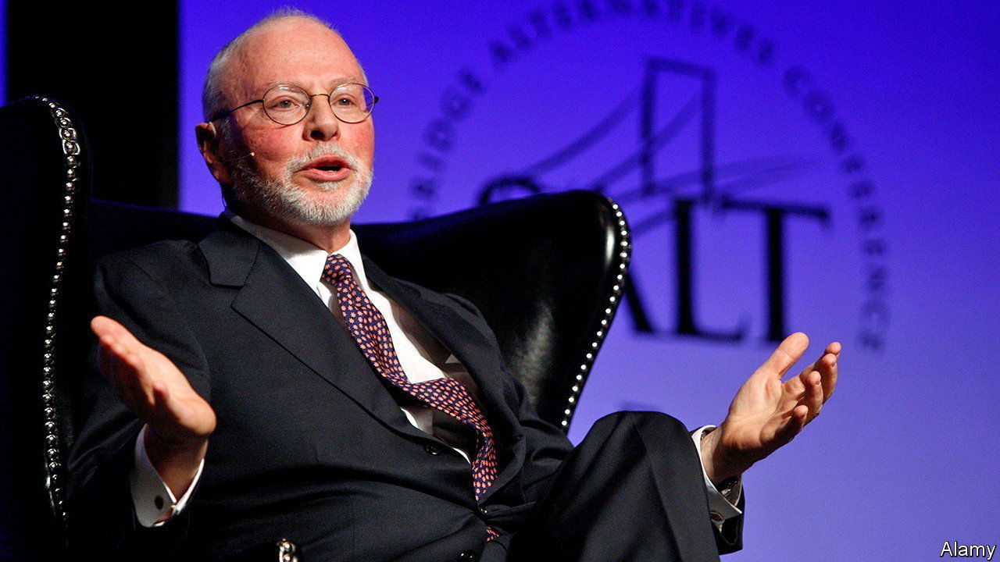
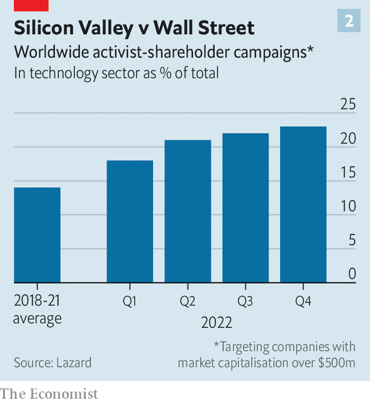

###### Gadfly season

# Elliott and fellow activist investors take on big tech 

##### Languishing Silicon Valley stocks attract Wall Street’s mischief-makers 

 

> Jan 26th 2023 

FOR BOSSES and boards, dealing with the odd activist shareholder is par for the course. Contending with a swarm of such gadflies is unusual. Last October Starboard Value, an activist hedge fund, took a “significant” stake in Salesforce, a maker of customer-management software, arguing that the firm had failed to convert its leading market position into juicy margins and needed to cut costs. On January 4th Salesforce duly announced it would lay off 8,000 staff, or 10% of its workforce. That was not enough to swat off the attacks. On January 22nd it emerged that Elliott Management, a fearsome member of the gadfly genus, had also taken a multibillion-dollar stake in the company. The next day another, Inclusive Capital, was reported to have been buying Salesforce shares.

 


So far the hedge funds have said little publicly about their demands. Deeper cost-cutting is almost certainly among them. Salesforce’s sales and marketing costs chew up 42% of its revenues, compared with 28% and 19% for SAP and Oracle, two big rivals, respectively (see chart 1). The activists could also push for a spin-off of one of Salesforce’s pricey recent acquisitions, such as MuleSoft, a business-software firm, Tableau, a data-visualisation tool, or Slack, a workplace-messaging app.

Salesforce is not the only tech firm suffering such vexation. Last July Elliott was revealed to hold around 9% of Pinterest, a digital pinboard; by December it had wriggled its way onto the board. In October Altimeter, an activist fund with a holding in Meta, called on the social-media empire to reduce headcount and scale back its metaverse investments. In November TCI, another such outfit, demanded that Alphabet lay off staff, lower highish salaries and cut back on bets unrelated to its core search business, such as autonomous driving.

All this buzz comes after a quiet few years. Between 2018 and 2021 the number of activist campaigns fell steadily worldwide. In 2022, as stockmarkets plunged, activists sprang back to life, launching 36% more attacks than the year before, according to Lazard, an investment bank. 

 


Silicon Valley, which went on an uncontrolled expansion binge amid the pandemic tech boom, presents a particularly juicy target. As Altimeter noted in a public letter to Meta, “It is a poorly kept secret in Silicon Valley that companies ranging from Google to Meta to Twitter to Uber could achieve similar levels of revenue with far fewer people.” Investors have also soured on tech stocks, whose promise of profits in the distant future look less attractive today as interest rates rise. The tech-heavy NASDAQ index has fallen by 30% since its highs in late 2021, twice as much as the S&amp;P 500 index of big American firms. That has allowed activists to swoop in at discounted prices, notes Gregory Rice of BCG, a consultancy. In 2022, 21% of activist campaigns globally took aim at tech, up from 14% in 2018-21 (see chart 2). In America, last year’s figure was 27%.

Dual-class share structures like those of Meta and Alphabet, which let founders keep majority voting rights, offer the targets some protection. Still, even founder-controlled firms have to keep shareholders happy. Meta’s share price took a drubbing after it rebuffed Altimeter’s call to ease off its metaverse plans. Two weeks later the company announced it would fire 11,000 staff, or 13% of its workforce, and trim up to $2bn, or some 5%, from its capital spending in 2023. On January 20th Alphabet, too, said it would sack 6% of its employees. 

Contrary to their reputation for short-term opportunism, activist investors can help boost long-term returns. One study of 2,000 activist campaigns concluded that target firms on average outperformed their rivals after five years on both share-price and operating measures. Microsoft and Apple, tech’s two giants, have both had constructive exchanges with activists in the past. In 2013 Apple was nudged by Carl Icahn, a veteran gadfly, into returning some of its mounting cash pile to shareholders. Microsoft’s revival in the past decade was helped along by the appointment of another activist, Mason Morfit, to the board at the start of Satya Nadella’s tenure as CEO in 2014. 

Whether or not other tech giants follow Apple’s and Microsoft’s conciliatory example, they may be realising that the activists aren’t going away. After Alphabet announced its lay-offs, TCI sent it another letter arguing they were too modest. ■


