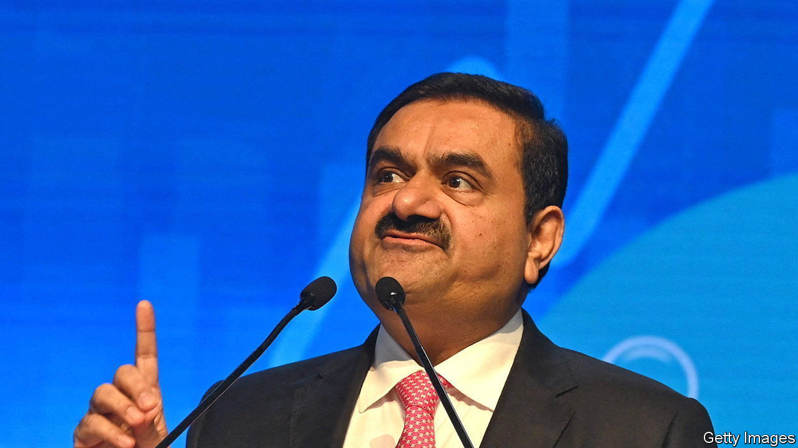

###### Picking on winners

# Hindenburg’s critique of the Adani empire 

##### A small investment firm picks a fight with India’s richest tycoon 

 

> Jan 26th 2023 

Not a day goes by in India without news of the exploits of its wealthiest tycoon, Gautam Adani. In September his fortune was estimated at $140bn, double what it was the year before, largely thanks to the huge gains of the seven publicly listed companies he controls. That encouraged new acquisitions, including an Israeli port, an Indian TV-news network and the country’s second-largest cement producer.

The latest Adani news was less euphoric. On January 24th Hindenburg Research, an American short-seller, which makes money when its targets’ share prices tank, released a report titled, “Adani Group: How the World’s Third-Richest Man is Pulling the Largest Con in Corporate history”. It alleges that share prices of Adani companies have been artificially inflated. The Adani Group’s chief financial officer, Jugeshinder Singh, called the report a “malicious combination of selective misinformation and stale, baseless and discredited allegations” intended to undermine an upcoming secondary share offering of the group’s flagship firm, Adani Enterprises. He also said that Hindenburg had published its report “without making any attempt to contact us or verify the factual matrix”.

Hindenburg made its name by sniffing out problems in sexy startups. They included Nikola, an electric-lorry firm whose founder was later convicted of fraud, and Lordstown Motors, a carmaker that had overstated orders. In going after Adani, Hindenburg has picked a fight with a corporate Goliath with a record of fast growth and of infrastructure investments that are pharaonic in their ambition. The short-seller notes that shares of Adani Enterprises, which describes itself as “an incubator focusing on establishing diverse new businesses”, trade at 500 times earnings. Adani Green Energy, a renewables firm, boasts a price-to-earnings ratio of over 800. By comparison, at the peak of the pandemic technology boom in late 2021, the ratio for America’s tech-heavy NASDAQ index was less than 30. On the basis of valuation alone, Hindenburg argues, the prices of the Adani businesses could drop by 85%. 

And lofty valuations aren’t the end of the story, the short-seller claims. It describes a complex edifice: seven Indian-listed companies sitting atop 578 subsidiaries. In 2022, it alleges, these engaged in 6,025 related-party transactions. This is the visible bit of an even more complex system, with multiple companies, many in foreign jurisdictions, which Hindenburg argues “have no obvious signs of operations”. The point, the report claims, is to manipulate the listed firms’ share prices and to shift money onto their balance-sheets “to maintain the appearance of financial health and solvency” amid high debt and thin liquid assets. Such allegations, Mr Singh said, have been “tested and rejected by India’s highest courts”.

Despite this forceful denial, investors were nervy. The combined market value of listed Adani firms fell by $11bn, or 5%. Some investors have harboured worries about the group’s structure, acquisitiveness and debt. The fact that the fall wasn’t steeper attests to its uncanny ability to weather storms. ■


