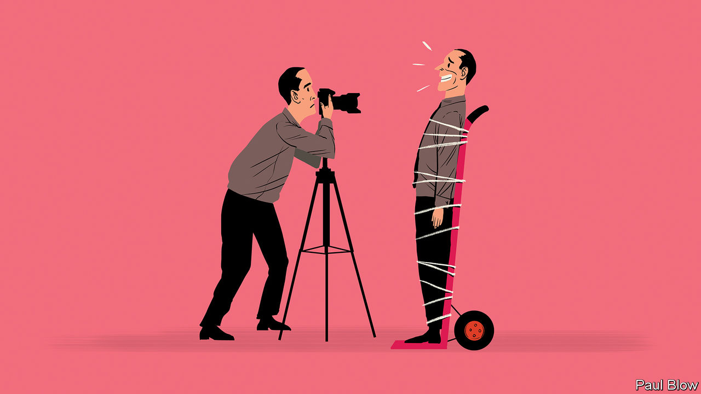

###### Bartleby

# The curse of the corporate headshot 

##### A strangely pervasive custom of odd poses and forced smiles 

 

> Jan 26th 2023 

Do an image search for the word “business” or “manager”, and what comes back? Nothing that remotely resembles business or managers. It isn’t just that the people are attractive. It is what they are doing. Many stock photos feature well-dressed types sitting around a table. One of them is holding forth and everyone else is laughing madly, like cult members hearing that the Rapture has been brought forward a week. 

In other pictures, a speaker is pointing at a pie chart. Her colleagues look astonished at what they are seeing. Or people are shaking hands, purposefully and often. If they are ever left to their own devices, they stand in front of floor-to-ceiling windows and gaze moodily at the skyline. What could they be thinking? Is it about what was on that pie chart? 

Some amount of business life involves sitting around a table. Occasionally there is laughter. But if you wanted to represent the reality of a meeting, one person would be talking, two people would be listening and everyone else would be wearing the glazed expression of clerics who have just lost their faith. If there was an accurate stock photo of someone working at a desk, its surface would be covered in crumbs and the laptop screen would be showing its owner’s social-media account.

The corporate headshot is the way that firms use photography to bend reality. But whereas stock photos tend to glamorise business, headshots achieve the reverse. They make corporate life seem less fun than it actually is.

Most companies’ websites contain a gallery of their senior executives and boards, the product of hours of awkward primping and posing. Executives are caked in make-up and asked to look into the camera with a succession of forced smiles. The results are consistently appalling. Most end up looking like well-dressed hostages. Someone, usually the general counsel, looks so pained that he or she appears to have just been Tasered. One or two eschew smiles altogether: in this context they are the hostage-takers. 

The awkwardness is amplified if the photographer has decided to show more than a person’s head and shoulders. Pity the executives who have been forced to stand side on to the camera, tilt their heads slightly like a giant parrot, fold their arms and told to look natural. If you ever saw someone standing like this in real life, you would think “better cross to the other side”, not “I bet that person is great at creating shareholder value.” 

What on earth is going on? There is some research to suggest that profile photos can have a useful effect in commercial settings. Humans are quick to form judgments about others by looking at their faces: baby-faced people are regarded as more trustworthy than those who look older, for example, whereas more mature faces convey expertise. A recent paper from Stuart Barnes of King’s College London and Samuel Kirshner of the University of New South Wales looked at the impact of facial characteristics on the prices that Airbnb hosts can charge their guests. They found that hosts with attractive and trustworthy faces could charge up to 5% more per night than their peers for similar apartments. Unsurprisingly, perceived trustworthiness mattered more for small, shared accommodation. 

But the decisions made by consumers on online marketplaces do not explain corporate headshots. Maybe some people try to choose between Disney+ and Netflix by going to the About Us section of their websites, but it seems unlikely. And even if executive profiles were somehow feeding into the subconscious decisions of investors and job applicants, it is not at all clear what type of photograph should follow. Managers will already be trying to convey an impossible brew of leadership qualities, from breezy confidence to naked vulnerability. Now they have to look baby-faced too? No wonder people end up gurning. 

So what does lie behind this strangely pervasive custom? A headshot is something for a new executive to show their mother, and for a weary one to show recruiters. It is useful for employees who have no idea what their ultimate boss looks like. Leadership galleries increasingly serve as a crude but quick measure of diversity. Perhaps the most plausible explanation is that it is just something that everyone else does. It is odd to have a leadership team that does not show their faces. Odd but not impossible. Alphabet lists its board members’ names and eschews photos altogether. You just have to imagine them, shaking their heads in amazement at a graph.


