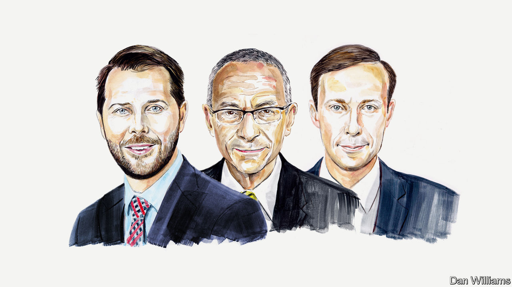

###### American politics

# Brian Deese, John Podesta and Jake Sullivan on the Inflation Reduction Act 

##### The three White House officials say it benefits the world—as well as America 

 

> Jan 24th 2023 

LAST SUMMER America enacted the Inflation Reduction Act (IRA). It is the most aggressive action taken in our history to build a clean-energy economy, to combat the climate crisis and to increase our energy security. This legislation means that for the first time, America is on the path to credibly meet our 2030 climate goals, including reducing domestic greenhouse-gas emissions by 50-52% below 2005 levels. Across the country, particularly in disadvantaged communities, we are already seeing the deployment of low-carbon technologies and the expansion of clean-energy manufacturing at scale. 

But the benefits don’t stop at America’s borders. Some have downplayed the potential global opportunities or raised competitiveness concerns, including this publication.  is wrong to say this is all “zero-sum” and troubling for foreign allies. New analysis from the Boston Consulting Group underscores what we believe: that the IRA will be the most significant policy driver for global emissions reduction this century—or perhaps ever—and it comes not a moment too soon. It will help increase clean-energy production and deployment not just in America, but around the world. In short, our international partners have nothing to fear from the IRA, and a whole lot to gain.

For starters, the new and exponential scale of this investment will drive down the cost of deploying clean energy everywhere. Indeed, the aforementioned new analysis shows that in some sectors the IRA’s global clean-energy cost reduction could be as much as 25% this decade. Given projected spending on clean energy worldwide, that implies more than $120bn could be saved globally by 2030.

Those savings mean more clean-energy deployment, which in turn means greater cost declines. And as American manufacturers produce clean energy at scale, America will drive down global costs as well.

With over $650bn in combined investment from the IRA, the Bipartisan Infrastructure Law and the CHIPS and Science Act, America will now be able to reduce its emissions by 1bn tonnes of carbon annually—more than ten times the climate impact of any prior American legislation. We will also double domestic clean-energy production by 2030 in game-changing technologies such as solar, wind, battery storage, hydrogen and advanced nuclear—the benefits of which will extend to every country on the planet.

We have already seen how public investments can promote production at scale for nascent technologies, as shown by wind and solar. Decades ago, America and other governments around the world invested in these sectors, advancing the technology and encouraging production. That led prices to fall by 60% and subsequently unlocked deployment around the globe. Solar has become the cheapest form of new energy installation. But the scale of clean-energy deployment needed both for decarbonisation and for additional cost reductions is enormous, which is why the IRA is so needed. 

The act is projected to drive hundreds of gigawatts per year of American solar and wind deployment, sparking additional public investments globally. That will reduce costs to an even greater extent, accelerate global deployment and eventually mean higher employment in the sector worldwide.

The IRA also goes further by investing in the next generation of clean-energy technologies, creating demand signals which then encourage producers to scale needed innovation. Take direct-air capture: since the passage of this new legislation, we’ve seen over 6m tonnes of new removal projects announced, and costs are now projected to drop by 50% in the coming decade, according to research from academics at Heriot-Watt University in Scotland and the University of Pennsylvania. Or consider clean hydrogen: in the wake of the IRA the market has completely shifted, with production costs expected to drop by as much as 50% in the next ten years, as the era of American-led clean-energy deployment commences. 

To put it simply: the more these fledgling technologies are adopted in America, the more prevalent they will become in other regions as well. In fact, we support our allies and partners investing in these industries and advancing their own plans in co-ordination with us. As President Joe Biden has said, we can harmonise our economic and trade approaches, create high-paying jobs and tackle the climate crisis—and not at each other’s expense. 

Of course, unlocking these potential global cost savings and emissions reductions will require not only sustaining but increasing international collaboration—both bilaterally and multilaterally. For example, last year America and the EU announced their commitment to negotiate the world’s first carbon-based sectoral arrangement on steel and aluminium trade by 2024. 

This represents a major victory in the fight to address the climate crisis while protecting our workers and enabling American industries to compete. Never have two global partners aligned their trade policies to confront the threats of climate change and global market distortions, ensuring that trade works to solve the challenges of the 21st century. And we will need more collaboration like this, as we increasingly help developing countries through new types of partnership (as has recently worked with Egypt, Indonesia and South Africa).

Tackling the climate crisis while increasing energy security requires sprinting to make zero-carbon solutions cheaper and widely available globally. The transition to a zero-carbon global economy may prove to be the greatest economic transformation the world has seen since the Industrial Revolution, affecting not only how we produce and consume energy, but how we live and move. 

On that score, the IRA may transform global growth, spurring a virtuous cycle of innovation for good that spans the globe. This is an inflection point in meeting the world’s decarbonisation imperatives, and American action in the past two years will help boost clean energy all around the world. ■

_______________


