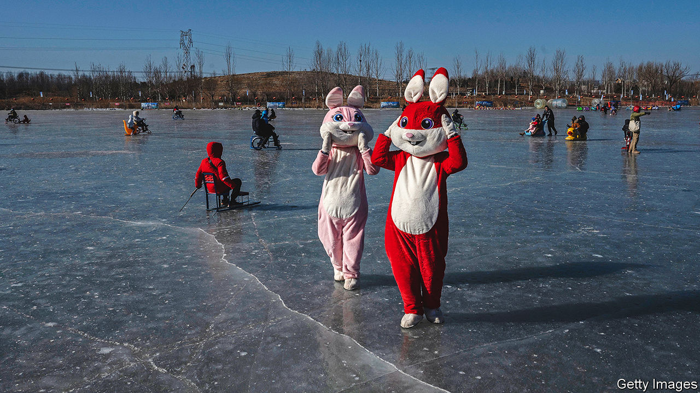

###### A cuddlier China?

# China is trying to win over Westerners and private firms 

##### But Xi Jinping is unlikely to change 

 

> Jan 25th 2023 

Liu He is a grey-haired 71-year-old on the verge of retirement from China’s highest level of economic policymaking. He must have many regrets, not least the battering of his country’s economy by a now-abandoned struggle to crush covid-19, and by the disease’s recent rapid spread. But Mr Liu grinned with obvious pride as he recalled how members of the global elite at the  had responded to his delegation’s upbeat remarks there a few days ago. “All kinds of people said, ‘Hey, China is back again!’” he told a television reporter. 

Mr Liu, who is one of China’s four deputy prime ministers and a trusted adviser of , was being modest. It was he, not others in his entourage, who had stolen the show. Among the assembled business titans his speech on January 17th struck a welcome note given the fragile state of the world economy. “If we work hard enough,” he said, “the Chinese economy will see a significant improvement in 2023.” He pledged “more focus” on supporting private business—which has been deeply disturbed by Mr Xi’s campaign of the past two years to tighten controls over technology firms and his stepped-up use of Marxist-sounding language. To those worried about China’s many barriers to foreign firms, Mr Liu had soothing words: “China’s national reality dictates that opening up to the world is a must, not an expediency. We must open up wider and make it work better.” 

There was nothing strikingly new in Mr Liu’s remarks. But their emollient tone fuelled speculation among observers that, as well as ditching the “zero-covid” policy, Mr Xi has decided to tone down some of the rhetoric that has caused jitters among businesspeople at home and abroad, ease pressure on entrepreneurs and prevent further deterioration of his country’s badly strained ties with the West. China’s state-controlled media have encouraged such thinking. After attending the forum Mr Liu met America’s treasury secretary, Janet Yellen, in Zurich for their first face-to-face encounter since she took up her post two years ago. One Chinese news outlet called it “another sign of ice-breaking between the world’s two largest economies”. 

It may well be that China sees a need to adjust its tactics on a range of matters, both economic and diplomatic. At 3%, annual GDP growth last year was the second-slowest since the death of Mao Zedong in 1976. America’s efforts to curb the flow of cutting-edge technology to China are frustrating Mr Xi’s ambitions for supremacy in the tech sector. As geopolitical tensions have grown, and covid has exposed the vulnerability of China-linked supply chains, Western firms have become much more nervous about relying on the country as the source of every widget. China’s cosy ties with Russia, and refusal to censure its invasion of Ukraine, have poisoned China’s relationship with much of Europe, a region it has long been trying to win over in an attempt to weaken America’s alliances. 

China likes to use Davos as a place for buttering up foreigners. In 2017, nearly five years after he took power and began spreading ripples of unease across the West, Mr Xi himself turned up. He was the first supreme leader of China to attend the forum. The audience heard a portrayal of the country as a champion of globalisation and leader of efforts to combat climate change. America’s president-elect, Donald Trump, appeared determined to steer in the opposite direction. That made it all the easier for Mr Xi to score points. 

But China’s recent actions also mark a shift. One was Mr Xi’s decision to meet his American counterpart, Joe Biden, on the margins of a G20 summit in Bali in November. Since August, China had been barely on talking terms with America because of a visit to Taiwan by Nancy Pelosi, then the speaker of America’s House of Representatives (China claims the island and abhors official contacts with it by foreigners). Antony Blinken, America’s secretary of state, is expected to visit Beijing in February, the State Department says. It would be the first such trip by America’s most senior diplomat since 2018. Also next month films by Marvel Studios, a Hollywood company, will be shown in Chinese cinemas, ending China’s unexplained four-year ban. 

China is putting out feelers to other Western countries, too. While in Bali, Mr Xi also met Australia’s prime minister, Anthony Albanese. It was the first one-on-one encounter between the two countries at that level since 2016—Australia having offended China on numerous fronts, including by calling for an independent inquiry into covid’s origins. China appears to have eased a two-year ban on imports of Australian coal. And Mr Xi has stepped up the tempo of diplomacy with Europe. In November he hosted a visit by Germany’s chancellor, Olaf Scholz. President Emmanuel Macron of France is expected to follow early this year. 

Soothing the private sector 

On the economy, the tone is also changing. The official account of the Communist Party’s annual closed-door gathering in December to discuss economic policy, the Central Economic Work Conference, contained far less of Mr Xi’s ideological language and no railing against “disorderly expansion of capital”, which fintech firms had previously been accused of perpetrating. It said China should “vigorously develop” the digital economy. The Asia Society Policy Institute, a think-tank in New York, said the wording was arguably Mr Xi’s “most affirmative and authoritative statement on the political and ideological legitimacy of the private sector” since he came to power. 

In recent weeks, the government has also retreated from its two-year-long attempt to curb property-market mayhem by imposing tight limits on borrowing by developers. The sector still , but businesspeople are relieved by the return to a more cautious approach. The campaign had been hammering sales. 

But it would be wrong to conclude that Mr Xi himself has changed, or that he is politically weaker. China’s chaotic exit from zero-covid—a policy with which he was closely linked—may have dented his credibility among China’s elite and an unknowable number of regular folk who have lost relatives to the virus, and now see their deaths covered up. But the country’s political machinery hums along as it did in the build-up to a party congress in October, at which Mr Xi secured an unprecedented third five-year term as general secretary and a Politburo packed with loyalists. 

Around the country, officials still pepper speeches with fawning references to Mr Xi and his leadership. China is still flexing its muscle around Taiwan (see next story). Even as they try to mend fences with Western countries, China’s envoys continue to use the sharp language about the West that has become a hallmark of diplomacy under Mr Xi. In Davos, Mr Liu may have said what his audience wanted to hear about China’s economy. But his call for an end to “cold-war” thinking was a veiled snipe at America. In China’s view, America is the chief purveyor of it. He twice mentioned Mr Xi’s idea of a “community with a shared future for mankind”. This means, in effect, a new world order in which criticism of China is taboo. 

Mr Xi will try to use two big political events this year to boost public and business confidence in the economy and in his support for non-state firms. The first is the annual session of the country’s parliament, which is due to be held in March. The outgoing prime minister, Li Keqiang, will deliver the main report. It is likely to echo the language of December’s work conference. In the autumn the party’s 376-member Central Committee will meet. By tradition, at this stage of China’s political cycle, it should focus on the economy. Expect reform to be the buzzword. 

But cynicism will abound, too. A year after he took power Mr Xi presided over a similar meeting of the Central Committee. Its vaguely worded communiqué gushed with talk of reform that soon began to sound empty as he focused on boosting party control over business, and beefing up state-owned firms in particular. 

Four years later, Mr Xi had his turn as Davos man. But subsequent years of his rule saw ever more draconian clampdowns at home—not least in Xinjiang and Hong Kong—a downward spiral in relations with the West and growing despondency among private entrepreneurs and foreign investors alike. “There’s just a certain amount of wishful thinking on some of this,” says Andrew Small of the German Marshall Fund of the United States, a research centre. “And I think, on the Chinese side, they’re aware that wishful thinking is something they can take advantage of.” ■


