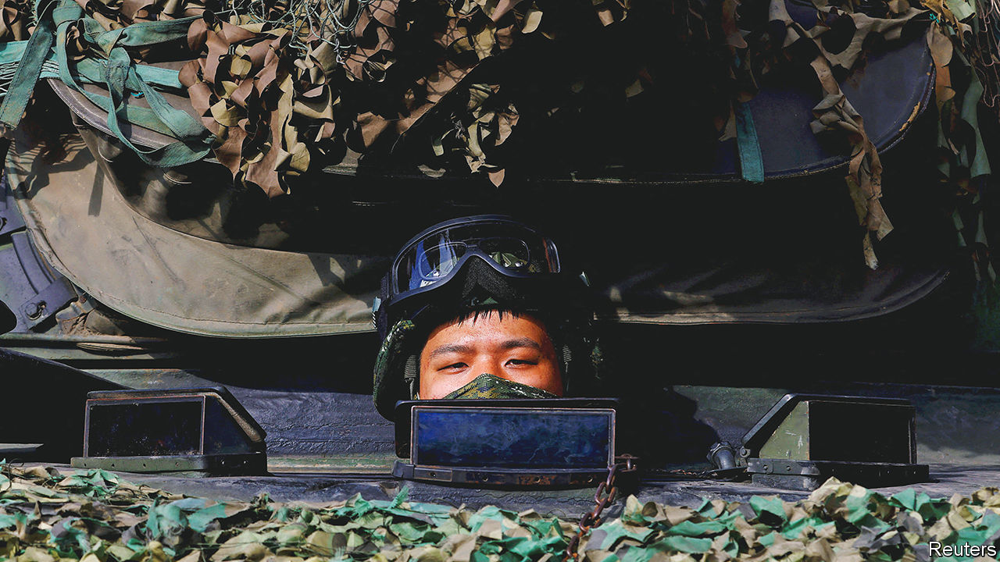
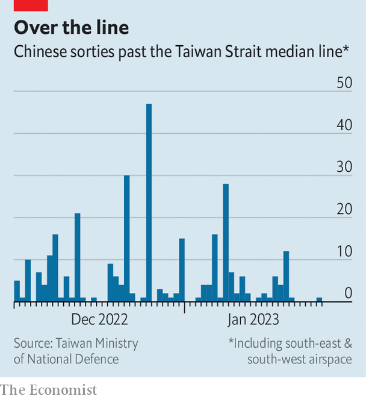

###### Tense as ever

# Does China’s softer tone extend to Taiwan? 

##### The mainland’s military movements suggest not 

 

> Jan 26th 2023 

The howls of China’s “wolf warrior” diplomats seem less intense of late, allowing the tones of more measured officials to resonate. But the change in timbre of , the self-governing island which America supports and China claims. This month China’s Eastern Theatre Command, which is responsible for Taiwan, released a music video called “My war eagle flies around the precious island”. It depicts Chinese jets and warships surrounding Taiwan, while a singer softly calls for a lost love to return home.

 


China’s actions are even more clear. In December and January it held military exercises around , deploying dozens of warplanes and several warships. China has been trying to erode the boundaries that divide Taiwan from the mainland. In 2022 Chinese planes made over 1,700 incursions into Taiwan’s air-defence-identification zone (ADIZ), prompting military alerts. China has also been increasing its sorties across the median line of the Taiwan Strait, the de facto maritime border between China and Taiwan. It has carried out 306 such missions since December 1st (see chart).

China’s largest incursion to date, on December 25th, saw 47 aircraft cross the median line. A Chinese spokesman, Colonel Shi Yi, said those missions were a response to American “provocation”. He was likely referring to a bill that President Joe Biden signed on December 23rd which authorised billions of dollars in grants and loans to Taiwan to buy American weapons.

Only $2bn in loans made it into the final spending bill that was passed into law. But America is planning to expand its own navy and training its marines for island fighting. In January top officials from America and Japan said they would work more closely on security and defence, and that America’s marine deployments on Japan’s south-western islands, near the Taiwan Strait, would be upgraded.

Taiwan has been taking steps to improve its defences, too. President Tsai Ing-wen announced in December that from 2024 men would be required to perform one year of military service, up from four months, and that conscripts would receive better training. Taiwan plans to spend $19.4bn on defence in 2023, up by 13.9% on last year. Still, experts say these steps are not enough. China spent $230bn on defence last year. It has expanded its naval, missile and nuclear capabilities. What Taiwan really needs is a new strategy that focuses less on big, expensive arms, which would not survive Chinese strikes, and more on agile and concealable weapons.

Yet during a recent Taiwanese military exercise in the city of Kaohsiung (pictured), big and cumbersome weapons played a central role. Soldiers wearing red helmets, marking them as invaders from the mainland, cowered on a field as tanks and armoured vehicles approached. “Under the strong power of our battle brigade, the enemy soldiers have retreated,” a Taiwanese announcer crowed.

The drill was meant to reassure Taiwan’s citizens ahead of the lunar new year on January 22nd (it is celebrated on both sides of the strait). Polls suggest the public is sceptical. In one last year, more than half of respondents said they did not believe Taiwan could hold off a Chinese invasion for very long. Things have remained mostly calm over the holiday, at least. Only one Chinese plane crossed the median line between January 21st and 25th. ■


