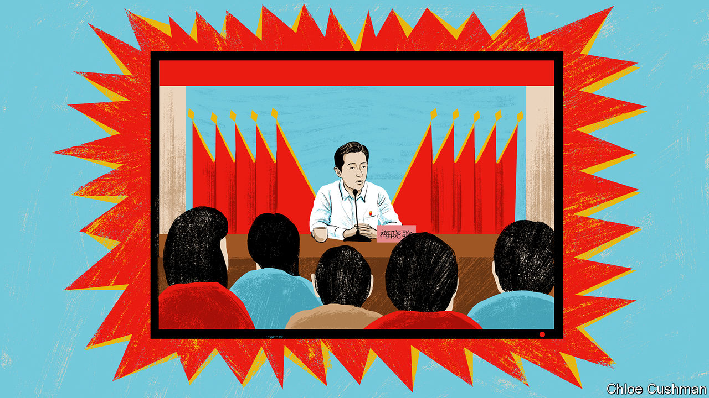

###### Chaguan

# What a new drama series reveals about China 

##### The propaganda machine creates a virtuous, village-born Communist Party chief 

 

> Jan 26th 2023 

Propaganda often clarifies how leaders see themselves, and would like to be seen. Look closely, and it can also expose insecurities. In this new year  is working overtime to promote “County Party Committee Courtyard”, a 24-part television drama now showing on multiple Chinese state and commercial channels.

The drama only obliquely refers to the party’s supreme leader, Xi Jinping. At moments, characters cite his most famous speeches and slogans. But his vision of party rule is everywhere.  reports have called it a tribute to last autumn’s Communist Party congress. Mr Xi, whose official biography emphasises his early years of rural service, pays close attention to the reputation of the grassroots party. That helps to explain his years-long anti-corruption drive and his orders to shun extravagant living. The son of revolutionary elders, Mr Xi invokes history (rewritten to play down the purges and frenzies of the Mao years) to portray party members as self-sacrificing servants of the people who have always governed most effectively when they mobilise the masses.

After Mao Zedong died in 1976 and China’s Communist Party ditched class warfare and revolution as its reasons for being, the country began a giant experiment in performance legitimacy. That is political-science jargon for the mandate to rule that even unelected, iron-fisted regimes may try to earn by delivering prosperity, order or other public goods. In the first decades of China’s reform and opening, many ordinary folk grumbled that officials were focused on economic development (and self-enrichment) rather than other forms of progress. In closed-door speeches, Mr Xi gave warning that ruling parties fall if they become corrupt and distant from the masses. His stated ideal is for party members to be unusually virtuous, and seen to be so. If that means frequent shows of frugal living and talk of officials keeping the masses in their hearts, so be it. Mr Xi’s version of performance legitimacy involves a hefty dose of performing.

Yet such showmanship carries risks. An early episode of the drama shows its star—a handsome, diligent and selfless Communist Party cadre, newly promoted to head a poor rural county—fretting late at night about whether his eloquence comes across as inauthentic. In the episode, a smartphone video of an emotional speech by the county chief, Mei Xiaoge, has just gone viral on social media. Viewers see the speech being given, then his underlings watching its filmed version in their offices, tears welling in their eyes. In his impromptu address, the chief recalls his father, as he urges retired grassroots party members to lead by example and sign an agreement to move their village graveyard as part of a wider modernisation campaign. He ends by bowing deeply to old party veterans. Soon they are lining up to sign, though that means their ancestors will be dug up.

Many hours later, sipping tea alone with the county’s party secretary, the chief frets that ordinary folk will see the video and think him “too good at putting on a show”. The secretary (whose party rank makes him the county chief’s boss) offers reassurance. The speech was moving, and you do come from the grassroots, the party boss tells his deputy.

The staging of this exchange is strikingly austere. The pair are working late in a small and cheerless official apartment, far from their families, debating the ethics of leadership. They might be priests on a mission, and indeed the series is filled with lines which make the party sound like a faith-based project. The county chief, who is soon promoted, urges underlings to act at all times so they can look the masses in the eyes. 

A severe man, often dressed in the white shirt and black trousers of a senior official, Mei shocks county bureaucrats by ditching unrealistic targets for economic development. He pledges instead to tackle long-neglected environmental problems and failures of governance. His style of management is personalised, involving anonymous visits to uncover problems and impassioned speeches to farmers. In return, locals believe that—as a village boy—he has their interests at heart, as when he asks them to lease their land to commercial farmers. Time and again he is shown winning over residents of Guangming County, his fictional rural patch, with his oratory and thrift (he is shown eating noodle soup from a roadside canteen, rather than gorging at banquets). 

A self-policing party

Alas for party chiefs, in the real world their stock of village-born paragons like Mei Xiaoge is not unlimited. The drama does not really wrestle with this problem. It was produced under the guidance of the State Administration of Radio, Film and Television and the party’s central propaganda department. Striving to avoid a boring series peopled by perfect officials, film-makers included some sinners. The villainy is pretty low-level, though. There are glimpses of local graft, often involving environmental rules, and some bribe-taking by traffic police. A junior official steals the work of an idealistic new colleague. But in the series, internal checks and balances ensure that justice is served. Local state television unmasks the corrupt police (an improbable plotline, given the muzzling of journalists in Mr Xi’s China). Under questioning, shamefaced police explain that they have not been paid for months. 

The series does show citizens protesting about injustice and petitioning higher authorities for redress. But the loudest protester, “Old Qiu”, is depicted as a pompous attention-seeker whose family wants him to pipe down. In the end even Old Qiu agrees to relocate, moved by a retired official who lets diggers demolish his beloved, tree-shaded house and garden. In Mr Xi’s China, the party needs no external accountability. In a rather abrupt ending, Guangming County is shown filling with beaming babies and children, reflecting the party’s concern about a shrinking population. Propaganda is revealing stuff. ■


