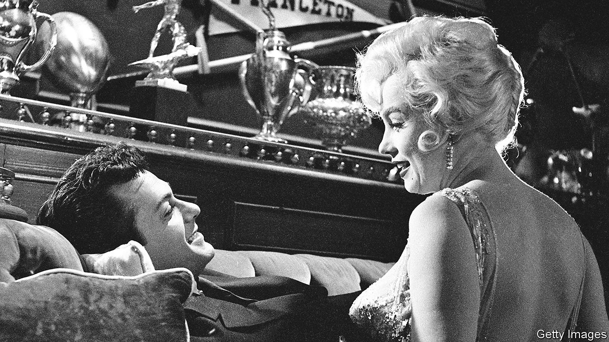

###### Back Story

# A Broadway musical updates “Some Like It Hot” 

##### It underscores the subtle genius of Billy Wilder’s screwball masterpiece 

 

> Jan 26th 2023 

They were shooting the ending of “Some Like It Hot” but didn’t have a final line. I.A.L. Diamond urged , his co-writer and the director, to use a quip cut from an earlier scene. So it was that when Osgood, the dappy millionaire played by Joe E. Brown, learns that Daphne, his fiancée (Jack Lemmon), is secretly a man, he responds: “Nobody’s perfect.” In a raucous new musical at the Shubert Theatre on Broadway, the line is revised. “I think you’re perfect,” Osgood tells Daphne, previously known as Jerry. 

It is invidious to compare a film of 1959 with a musical adaptation staged today. And not just any film: “Some Like It Hot” is one of the greatest of all time and probably the best comedy. Invidious but inevitable, and instructive: about the distance between then and now, the virtues of subtlety and the rich grey areas to be found in black-and-white movies.

The sign-off is immortal, but almost every line is a punchline in Diamond’s and Wilder’s screenplay, in which two hapless male musicians in Prohibition-era Chicago witness a gangland massacre, then disguise themselves as women in an all-girl band. The rows on set became legendary, but the result is alchemy. ’s tragic real-life despair suffuses her portrayal of Sugar, a boozy ukulele player who always gets “the fuzzy end of the lollipop”. The spark between Monroe and Tony Curtis (playing Joe, Jerry’s partner in mime) ignites on screen. The nights Wilder had spent in Weimar nightclubs before emigrating reverberate in the jazzy mood. 

The musical retains most of the plot and some of the dialogue and gags. But amid the new songs—several of them corkers—and the roof-lifting choreography, the story has been tweaked. In a delirious screen sequence that might now be called post-modern, Curtis’s character impersonates a millionaire to seduce Monroe’s, imitating Cary Grant’s accent as part of the act. Here, in a nod to Wilder, he pretends to be a German screenwriter.

Other changes are bigger, and more telling. Like a lot of mid-century American cinema, “Some Like It Hot” dealt with the question of race by ignoring it. On stage, Sugar (Adrianna Hicks) is black, as are Jerry/Daphne (J. Harrison Ghee) and the band leader, Sweet Sue (NaTasha Yvette Williams). “No use livin’ in the past,” Sue sings in the opening number. In the film, the all-white band takes the train to Florida; the theatrical version abjures the segregated South and heads to California. 

This is a salutary update. The gender politics have been revamped too. The film draws some broad laughs from the spectacle of men . That is very 1959. In the new musical, Jerry is liberated and exhilarated by becoming Daphne. “The lady that I’m lovin’ is ,” sings Ghee—who, offstage, is non-binary—in an ode to gender fluidity.

It is natural to think that the present always knows best. Often it does. Gender nonconformity wasn’t as much of a thing in 1959; or rather, not in the same way, or with the same vocabulary. Sometimes, though, wisdom and compassion operate in disguise.

Amid the smooching, innuendoes and couchette parties, the film’s most radical moment comes in a less famous line (kept on stage). “I’m Daphne,” says Lemmon’s character when first introduced as a woman, spontaneously ditching her intended name, Geraldine. An independent persona is born, which—comically yet sincerely—soon takes off and over. As Curtis put it in a racy memoir of the movie, the implication is that “a person can be more than one thing.” 

The straight relationships are a critique dressed up as a cartoon. Voluptuous Sugar is deceived by caddish Joe, but when the gangsters reappear, as they must, Joe, like Daphne, is a different person. Newly aware that too many men are “rough hairy beasts”, his masculinity has been detoxified. You could even say that the slapstick, speakeasies and mobsters bursting out of giant cakes are all a cover for Wilder’s morals of transformation and respect. He just doesn’t make a song and dance about them.

The subtlety of his screwball masterpiece peaks in that last line. The replacement, “I think you’re perfect,” is an uplifting sentiment, well-suited to the brio of musical theatre and to an age that craves affirmation. The magic of “Nobody’s perfect” is that it is unexpected, but also that it is true. Nothing and nobody is flawless in the fallen world Wilder knew and depicted, in which jokes are entwined with jeopardy, high jinks with woe, and wrenching hope from hardship is victory enough. That is the difference between a good night out and genius.


